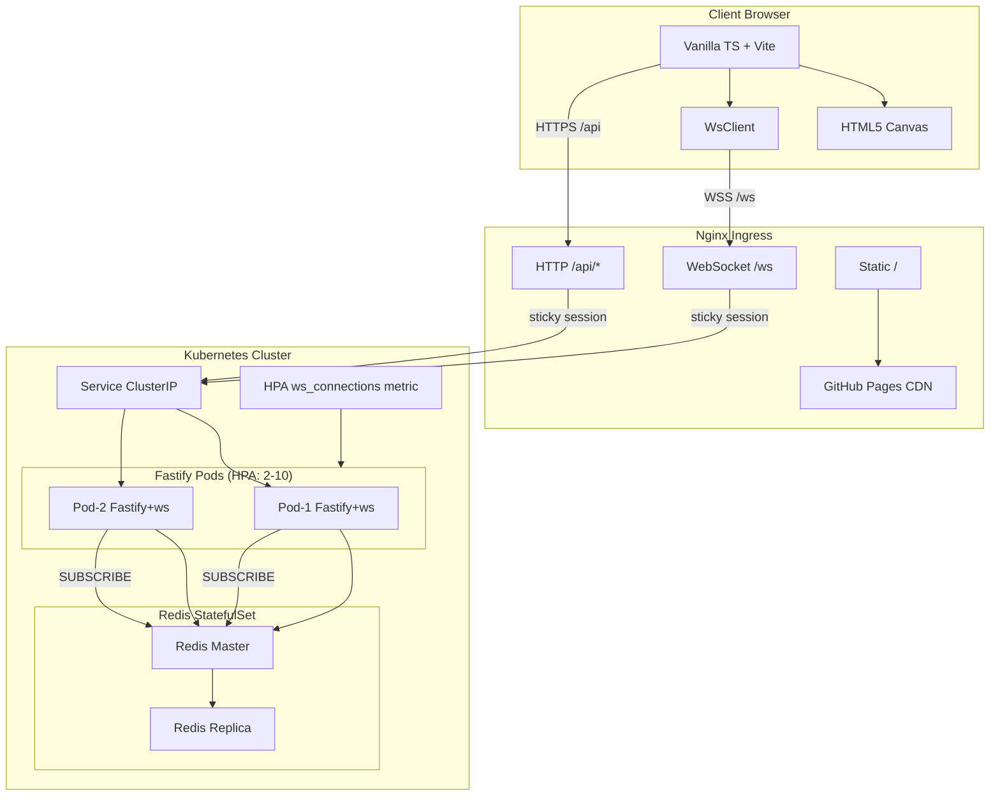

# Ladder Room Online — 線上多人爬樓梯抽獎

[](https://github.com/ibalasite/climb_stairs/actions/workflows/ci.yml) [](LICENSE)

> HTML5 多人線上房間制爬樓梯抽獎遊戲。主持人建立房間，最多 50 人同時參與，透過 WebSocket 即時同步遊戲狀態，HTML5 Canvas 渲染動態揭曉動畫。

---

## 📋 專案說明

**Ladder Room Online** 是一款基於 HTML5 Canvas 的線上多人爬樓梯抽獎系統，參考 LINE 爬樓梯玩法設計。

- 產品名稱：Ladder Room Online
- 版本：v2.2（對應產品 MVP v1）
- 產品類型：多人線上房間制抽獎／派對互動遊戲
- 核心玩法參考：LINE 爬樓梯遊戲
- 最多支援 50 名玩家同時連線

---

## ✨ 核心功能

- 玩家輸入暱稱並透過 6 碼房間碼加入房間（1.5 秒內進入等待畫面）
- 等待室即時顯示玩家列表（WebSocket 廣播，2 秒內更新）
- 主持人一鍵開始遊戲，伺服器即時生成爬梯結構
- 逐人揭曉（manual）或自動循序揭曉（auto）兩種模式
- HTML5 Canvas 動態路徑動畫，突顯自己的爬梯路徑（桌機 ≥30 FPS、手機 ≥24 FPS）
- 主持人可踢出玩家，玩家可隨時重連（JWT 長效連線）
- END_GAME 結束遊戲，PLAY_AGAIN 重置房間保留在線玩家
- 支援最多 50 人同時連線，Redis 原子操作保障一致性

---

## 🏗️ 系統架構



詳細設計：[EDD — 工程設計文件](https://ibalasite.github.io/climb_stairs/edd.html)

---

## 🛠️ 技術棧

`ts-fastify-ws-redis-vanillajs-vite`

| 層次 | 技術 | 版本 / 說明 |
|------|------|------------|
| Runtime | Node.js | 20 LTS |
| 語言 | TypeScript | strict mode，前後端共用型別 |
| HTTP Server | Fastify | REST API `/api/*` |
| WebSocket | ws（原生） | `ws` npm package，`maxPayload: 65536` |
| 快取 / 狀態 | Redis | 原子操作、Pub/Sub、房間持久化 |
| 前端 | Vanilla TypeScript + Vite | 無 UI 框架，HTML5 Canvas 渲染 |
| Monorepo | npm workspaces | `packages/shared`、`packages/server`、`packages/client` |
| 測試 | Vitest | Unit + Integration（testcontainers）+ E2E（Playwright） |
| CI/CD | GitHub Actions | lint → audit → test → build → deploy |
| 容器 | Docker（Distroless Node.js 20） | 多階段建構 |

---

## 🚀 快速啟動

### 前置需求

- Node.js 20+
- npm 10+ 或 pnpm 9+
- Docker 24+（推薦：Docker 一鍵啟動）
- Redis 7+（或使用 Docker Compose）
- Git

### 🐳 Docker（推薦）

```bash
git clone https://github.com/ibalasite/climb_stairs
cd climb_stairs
cp .env.example .env
docker compose up -d
```

服務啟動後開啟 `http://localhost:3000`

### 🍎 macOS / 🐧 Linux

```bash
git clone https://github.com/ibalasite/climb_stairs
cd climb_stairs
npm install
cp .env.example .env
# 啟動 Redis
redis-server &
# 啟動後端
npm run dev --workspace=packages/server
# 另開視窗啟動前端
npm run dev --workspace=packages/client
```

### 🪟 Windows

```powershell
git clone https://github.com/ibalasite/climb_stairs
cd climb_stairs
npm install
copy .env.example .env
npm run dev --workspace=packages/server
```

> 💡 Windows 使用者建議使用 **WSL2 + Docker Desktop**。

---

## ⚙️ 環境變數

複製 `.env.example` 為 `.env` 並填入：

| 變數名稱 | 說明 | 必填 | 預設值 |
|---------|------|------|--------|
| `NODE_ENV` | 執行環境（development / production） | ✅ | `development` |
| `PORT` | HTTP server 監聽 port | ✅ | `3000` |
| `METRICS_PORT` | Prometheus metrics port | ✅ | `8080` |
| `REDIS_HOST` | Redis 主機位址 | ✅ | `localhost` |
| `REDIS_PORT` | Redis port | ✅ | `6379` |
| `REDIS_DB` | Redis DB 編號 | ✅ | `0` |
| `REDIS_PASSWORD` | Redis 認證密碼 | ✅ | `REPLACE_WITH_STRONG_PASSWORD` |
| `JWT_SECRET` | JWT 簽名密鑰（至少 64 bytes hex） | ✅ | `REPLACE_WITH_64_BYTE_HEX_SECRET` |
| `JWT_ALGORITHM` | JWT 簽名演算法 | ✅ | `HS256` |
| `JWT_TTL_SECONDS` | JWT 有效期（秒） | ✅ | `21600` |
| `JWT_CLOCK_SKEW_SECONDS` | JWT 時鐘偏移容忍值 | ✅ | `30` |
| `ALLOWED_ORIGINS` | CORS 允許來源（production 用） | ✅ | `https://your-frontend-domain.com` |
| `ROOM_TTL_SECONDS` | 房間最長存活時間（秒） | ✅ | `86400` |
| `ROOM_IDLE_EXPIRE_SECONDS` | 空閒房間過期時間（秒） | ✅ | `300` |
| `MAX_PLAYERS_PER_ROOM` | 每房間最大玩家數 | ✅ | `50` |
| `WS_MAX_PAYLOAD_BYTES` | WebSocket 最大訊息大小 | ✅ | `65536` |
| `WS_RATE_LIMIT_PER_MIN` | WebSocket 每分鐘訊息上限 | ✅ | `60` |
| `LOG_LEVEL` | 日誌級別（info / debug / warn / error） | ✅ | `info` |
| `LOG_PRETTY` | 開發用美化日誌輸出 | ✅ | `true` |

完整說明：[.env.example](.env.example)

---

## 📡 API 快速參考

| Endpoint | 說明 |
|----------|------|
| `POST /api/rooms` | 建立房間，回傳 roomCode + JWT |
| `POST /api/rooms/:code/players` | 加入房間，回傳 playerId + JWT |
| `GET /api/rooms/:code` | 查詢房間狀態（不需 token） |
| `GET /health` | Health check |
| `DELETE /api/rooms/:code/players/:playerId` | 踢除玩家（需主持人 token） |

📖 完整 API 文件：[docs/API.md](https://ibalasite.github.io/climb_stairs/api.html)

---

## 📁 目錄結構

```
climb_stairs/
├── .env.example          # 環境變數範例（複製為 .env）
├── .github/              # GitHub Actions CI/CD
├── Dockerfile            # Container 映像定義
├── docs/                 # 設計文件 + HTML 文件網站
│   └── pages/            # 靜態 HTML 文件站（GitHub Pages）
├── features/             # BDD Feature Files（Gherkin）
├── k8s/                  # Kubernetes 配置
├── package.json          # npm 套件定義
├── packages/             # Monorepo 套件
│   ├── shared/           # 共用型別 / 工具（前後端共用）
│   ├── server/           # Fastify + WebSocket 後端
│   └── client/           # Vanilla TS + Vite 前端
└── scripts/              # 啟動 / 部署腳本
```

---

## 📚 文件

| 文件 | 說明 | HTML 線上版 |
|------|------|------------|
| [PDD](docs/PDD.md) | 產品設計文件 — 目標、範疇、驗收標準 | [🌐](https://ibalasite.github.io/climb_stairs/pdd.html) |
| [PRD](docs/PRD.md) | 產品需求文件 — User Stories、AC | [🌐](https://ibalasite.github.io/climb_stairs/prd.html) |
| [EDD](docs/EDD.md) | 工程設計文件 — 架構、技術選型 | [🌐](https://ibalasite.github.io/climb_stairs/edd.html) |
| [ARCH](docs/ARCH.md) | 系統架構設計 | [🌐](https://ibalasite.github.io/climb_stairs/arch.html) |
| [API](docs/API.md) | API 文件 — Endpoints、WebSocket Events | [🌐](https://ibalasite.github.io/climb_stairs/api.html) |
| [SCHEMA](docs/SCHEMA.md) | Redis Schema、Lua Scripts | [🌐](https://ibalasite.github.io/climb_stairs/schema.html) |
| [DESIGN](docs/DESIGN.md) | 前端 UI 規範、Canvas 座標系 | [🌐](https://ibalasite.github.io/climb_stairs/design.html) |
| [BDD](features/) | Gherkin Feature Files | [🌐](https://ibalasite.github.io/climb_stairs/bdd.html) |

📖 **完整文件網站**：[https://ibalasite.github.io/climb_stairs/](https://ibalasite.github.io/climb_stairs/)

---

## 🧪 測試

```bash
# 安裝依賴
npm install

# 執行所有測試
npm test --workspace=packages/shared
npm test --workspace=packages/server

# 測試覆蓋率
npm run coverage --workspace=packages/shared
npm run coverage --workspace=packages/server
```

測試覆蓋率目標：**shared ≥ 90%　server ≥ 80%**　CI 狀態：[](https://github.com/ibalasite/climb_stairs/actions/workflows/ci.yml)

---

## ⚠️ 已知限制

- WebSocket 整合測試標記為 MANUAL（需真實 Redis 環境）
- `packages/client/` 前端 Vite 應用尚在開發中
- k8s 部署需自行提供 `KUBECONFIG` secret

---

## 📝 Changelog

完整版本歷程：[GitHub Releases](https://github.com/ibalasite/climb_stairs/releases)

---

## 📄 License

MIT License — 詳見 [LICENSE](LICENSE)

---

## 🤝 開發說明

本專案由 [MYDEVSOP AutoDev](https://github.com/ibalasite/MYDEVSOP) 全自動生成，
涵蓋 PRD / EDD / BDD / TDD / k8s / CI/CD / HTML 文件網站全流程。
