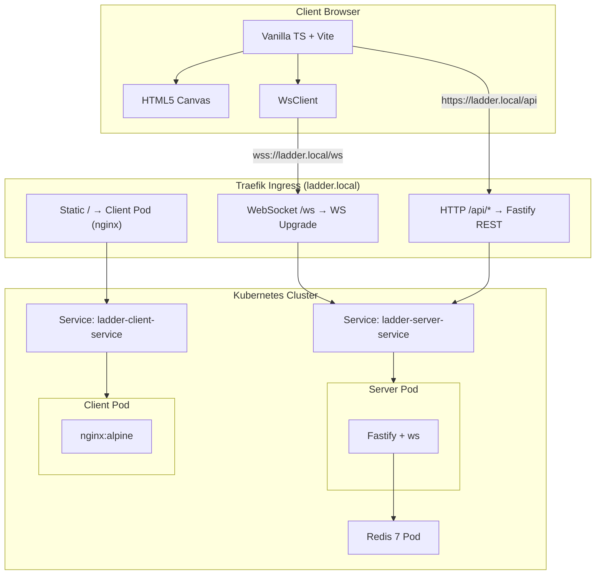

# Ladder Room Online

[](https://github.com/ibalasite/climb_stairs/actions/workflows/ci.yml)
[](LICENSE)
[](https://nodejs.org)
[](https://www.typescriptlang.org)

> 基於 LINE 爬樓梯玩法的 HTML5 線上多人互動抽獎遊戲，支援最多 50 位玩家從不同地點透過瀏覽器加入同一場抽獎活動，主持人掌控揭曉節奏，結果公正可驗證。

---

## 📋 專案說明

Ladder Room Online 是一款基於 LINE 爬樓梯玩法的 **HTML5 線上多人互動抽獎遊戲**，支援最多 50 位玩家從不同地點透過瀏覽器加入同一場抽獎活動。

相較於 LINE 原生爬樓梯，本系統解決了以下問題：

| 問題 | 解決方案 |
|------|---------|
| 人數限制（≤25 人） | 支援 2–50 位玩家，後端確保一致性 |
| 視覺不完整 | HTML5 Canvas 全量渲染，任何解析度都完整顯示 |
| 無法控制揭曉節奏 | 主持人手動逐步揭曉，或設定自動揭曉間隔 |
| 無法異地參與 | WebSocket 實時同步，掃碼或連結即可加入 |
| 結果無法驗證 | 確定性 seed（djb2 hash）+ bijection 映射，可重播驗證 |

---

## ✨ 核心功能

- **建立房間** — 主持人建立唯一 6 碼房間碼，2 秒內回傳，Redis 去重
- **設定中獎名額** — 主持人動態設定得獎人數（W），即時廣播給所有玩家
- **開始遊戲** — 房間人數 ≥ 2 且 W 設定後啟動，seed 原子生成禁止提前洩漏
- **手動逐步揭曉** — 主持人逐步揭曉路徑，配合現場節奏製造懸念
- **自動揭曉間隔** — 設定 1–30 秒自動揭曉，支援中途切換手動模式
- **玩家加入房間** — 輸入房間碼 + 暱稱加入，斷線後 30 秒內可重連復原狀態
- **觀看揭曉動畫** — 路徑行走動畫（桌機 ≥ 30fps，手機 ≥ 24fps），同色標識各玩家
- **再玩一局** — 主持人觸發再玩，保留在線玩家，清除結果重置房間

---

## 🏗️ 系統架構



詳細設計：[EDD — 工程設計文件](docs/EDD.md) ｜ [ARCH — 架構文件](docs/ARCH.md)

---

## 🛠️ 技術棧

**`ts-fastify-ws-redis-vanillajs-vite`**

| 層次 | 技術 |
|------|------|
| 後端語言/框架 | Node.js 20 + TypeScript 5 + Fastify 4 |
| WebSocket | ws（原生 RFC 6455） |
| 快取 / 持久層 | Redis 7（唯一資料層） |
| 前端 | Vanilla TypeScript + Vite 5 |
| 渲染 | HTML5 Canvas API（無 UI 框架） |
| 容器化 | Docker + Kubernetes（Rancher Desktop 本機） |
| Ingress | Traefik（K8s） |
| CI/CD | GitHub Actions |
| 測試 | Vitest + Playwright |

---

## 🚀 快速啟動

### 前置需求

- Node.js 20+
- npm 10+ 或 pnpm 9+
- Docker 24+（推薦：Docker 一鍵啟動）
- Git

### 🐳 Docker（推薦）

```bash
git clone https://github.com/ibalasite/climb_stairs
cd climb_stairs
cp .env.example .env
# 編輯 .env：設定 JWT_SECRET 和 REDIS_PASSWORD
docker compose up -d
# 開啟 http://localhost:5173
```

### 🍎 macOS / 🐧 Linux

```bash
git clone https://github.com/ibalasite/climb_stairs
cd climb_stairs
npm install
cp .env.example .env
# 需要本機 Redis（預設 localhost:6379）
npm run dev
```

### 🪟 Windows

```powershell
git clone https://github.com/ibalasite/climb_stairs
cd climb_stairs
npm install
copy .env.example .env
npm run dev
```

> 💡 Windows 使用者建議使用 **WSL2 + Docker Desktop**。

---

## ⚙️ 環境變數

複製 `.env.example` 為 `.env` 並填入：

| 變數名稱 | 說明 | 必填 | 預設值 |
|---------|------|------|--------|
| `NODE_ENV` | 執行環境（development/production） | ✅ | `development` |
| `PORT` | HTTP 伺服器 port | ✅ | `3000` |
| `METRICS_PORT` | Prometheus metrics port | ✅ | `8080` |
| `REDIS_HOST` | Redis 主機位址 | ✅ | `localhost` |
| `REDIS_PORT` | Redis port | ✅ | `6379` |
| `REDIS_PASSWORD` | Redis 密碼 | ✅ | `REPLACE_WITH_STRONG_PASSWORD` |
| `JWT_SECRET` | JWT 簽名金鑰（64 bytes hex） | ✅ | `REPLACE_WITH_64_BYTE_HEX_SECRET` |
| `JWT_TTL_SECONDS` | JWT 有效期（秒） | ✅ | `21600` |
| `ALLOWED_ORIGINS` | 允許的 CORS 來源（逗號分隔） | ✅ | `https://your-frontend-domain.com` |
| `ROOM_TTL_SECONDS` | 房間 TTL（秒） | ✅ | `86400` |
| `MAX_PLAYERS_PER_ROOM` | 每房最大人數 | ✅ | `50` |
| `WS_RATE_LIMIT_PER_MIN` | WS 訊息速率限制（/分鐘） | ✅ | `60` |
| `LOG_LEVEL` | 日誌等級（info/debug/warn/error） | ✅ | `info` |

---

## 📡 API 快速參考

| Endpoint | 說明 |
|----------|------|
| `POST /api/rooms` | 建立新房間（回傳 roomCode） |
| `POST /api/rooms/:code/players` | 加入房間（回傳 JWT token） |
| `GET /api/rooms/:code` | 查詢房間狀態 |
| `DELETE /api/rooms/:code/players/:playerId` | 離開房間 |
| `POST /api/rooms/:code/game/start` | 開始遊戲 |
| `POST /api/rooms/:code/game/reveal` | 揭曉下一條路徑 |
| `GET /health` | 健康檢查（含 Redis 連線狀態） |
| `WS /ws?roomCode=&token=` | WebSocket 實時連線入口 |

📖 完整 API 文件：[docs/API.md](docs/API.md)

---

## 📁 目錄結構

```
climb_stairs/
├── .env.example       # 環境變數範例（複製為 .env）
├── .github/           # GitHub Actions CI/CD
├── docs/              # 設計文件 + HTML 文件網站
│   ├── pages/         # 生成的 HTML 文件頁面
│   ├── diagrams/      # Mermaid 架構圖
│   ├── BRD.md         # 商業需求文件
│   ├── PRD.md         # 產品需求文件
│   ├── EDD.md         # 工程設計文件
│   └── ...
├── features/          # BDD Feature Files（Gherkin）
├── k8s/               # Kubernetes 配置
├── packages/          # Monorepo 套件
│   ├── server/        # Fastify + ws 後端
│   ├── client/        # Vanilla TS + Vite 前端
│   └── shared/        # 共用型別 + 業務邏輯
├── scripts/           # 啟動 / 部署腳本
├── tests/             # 效能測試（k6 / autocannon）
└── package.json       # npm workspace 根
```

---

## 📚 文件

| 文件 | 說明 | 線上版 |
|------|------|--------|
| [BRD](docs/BRD.md) | 商業需求文件 — 目標、範疇、驗收標準 | [🌐](https://ibalasite.github.io/climb_stairs/brd.html) |
| [PRD](docs/PRD.md) | 產品需求文件 — User Stories、AC | [🌐](https://ibalasite.github.io/climb_stairs/prd.html) |
| [PDD](docs/PDD.md) | 產品設計文件 — UI/UX 規格、色彩系統 | [🌐](https://ibalasite.github.io/climb_stairs/pdd.html) |
| [EDD](docs/EDD.md) | 工程設計文件 — 架構、技術選型、WS 協定 | [🌐](https://ibalasite.github.io/climb_stairs/edd.html) |
| [ARCH](docs/ARCH.md) | 架構文件 — 元件圖、序列圖、部署拓撲 | [🌐](https://ibalasite.github.io/climb_stairs/arch.html) |
| [API](docs/API.md) | API 文件 — REST Endpoints、WS 訊息格式 | [🌐](https://ibalasite.github.io/climb_stairs/api.html) |
| [SCHEMA](docs/SCHEMA.md) | Redis 資料結構、TypeScript 型別對照 | [🌐](https://ibalasite.github.io/climb_stairs/schema.html) |
| [TEST_PLAN](docs/TEST_PLAN.md) | 測試計劃 — Unit/Integration/E2E/Perf/UAT | [🌐](https://ibalasite.github.io/climb_stairs/test_plan.html) |
| [BDD Features](features/) | Gherkin Feature Files（79+ 場景） | [🌐](https://ibalasite.github.io/climb_stairs/bdd.html) |

📖 **完整文件網站**：[https://ibalasite.github.io/climb_stairs/](https://ibalasite.github.io/climb_stairs/)

---

## 🧪 測試

```bash
# 執行所有測試
npm test

# 指定套件測試
npm test --workspace=packages/server
npm test --workspace=packages/client
npm test --workspace=packages/shared

# 測試覆蓋率
npm run test:coverage

# 效能測試（需先啟動服務）
cd tests/performance && ./autocannon-http.sh
k6 run tests/performance/k6-room-api.js
```

測試覆蓋率目標：**≥ 80%**（shared: 100%，server: 82%，client: 100%）

---

## ⚠️ 已知限制

- 單一伺服器實例，無水平擴展（Redis 為唯一持久層）
- 自動揭曉（US-H05）尚未完整實作
- WebSocket 重連機制未完整 E2E 測試
- 效能測試腳本（k6）需手動執行，未納入 CI 自動觸發

---

## 📝 Changelog

完整版本歷程：[GitHub Releases](https://github.com/ibalasite/climb_stairs/releases)

---

## 📄 License

MIT License — 詳見 [LICENSE](LICENSE)

---

## 🤝 開發說明

本專案由 [MYDEVSOP AutoDev](https://github.com/ibalasite/MYDEVSOP) 全自動生成，
涵蓋 PRD / EDD / BDD / TDD / k8s / CI/CD / HTML 文件網站全流程。

---

## Security Policy

**Reporting a Vulnerability（漏洞回報）**

如發現安全漏洞，請勿公開回報，改以 Email 聯繫：`security@ladder-room.example.com`

| 嚴重性 | 回應時間 SLA |
|--------|------------|
| Critical | 72 小時內確認 |
| High | 7 日內修補計畫 |
| Medium / Low | 90 日內修補 |

主要安全注意事項：
- JWT_SECRET 使用 `openssl rand -hex 64` 生成 64 bytes hex
- Redis 密碼使用強密碼（生產環境不可留預設值）
- ALLOWED_ORIGINS 生產環境限制為實際前端 domain
- WS_RATE_LIMIT_PER_MIN 防止 WebSocket 訊息洪泛

---

## Architecture Quick Reference

| 決策 | 選擇 | 理由 |
|------|------|------|
| 後端語言/框架 | Node.js 20 + Fastify 4 | 高並發 I/O，低延遲 WebSocket |
| 資料庫 | Redis 7（僅快取層） | 無需持久化；房間 TTL 自動清理 |
| 部署平台 | Kubernetes（本機 Rancher Desktop） | 可移植至任何 K8s 環境 |
| 前端框架 | Vanilla TypeScript + Vite | 無框架負擔，bundle < 150KB |
| 認證機制 | JWT（HS256，6 小時 TTL） | 無狀態，WebSocket upgrade 攜帶 |
| WebSocket | ws（原生，無 Socket.IO） | 最小依賴，原生 RFC 6455 |

完整架構文件：[docs/ARCH.md](docs/ARCH.md)

---

## Code of Conduct

本專案遵循 [Contributor Covenant v2.1](https://www.contributor-covenant.org/version/2/1/code_of_conduct/) 行為準則。

參與本專案即表示您同意遵守此準則。如有違規行為請聯繫：`conduct@ladder-room.example.com`
