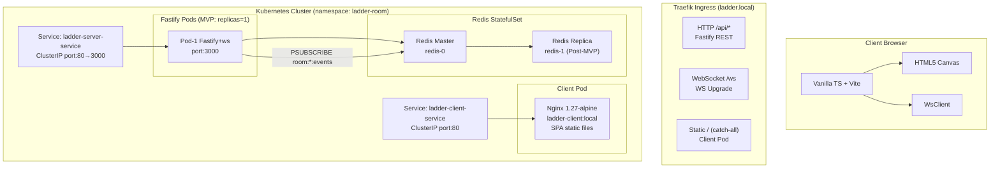

# Ladder Room Online

[](https://github.com/ibalasite/climb_stairs/actions/workflows/ci.yml)
[](LICENSE)
[](https://nodejs.org)

> 多人線上梯子遊戲平台，主持人建立房間、玩家即時加入，透過公平隨機梯子抽籤決定命運，支援 WebSocket 同步、手動/自動揭曉，以及再玩一局功能。

---

## 📋 專案說明

Ladder Room Online 是一個基於瀏覽器的多人即時梯子遊戲（鬼腳圖）。主持人建立房間並設定中獎名額，玩家掃碼或分享連結加入等候室，開局後系統隨機生成梯子結構，主持人逐步或自動揭曉每條路徑的結果。

支援最多 50 人同時在線，透過 WebSocket 保持所有玩家畫面即時同步。遊戲結束後，主持人可一鍵「再玩一局」，重置房間讓所有人繼續暢玩。

技術棧：TypeScript + Fastify（後端）+ Vanilla TS + Vite（前端）+ Redis（Pub/Sub 廣播）+ Kubernetes（部署）。

---

## ✨ 核心功能

- 建立房間並設定中獎名額（US-H01、US-H02）
- 開始遊戲，隨機生成公平梯子（US-H03）
- 手動逐步揭曉路徑（US-H04）
- 設定自動揭曉間隔（US-H05）
- 一鍵揭曉全部路徑（US-H06）
- 踢除玩家（US-H07）
- **再玩一局** — 遊戲結束後重置房間（US-H08）
- 複製邀請連結（US-H09）
- 玩家加入房間、即時查看玩家列表、觀看揭曉動畫（US-P01~P03）

---

## 🏗️ 系統架構



詳細設計：[EDD — 工程設計文件](https://ibalasite.github.io/climb_stairs/edd.html) ｜ [API 文件](https://ibalasite.github.io/climb_stairs/api.html)

---

## 🛠️ 技術棧

`ts-fastify-ws-redis-vanillajs-vite`

| 層次 | 技術 |
|------|------|
| 後端 API | TypeScript + Fastify 4 |
| 即時通訊 | WebSocket（ws 套件）|
| 快取 / Pub-Sub | Redis 7（ioredis）|
| 前端 | Vanilla TypeScript + Vite |
| 畫布渲染 | HTML5 Canvas |
| 部署 | Kubernetes (k3s / Rancher Desktop) + Traefik Ingress |
| 容器 | Docker（Nginx 1.27-alpine for client, Node 20 for server）|
| 測試 | Vitest（unit + integration），Playwright（E2E）|
| CI/CD | GitHub Actions |

---

## 🚀 快速啟動

### 前置需求

- Node.js 20+
- npm 10+ 或 pnpm 9+
- Docker 24+（推薦：Docker 一鍵啟動）
- Git

### 🐳 Docker（推薦）

```bash
git clone https://github.com/ibalasite/climb_stairs
cd climb_stairs
cp .env.example .env
docker compose up -d
```

開啟瀏覽器：http://localhost:8090

### 🍎 macOS / 🐧 Linux（開發模式）

```bash
git clone https://github.com/ibalasite/climb_stairs
cd climb_stairs
npm install
cp .env.example .env
npm run dev
```

### ☸️ Kubernetes（本機 k3s / Rancher Desktop）

```bash
kubectl apply -f k8s/
# 建立 Docker image
docker build -f Dockerfile.client -t ladder-client:local .
docker build -f Dockerfile.server -t ladder-server:local .
```

開啟瀏覽器：http://localhost:8888

### 🪟 Windows

```powershell
git clone https://github.com/ibalasite/climb_stairs
cd climb_stairs
npm install
copy .env.example .env
npm run dev
```

> 💡 Windows 使用者建議使用 **WSL2 + Docker Desktop**。

---

## ⚙️ 環境變數

複製 `.env.example` 為 `.env` 並填入：

| 變數名稱 | 說明 | 必填 | 預設值 |
|---------|------|------|--------|
| `NODE_ENV` | 執行環境 | ✅ | `development` |
| `PORT` | Fastify 監聽 port | ✅ | `3000` |
| `METRICS_PORT` | Prometheus metrics port | ✅ | `8080` |
| `REDIS_HOST` | Redis 主機位址 | ✅ | `localhost` |
| `REDIS_PORT` | Redis port | ✅ | `6379` |
| `REDIS_DB` | Redis database index | ✅ | `0` |
| `REDIS_PASSWORD` | Redis 密碼 | ✅ | `REPLACE_WITH_STRONG_PASSWORD` |
| `JWT_SECRET` | JWT 簽名密鑰（64 bytes hex）| ✅ | `REPLACE_WITH_64_BYTE_HEX_SECRET` |

---

## 📡 API 快速參考

| Endpoint | 說明 |
|----------|------|
| `POST /api/rooms` | 建立新房間 |
| `POST /api/rooms/:code/players` | 玩家加入房間 |
| `GET /api/rooms/:code` | 取得房間狀態 |
| `POST /api/rooms/:code/game/start` | 主持人開始遊戲 |
| `POST /api/rooms/:code/game/reveal` | 揭曉路徑 |
| `POST /api/rooms/:code/game/play-again` | 再玩一局（重置房間）|

📖 完整 API 文件：[docs/API.md](https://ibalasite.github.io/climb_stairs/api.html)

---

## 📁 目錄結構

```
climb_stairs/
├── .github/          # GitHub Actions CI/CD
├── docs/             # 設計文件 + HTML 文件網站
├── features/         # BDD Feature Files（Gherkin）
├── k8s/              # Kubernetes 配置
├── packages/
│   ├── client/       # Vanilla TS + Vite 前端
│   ├── server/       # Fastify + WebSocket 後端
│   └── shared/       # 共用型別與邏輯（GenerateLadder 等）
├── docker-compose.yml   # 本機多服務啟動
├── Dockerfile.client    # Client nginx container
└── .env.example         # 環境變數範例（複製為 .env）
```

---

## 📚 文件

| 文件 | 說明 | HTML 線上版 |
|------|------|------------|
| [BRD](docs/BRD.md) | 商業需求文件 — 目標、範疇、驗收標準 | [🌐](https://ibalasite.github.io/climb_stairs/brd.html) |
| [PRD](docs/PRD.md) | 產品需求文件 — User Stories、AC | [🌐](https://ibalasite.github.io/climb_stairs/prd.html) |
| [EDD](docs/EDD.md) | 工程設計文件 — 架構、技術選型 | [🌐](https://ibalasite.github.io/climb_stairs/edd.html) |
| [API](docs/API.md) | API 文件 — Endpoints、Schema | [🌐](https://ibalasite.github.io/climb_stairs/api.html) |
| [SCHEMA](docs/SCHEMA.md) | 資料庫 Schema | [🌐](https://ibalasite.github.io/climb_stairs/schema.html) |
| [BDD](features/) | Gherkin Feature Files | [🌐](https://ibalasite.github.io/climb_stairs/bdd.html) |

📖 **完整文件網站**：[https://ibalasite.github.io/climb_stairs/](https://ibalasite.github.io/climb_stairs/)

---

## 🧪 測試

```bash
# 執行所有測試
npm test

# 測試覆蓋率
npm run test:coverage

# 只跑 server 測試
cd packages/server && npx vitest run
```

測試覆蓋率目標：**≥ 80%**　CI 狀態：[](https://github.com/ibalasite/climb_stairs/actions/workflows/ci.yml)

---

## ⚠️ 已知限制

- CoreDNS 在 Rancher Desktop k3s 開發叢集中不穩定，Client nginx 改以 ClusterIP 直接代理
- MVP 階段單一 Fastify Pod（replicas=1），HPA 與 sticky session 於 Post-MVP 啟用
- 目前無已知重大功能缺陷

---

## 📝 Changelog

完整版本歷程：[GitHub Releases](https://github.com/ibalasite/climb_stairs/releases)

---

## 📄 License

MIT License — 詳見 [LICENSE](LICENSE)

---

## 🤝 開發說明

本專案由 [MYDEVSOP AutoDev](https://github.com/ibalasite/MYDEVSOP) 全自動生成，
涵蓋 PRD / EDD / BDD / TDD / k8s / CI/CD / HTML 文件網站全流程。

---

## Security Policy

**Reporting a Vulnerability（漏洞回報）**

如發現安全漏洞，請勿公開回報，改以 Email 聯繫：`security@ibalasite.github.io`

| 嚴重性 | 回應時間 SLA |
|--------|------------|
| Critical | 72 小時內確認 |
| High | 7 日內修補計畫 |
| Medium / Low | 90 日內修補 |

詳見 [SECURITY.md](./SECURITY.md)。

---

## Architecture Quick Reference

| 決策 | 選擇 | 理由 |
|------|------|------|
| 後端語言 | TypeScript + Fastify | 型別安全、高效能、低延遲 |
| 即時通訊 | WebSocket（ws）| 雙向推播，無 polling overhead |
| 資料庫 / Pub-Sub | Redis 7 | 房間狀態快取 + 跨 Pod 廣播 |
| 前端框架 | Vanilla TS + Vite | 零框架依賴，Canvas 自由控制 |
| 認證機制 | JWT（RS256 / HS256）| 無狀態、可驗證的玩家身份 |

完整架構文件：[docs/EDD.md](docs/EDD.md)

---

## Code of Conduct

本專案遵循 [Contributor Covenant v2.1](https://www.contributor-covenant.org/version/2/1/code_of_conduct/) 行為準則。

參與本專案即表示您同意遵守此準則。如有違規行為請聯繫：`conduct@ibalasite.github.io`
