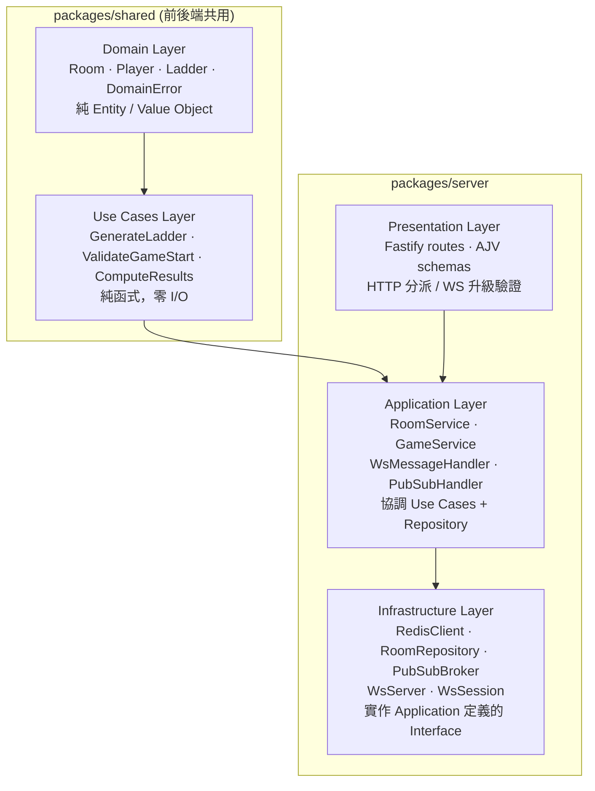
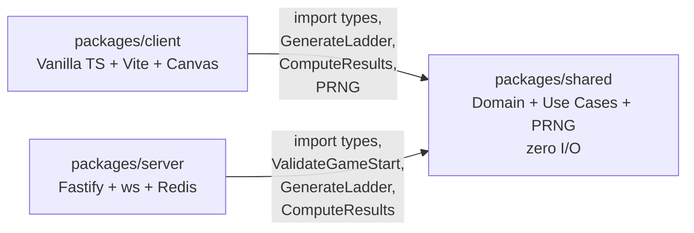
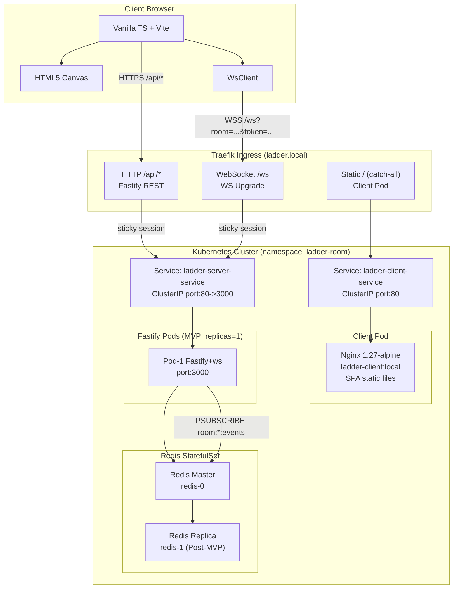
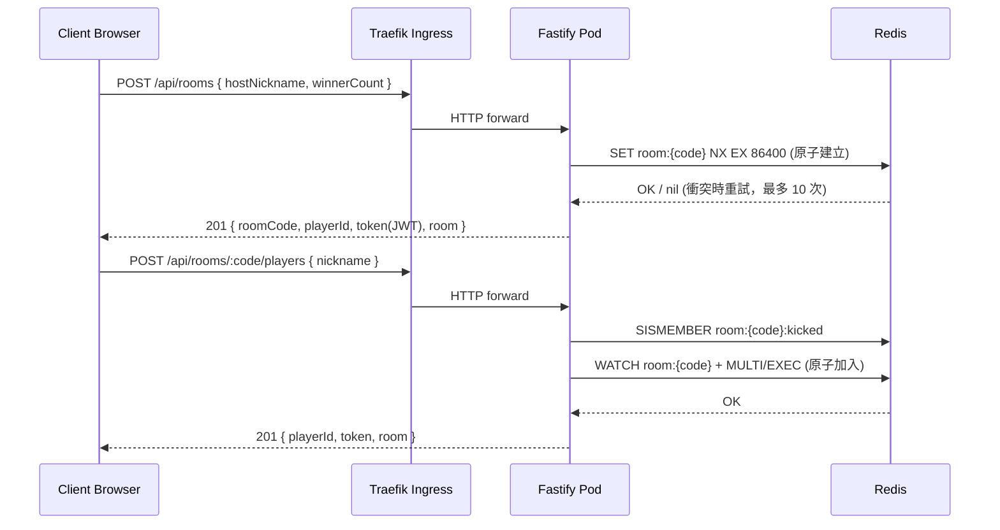
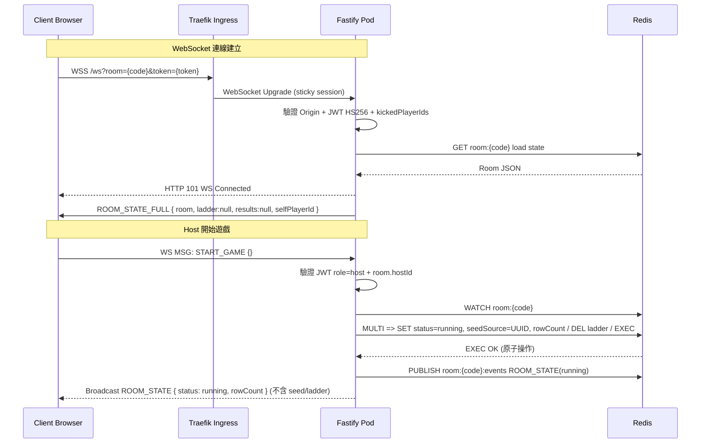
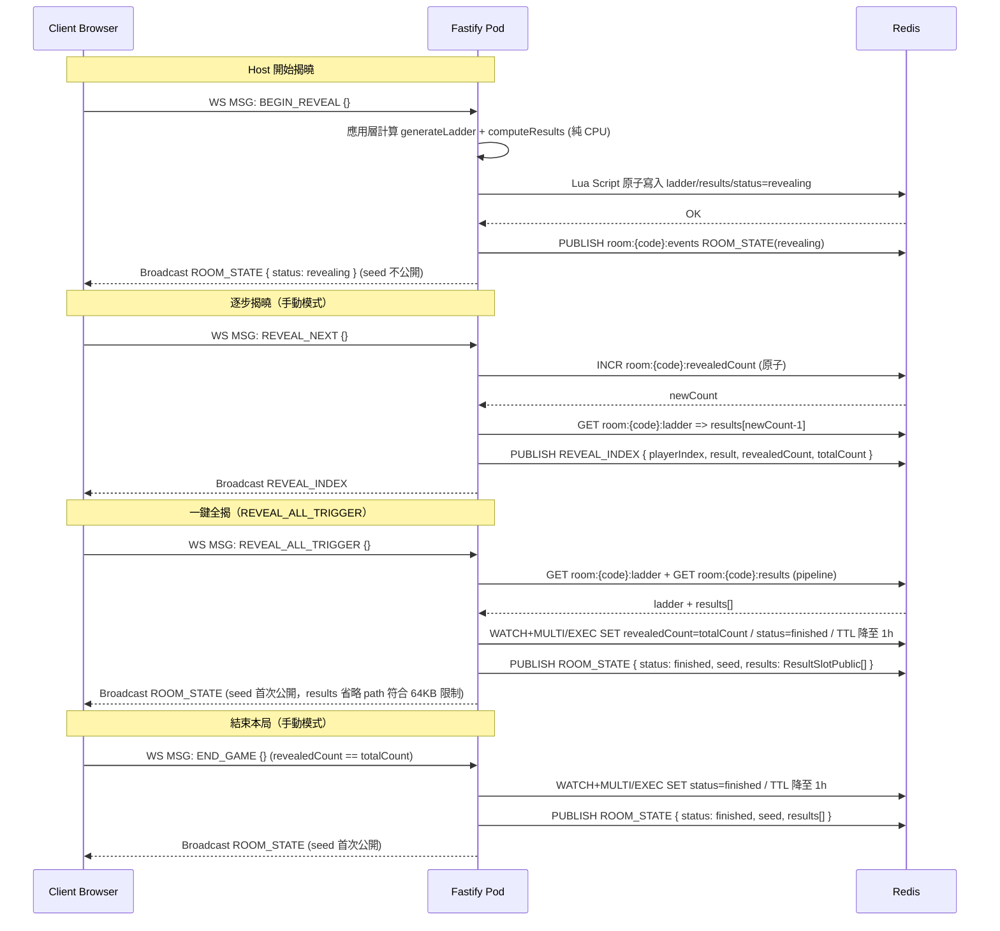
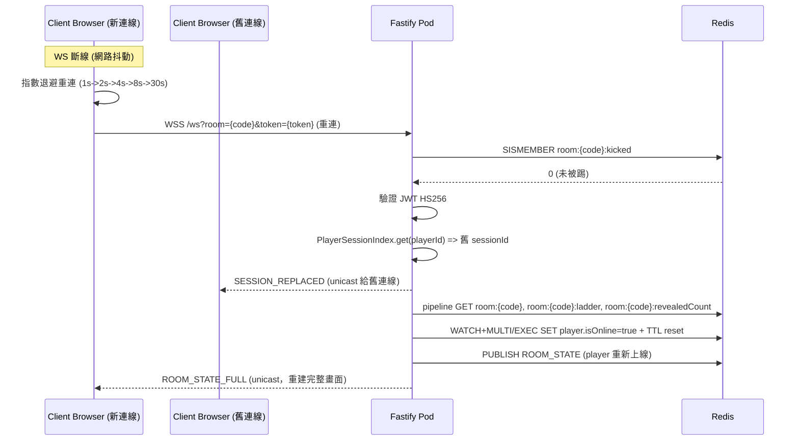
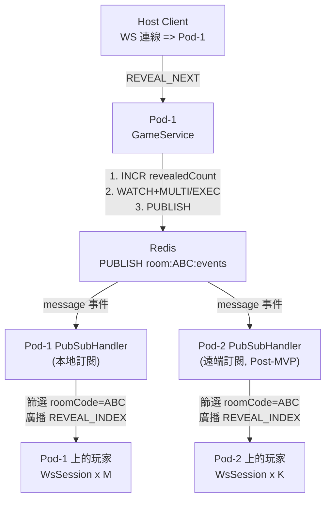
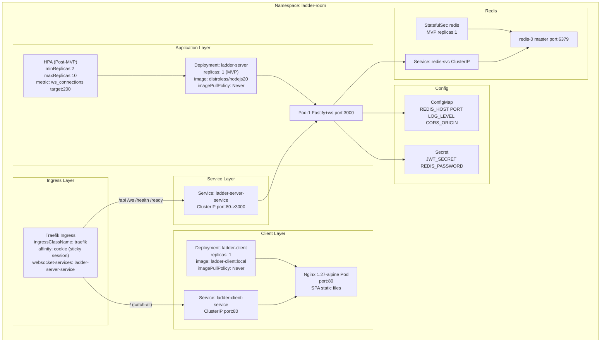
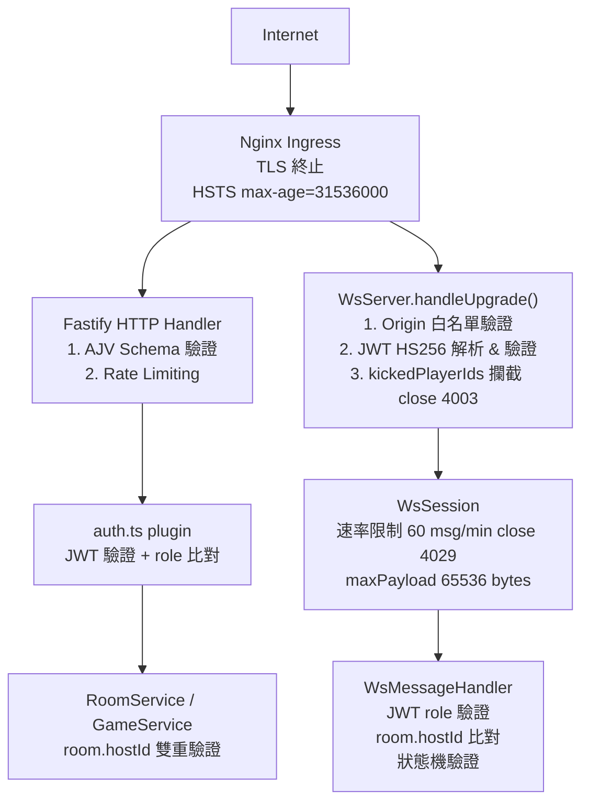

# ARCH — Ladder Room Online Architecture Design Document

> Version: v2.0
> Date: 2026-04-21
> Based on: EDD v2.0, PRD v1.4, legacy-ARCH v1.3

---

## §1 System Overview

Ladder Room Online 採用四層架構：**Client → Nginx Ingress → Fastify/WS Server → Redis**。

| 層級 | 組件 | 說明 |
|------|------|------|
| Client | Vanilla TypeScript + Vite + HTML5 Canvas | 瀏覽器端；HTTPS REST API + WSS 長連接即時事件；Canvas 2D 渲染梯子動畫 |
| Ingress | Traefik（Kubernetes Ingress） | TLS 終止、HTTPS/WSS 路由分派、sticky session、catch-all 路由至 Client Nginx Pod |
| Server | Fastify + ws（Server Pod） | HTTP REST（`/api/*`）及 WebSocket（`/ws`）共用進程；Fastify 處理 REST；ws 原生 WebSocket 處理即時通訊 |
| Storage | Redis（StatefulSet） | 房間狀態持久化（CRUD）、原子操作（WATCH/MULTI/EXEC）、Pub/Sub 跨 Pod 廣播 |

**核心設計決策：**

1. **Vanilla TypeScript + Vite**（無 UI 框架）— 確保最小 JS bundle，無框架冗餘依賴
2. **WebSocket（ws 原生）**（非 Socket.IO）— 雙向通訊，標準協定，無 polling fallback 需求
3. **Redis 作為唯一持久層**（非 in-memory）— Pod 重啟後狀態存活，跨 Pod Pub/Sub 廣播
4. **Clean Architecture + packages/shared**（核心邏輯前後端共用）— 算法一致性可驗證，結果可事後審計
5. **Mulberry32 PRNG + djb2 seed + Fisher-Yates**（確定性 PRNG）— 100% 客戶端結果一致，無舞弊空間
6. **Kubernetes 兩 Pod 架構**（server pod + client nginx pod）— 本機與生產環境統一，前後端分離部署

---

## §2 Component Architecture

### §2.1 Clean Architecture 分層



### §2.2 套件依賴關係



### §2.3 Kubernetes Pod 拓撲



### §2.4 模組職責總覽

| 模組路徑 | 職責 |
|----------|------|
| `container.ts` | 以工廠函式組裝所有依賴（DI 根），回傳完整注入樹，不含業務邏輯 |
| `main.ts` | 啟動 Fastify 伺服器、掛載 WsServer、初始化 PubSubBroker，並設定 graceful shutdown |
| `application/services/RoomService.ts` | 協調房間建立、加入、踢出等業務流程，呼叫 RoomRepository 並發布 ROOM_STATE 廣播 |
| `application/services/GameService.ts` | 協調遊戲開局（START_GAME）、開始揭曉（BEGIN_REVEAL）、逐一揭曉（REVEAL_NEXT）、全揭（REVEAL_ALL_TRIGGER）、結束（END_GAME）、再玩一局（PLAY_AGAIN）流程 |
| `application/handlers/WsMessageHandler.ts` | 解析 ClientEnvelope，執行二次 role + room.hostId 驗證，分派至對應 Service 方法 |
| `application/handlers/PubSubHandler.ts` | 訂閱 Redis `room:*:events` 頻道，將收到的 PubSubMessage 轉發至房間內所有本地 WsSession |
| `infrastructure/redis/RoomRepository.ts` | 實作 IRoomRepository：對 Redis 進行 Room CRUD、TTL 管理；BEGIN_REVEAL 使用 Lua Script |
| `infrastructure/redis/PubSubBroker.ts` | 封裝 Redis PUBLISH 與 SUBSCRIBE，抽象跨 Pod 廣播細節 |
| `infrastructure/websocket/WsServer.ts` | 封裝 ws.Server，處理 HTTP Upgrade、JWT 驗證、踢除攔截（close 4003），建立 WsSession |
| `infrastructure/websocket/WsSession.ts` | 管理單一 WebSocket 連線生命週期：心跳、速率限制（60 msg/min）、斷線計時 |

---

## §3 Sequence Diagrams

### §3.1 Room Creation



### §3.2 Game Start



### §3.3 Path Reveal



### §3.4 WS Reconnection



---

## §4 Data Flow Architecture

### §4.1 狀態機轉換

```
waiting  -->  running  -->  revealing  -->  finished
                                              |
                                         (PLAY_AGAIN)
                                              |
                                           waiting
```

| 狀態轉換 | 觸發事件 | seed 公開 | ladder 公開 |
|---------|---------|-----------|------------|
| waiting → running | START_GAME | 否 | 否（尚未生成） |
| running → revealing | BEGIN_REVEAL | 否 | LadderDataPublic（省略 seed） |
| revealing → finished | END_GAME | 是（首次公開） | LadderData（完整） |
| finished → waiting | PLAY_AGAIN | 清空 | 清空 |

### §4.2 Redis Pub/Sub 廣播流



### §4.3 Pod 本地記憶體（重啟後消失）

| 資料結構 | 說明 |
|---------|------|
| `WsSessionMap`: Map&lt;sessionId, WsSession&gt; | 主索引：ws.WebSocket 物件、playerId、roomCode、rate limit counter |
| `PlayerSessionIndex`: Map&lt;playerId, sessionId&gt; | 副索引：O(1) 查詢同一 playerId 的現有 Session，用於 SESSION_REPLACED、KICK |
| PubSubBroker 訂閱 socket | ioredis.duplicate() 連線，PSUBSCRIBE `room:*:events` |

---

## §5 Deployment Architecture

### §5.1 Kubernetes 部署（namespace: ladder-room）



### §5.2 本機開發環境（Rancher Desktop）

- Rancher Desktop 作為本機 Kubernetes 環境（containerd runtime）
- `/etc/hosts` 設定 `127.0.0.1 ladder.local`
- 一鍵開發腳本：`./scripts/dev-k8s.sh [up|down|restart|logs]`

| 命令 | 動作 |
|------|------|
| `up` | docker build + kubectl apply（server + client image） |
| `down` | kubectl delete + image 清理 |
| `restart` | 重新 build 並 rolling restart |
| `logs` | 串流所有 Pod 日誌 |

### §5.3 Docker Image 策略

| 服務 | Dockerfile | Base Image | 策略 |
|------|-----------|-----------|------|
| Server | `Dockerfile` | Distroless Node.js 20 | 多階段建構；imagePullPolicy: Never（本機） |
| Client | `Dockerfile.client` | Nginx 1.27-alpine | 多階段建構；imagePullPolicy: Never（本機） |

### §5.4 必要環境變數

| 變數 | 說明 | 本地預設值 |
|------|------|-----------|
| `NODE_ENV` | `development` / `production` | `development` |
| `PORT` | Fastify 監聽埠 | `3000` |
| `JWT_SECRET` | HS256 簽章金鑰（≥ 32 bytes） | `dev-secret-do-not-use-in-prod` |
| `REDIS_URL` | ioredis 連線字串 | `redis://localhost:6379` |
| `REDIS_PASSWORD` | Redis 驗證密碼（生產必填，以 k8s Secret 注入） | —（本地不設定） |
| `LOG_LEVEL` | pino log level | `debug` |
| `CORS_ORIGIN` | 允許的 HTTP Origin | `http://localhost:5173` |

---

## §6 Scalability Architecture

### §6.1 MVP：Single Pod

- `replicas: 1`，無 HPA
- Redis 單節點（StatefulSet replicas: 1）
- Pub/Sub 退化為本地呼叫，overhead 可忽略
- 目標：5,000 WS 連線（100 房 x 50 人），單實例 Node.js 可達成

### §6.2 Post-MVP：HPA 多 Pod

有序升級步驟（避免生產中斷）：

1. **先升級 Redis**：StatefulSet `replicas` 從 1 改為 2，等待 replica 同步完成
2. **驗證 Pub/Sub**：確認 `prom-client` 已暴露 `ws_active_connections` Gauge
3. **Deployment 啟用多 Pod**：移除固定 `replicas: 1`，新增 HPA（minReplicas: 2, maxReplicas: 10, metric: ws_active_connections 目標 200）
4. **確認 Ingress affinity**：Traefik sticky session（`traefik.ingress.kubernetes.io/service.sticky.cookie: "true"`）（MVP 已設定）
5. **滾動更新觀察**：客戶端指數退避重連後收到 ROOM_STATE_FULL 恢復狀態
6. **Pub/Sub 驗證**：跨 Pod 廣播正常（k6 模擬多 Pod 場景）

### §6.3 計時器所有權

| 計時器 | 所有者 | Pod 重啟後恢復策略 |
|--------|-------|-----------------|
| auto-reveal interval | `GameService`（靜態 Map `roomCode → NodeJS.Timeout`） | Host 重發 SET_REVEAL_MODE；Client 收到 ROOM_STATE_FULL 且 `autoRevealActive=true` 時自動觸發 |
| host-transfer grace（60s） | `WsSession`（disconnect event 觸發） | Pod 重啟後 timer 消失；下一個到達事件補跑 hostTransferIfNeeded() |

### §6.4 Redis 失敗降級策略（MVP）

Redis 單節點是 MVP SPOF。當 ioredis `error` 事件觸發時：

- `RoomRepository` 所有方法拋出 `SYS_REDIS_ERROR`
- Application 層捕捉後對觸發方 WS Session 發送 `ERROR { code: "SYS_REDIS_ERROR" }` 並保持連線
- 新的 HTTP 加入請求回傳 `503 Service Unavailable`
- `GET /health` 回傳 `{ redis: "error" }` — Kubernetes readinessProbe 立即將 Pod 移出 Service endpoints

---

## §7 Security Architecture



| 安全邊界 | 位置 | 措施 |
|----------|------|------|
| JWT 驗證 | WsServer.handleUpgrade、Fastify auth plugin | `jose` HS256 簽章驗證；exp 檢查（允許 30s clock skew） |
| Host 雙重驗證 | WsMessageHandler、RoomService | JWT `role=host` AND `room.hostId === playerId` |
| roomCode 格式驗證 | AJV Schema | 正規表達式 `[A-HJ-NP-Z2-9]{6}` |
| nickname 注入防護 | AJV Schema | pattern `^[^\x00-\x1F\x7F]{1,20}$` |
| 被踢玩家攔截 | WsServer.handleUpgrade | 檢查 `kickedPlayerIds`，close code 4003 |
| WS Payload 大小 | ws.Server 設定 | `maxPayload: 65536`（64KB） |
| WS 速率限制 | WsSession | 60 msg/min/連線，超限 close 4029 |
| HTTP 速率限制 | Fastify rate-limit plugin | POST /rooms 10/min/IP；JOIN 20/min/IP |
| seed 公開時機 | GameService | seed 在 `status=finished` 前禁止傳送給任何客戶端 |
| CSP | Nginx 回應標頭 | `default-src 'self'; connect-src wss://domain` |
| Redis 訪問 | k8s NetworkPolicy | 僅允許 Pod namespace 訪問 redis-svc |
| Pod 執行環境 | k8s SecurityContext | `runAsNonRoot: true; readOnlyRootFilesystem: true` |

**WebSocket Origin 驗證：** `WsServer.handleUpgrade()` 在 JWT 驗證之前，需檢查 HTTP `Origin` 請求標頭是否符合環境變數 `CORS_ORIGIN`（白名單比對）。瀏覽器 WS 升級不受 CORS policy 自動保護（無 preflight），Origin 比對是防止 CSRF-over-WebSocket 的必要伺服端措施。

**信任邊界說明：**
- Nginx 內網（cluster-internal）到 Fastify 視為可信，TLS 由 Nginx 終止
- Redis 視為可信內部服務（NetworkPolicy 隔離）
- 所有來自 Client（HTTP body、WS payload）視為不可信，須完整驗證

---

*ARCH 版本：v2.0*
*生成時間：2026-04-21（devsop-autodev STEP-09）*
*基於 EDD v2.0 + PRD v1.4 + legacy-ARCH v1.3*
