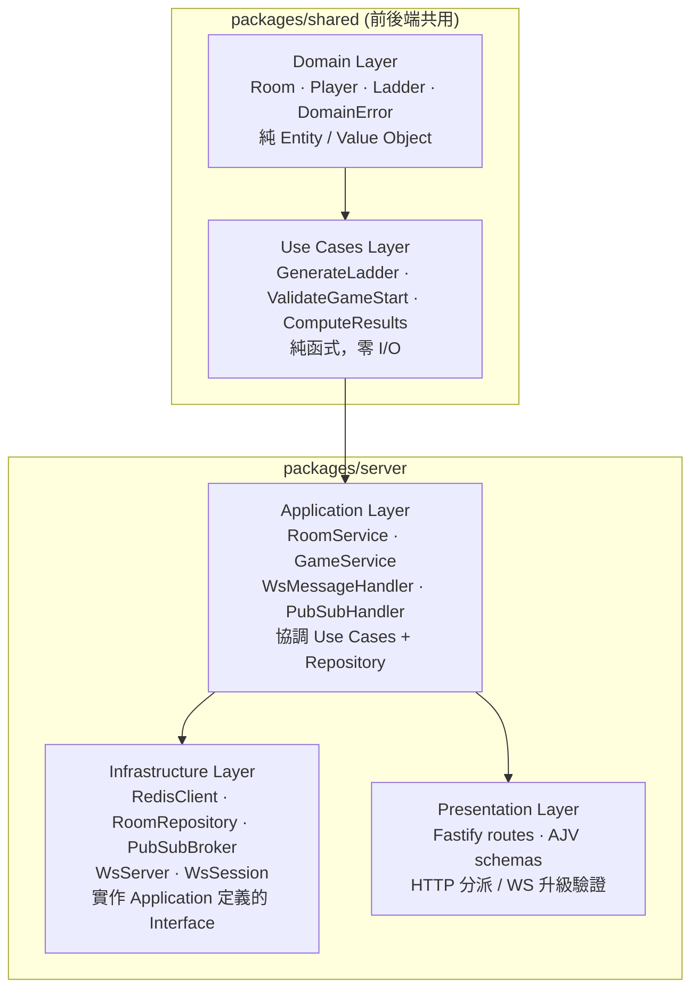
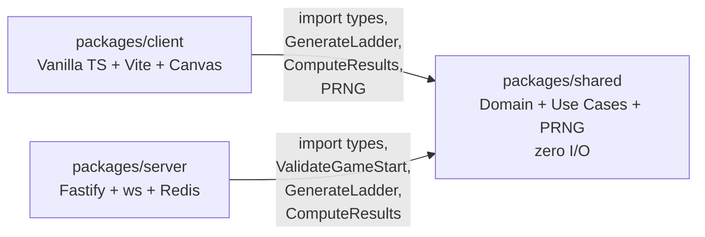
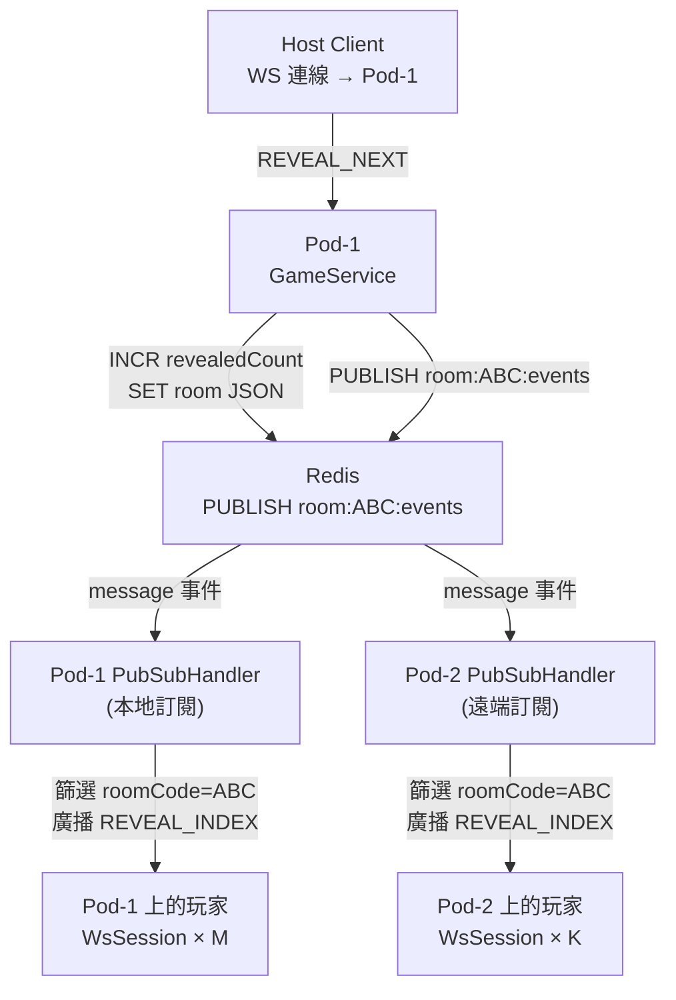
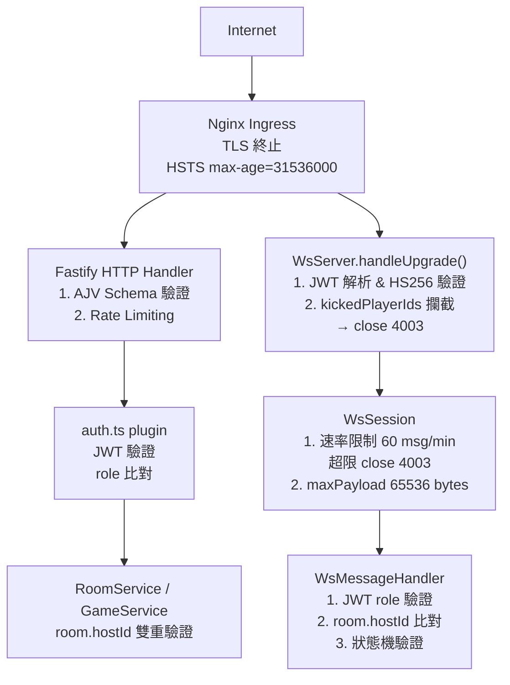

# ARCH — Ladder Room Online Architecture Design Document

> Version: v1.0
> Date: 2026-04-19
> Based on: EDD v1.1, PRD v1.1, PDD v2.1

---

## 1. 架構概覽

Ladder Room Online 採用 **Clean Architecture** 分層設計，核心原則為依賴方向永遠指向內層 (Domain)，外層 (Infrastructure/Presentation) 依賴抽象介面而非具體實作。



| 層級 | 所在套件 | 職責 | 外部依賴 |
|------|----------|------|----------|
| Domain | packages/shared | Entity、Value Object、純業務規則、DomainError | 無 |
| Use Cases | packages/shared | 協調 Domain 物件完成業務流程，回傳純資料結構 | 僅依賴 Domain |
| Application | packages/server/src/application | 呼叫 Use Cases、協調 Repository 介面、發布 WS 事件 | Use Cases + 抽象 Interface |
| Infrastructure | packages/server/src/infrastructure | Redis 實作、WebSocket 封裝、ioredis / jose SDK | 實作 Application Interface |
| Presentation | packages/server/src/presentation | HTTP Route、AJV Schema 驗證、WS 訊息分派 | Application Service |

**黃金法則：** 任何模組只能 `import` 同層或內層的模組；`packages/shared` 不得 `import` 任何 Node.js 內建 I/O 模組（fs、net、http 等）。

---

## 2. 套件依賴關係



### packages/shared — 輸出清單

| 路徑 | 輸出內容 | 限制 |
|------|----------|------|
| `src/domain/entities/` | Room, Player, Ladder, LadderSegment | 純 TypeScript class/interface |
| `src/domain/value-objects/` | RoomCode, RoomStatus | 純函式驗證 |
| `src/domain/errors/` | DomainError 基類及子類 | 無外部依賴 |
| `src/use-cases/` | GenerateLadder, ValidateGameStart, ComputeResults | 純函式，可在瀏覽器執行 |
| `src/prng/` | djb2, createMulberry32, fisherYatesShuffle | 無 `Math.random()` |
| `src/types/index.ts` | 所有共用 TypeScript interface/type | 不含 class 實作 |

**Import 規則：**
- `packages/client` 可 import shared 的全部匯出
- `packages/server` 可 import shared 的全部匯出
- `packages/shared` 不得 import client 或 server 的任何模組
- client 與 server 之間無直接 import（透過 WS/HTTP 通訊）

### packages/server — 輸出清單

`packages/server` 不對外匯出模組；它是可執行進程。`container.ts` 是唯一組裝點。

### packages/client — 輸出清單

`packages/client` 不對外匯出模組；Vite 建構成靜態資產部署至 GitHub Pages。

---

## 3. 模組職責

以下為 `packages/server/src` 各模組的單句職責說明。

| 模組路徑 | 職責 |
|----------|------|
| `container.ts` | 以工廠函式組裝所有依賴（DI 根），回傳完整注入樹，不含任何業務邏輯 |
| `main.ts` | 啟動 Fastify 伺服器、掛載 WsServer、初始化 PubSubBroker，並設定 graceful shutdown |
| `presentation/routes/rooms.ts` | 處理房間 CRUD HTTP 路由（POST /rooms、GET /rooms/:code、POST /rooms/:code/start 等） |
| `presentation/routes/players.ts` | 處理玩家 HTTP 路由（POST /rooms/:code/players、DELETE /rooms/:code/players/:id） |
| `presentation/schemas/` | 定義 Fastify AJV JSON Schema，對所有 HTTP 請求/回應做格式驗證 |
| `application/services/RoomService.ts` | 協調房間建立、加入、踢出等業務流程，呼叫 RoomRepository 並發布 ROOM_STATE 廣播 |
| `application/services/GameService.ts` | 協調遊戲開局、揭示、結束、重置流程，呼叫 GenerateLadder/ComputeResults 並觸發廣播 |
| `application/handlers/WsMessageHandler.ts` | 解析 ClientEnvelope，驗證 JWT role，分派至對應 Service 方法 |
| `application/handlers/PubSubHandler.ts` | 訂閱 Redis `room:*:events` 頻道，將收到的 PubSubMessage 轉發至房間內所有本地 WsSession |
| `infrastructure/redis/RedisClient.ts` | 建立並匯出 ioredis 單例（含連線重試設定） |
| `infrastructure/redis/RoomRepository.ts` | 實作 IRoomRepository：對 Redis 進行 Room 的 CRUD、TTL 管理與 WATCH/MULTI/EXEC 原子操作 |
| `infrastructure/redis/PubSubBroker.ts` | 封裝 Redis PUBLISH 與 SUBSCRIBE，抽象跨 Pod 廣播細節 |
| `infrastructure/websocket/WsServer.ts` | 封裝 `ws.Server`，處理 HTTP Upgrade、JWT 驗證、踢除攔截（close 4003），建立 WsSession |
| `infrastructure/websocket/WsSession.ts` | 管理單一 WebSocket 連線的生命週期：心跳、訊息序列化/反序列化、速率限制（60 msg/min）、斷線計時 |

---

## 4. 主要設計決策

### 4.1 選用原生 `ws` 而非 Socket.IO

**決策：** WebSocket 伺服器採用 `ws` 套件，不使用 Socket.IO。

**理由：**
- Socket.IO 的 polling fallback 在本專案中無需求（所有目標瀏覽器均支援原生 WebSocket）。
- `ws` 的 bundle size 遠小於 Socket.IO，降低 Node.js 冷啟動時間。
- 跨語言客戶端（未來可能有原生 App）直接使用標準 WS 協定無需額外 adapter。

**取捨：** 需要自行實作房間廣播、心跳、重連邏輯；透過 `WsSession` 封裝後複雜度可控。

---

### 4.2 Monorepo 結構

**決策：** 三套件 monorepo（packages/shared、packages/server、packages/client）。

**理由：**
- `packages/shared` 在前後端共用梯子生成算法（PRNG + GenerateLadder + ComputeResults），確保兩端結果可獨立驗證（PRD FR-03-1 可審計性）。
- 單一 CI pipeline 同時執行跨套件類型檢查，及早捕捉介面不相容問題。
- `tsconfig` 互相引用，型別變更即時傳播，無需手動同步 `@types/*`。

**取捨：** npm workspace 增加初始設定複雜度；大型 monorepo 工具（Turborepo）在 MVP 階段略顯過重，以 npm workspaces 即可。

---

### 4.3 Redis Pub/Sub 用於跨 Pod 廣播

**決策：** 每個 Pod SUBSCRIBE `room:*:events`，任一 Pod 觸發事件時 PUBLISH 至對應頻道，所有 Pod 的 PubSubHandler 負責轉發至本地 WsSession。

**理由：**
- Redis 是唯一共享狀態層，Pub/Sub 不需要引入第三方訊息佇列（Kafka、RabbitMQ）即可完成 Pod 間廣播。
- `room:*:events` pattern subscription 確保新房間自動被訂閱，無需手動管理 channel 清單。
- MVP 為單實例，Pub/Sub 退化為本地呼叫，overhead 可忽略。

**取捨：** Redis Pub/Sub 為 at-most-once 語意，訊息不持久化；若 Pod 在 PUBLISH 後崩潰，尚未收到廣播的客戶端需依賴 WS 重連後的 ROOM_STATE_FULL 補齊狀態。

---

### 4.4 不使用 ORM

**決策：** 直接使用 ioredis 命令，Room 以 JSON 字串儲存於單一 Redis key。

**理由：**
- Room 是聚合根（aggregate root），以 JSON 整包讀取/寫入更符合 Redis 用途，避免多次 HGET 組合。
- ORM（Prisma、TypeORM）為 SQL 導向，不適合 Redis 的 key-value 模型。
- 原子操作（WATCH/MULTI/EXEC、INCR）需直接控制 Redis 命令；ORM 抽象層反而降低可控性。

**取捨：** 需手動維護 JSON 序列化/反序列化與型別斷言；`RoomRepository` 單元測試須 mock RedisClient。

---

### 4.5 Constructor Injection + container.ts 工廠

**決策：** 所有依賴透過 constructor 注入，`container.ts` 集中組裝，不引入 DI 框架（InversifyJS 等）。

**理由：**
- 無框架 DI 對 Vitest 測試友善：直接傳入 mock 物件，不需 `@injectable()` 裝飾器或 metadata。
- `container.ts` 作為組裝根（Composition Root），依賴圖一目了然。
- 避免引入 `reflect-metadata` polyfill 增加 bundle 大小。

**取捨：** 大型應用程式中手動組裝容易遺漏依賴；本專案服務數量固定（< 10 個），risk 可控。

---

### 4.6 JWT HS256 (jose) 作為 Session Token

**決策：** WS 升級與 host-only HTTP 操作均使用 JWT HS256（`jose` 套件），payload 為 `{ playerId, roomCode, role: "host" | "player", exp }`。

**理由：**
- 無狀態驗證：每個請求自帶身份資訊，不需額外 Redis 查詢即可驗證 role。
- `jose` 支援 Web Crypto API，瀏覽器端未來可直接驗證（可審計）。
- HS256 在 shared secret 模型下實作簡單，適合 MVP 單服務架構。

**取捨：** Token 一旦簽發無法提前撤銷（除非加黑名單）；host 轉移後舊 host token 在 exp 前仍有效，須以 `room.hostId` 做雙重驗證。

---

### 4.7 MVP 單實例，HPA 為 Post-MVP

**決策：** MVP 部署單一 Node.js 實例，不啟用 Kubernetes HPA 與多 Pod（PRD Out-of-Scope #9）。

**理由：**
- PRD NFR-02 目標 5,000 WS 連線（100 房 × 50 人）在單實例 Node.js 上可達成。
- 避免 MVP 過早投入 sticky session、Nginx affinity、Redis Sentinel 等複雜度。
- 架構已預留多 Pod 設計（Pub/Sub、RoomRepository 無本地狀態）：Post-MVP 啟用 HPA 只需改 k8s manifest。

**取捨：** 單實例無高可用；Pod 重啟期間所有 WS 連線中斷，客戶端依賴指數退避重連恢復。

---

## 5. 依賴注入 (DI) 設計

### 5.1 Constructor Injection 模式

所有 Service、Handler、Repository 的依賴均透過 constructor 參數傳入，類別內部不直接 `new` 依賴物件：

```typescript
// 正確：依賴從外部注入
class GameService {
  constructor(
    private readonly roomRepo: IRoomRepository,
    private readonly pubSub: IPubSubBroker,
  ) {}
}

// 錯誤：內部直接建立依賴
class GameService {
  private roomRepo = new RoomRepository(redis); // 禁止
}
```

### 5.2 container.ts 工廠結構

```
container.ts
  ├── redisClient    = new RedisClient(config.REDIS_URL)
  ├── roomRepo       = new RoomRepository(redisClient)
  ├── pubSubBroker   = new PubSubBroker(redisClient)
  ├── roomService    = new RoomService(roomRepo, pubSubBroker)
  ├── gameService    = new GameService(roomRepo, pubSubBroker)
  ├── wsMessageHandler = new WsMessageHandler(roomService, gameService)
  ├── pubSubHandler  = new PubSubHandler(pubSubBroker, wsSessionMap)
  └── wsServer       = new WsServer(config, wsMessageHandler, wsSessionMap)
```

`container.ts` 回傳 `{ fastify, wsServer, pubSubHandler }`，`main.ts` 呼叫後啟動伺服器。

### 5.3 測試時替換 Test Double

```typescript
// 單元測試：直接傳入 mock，不需要 DI 框架
const mockRepo: IRoomRepository = {
  findByCode: vi.fn().mockResolvedValue(room),
  save: vi.fn().mockResolvedValue(undefined),
  // ...
};
const svc = new GameService(mockRepo, mockPubSub);
```

定義 `IRoomRepository`、`IPubSubBroker` 介面於 `application/` 層，`infrastructure/` 層實作；測試只依賴介面，不啟動真實 Redis。整合測試則使用 `testcontainers` 啟動真實 Redis 容器。

---

## 6. 狀態管理策略

### 6.1 Redis 為唯一真相來源

所有房間狀態（Room JSON）以 `room:{code}` key 儲存於 Redis，Pod 本地記憶體不快取業務狀態。

```
Redis Keys:
  room:{code}              → Room JSON（含 players、ladder、results、kickedPlayerIds）
  room:{code}:revealedCount → Integer（INCR 原子遞增，避免 race condition）

Key TTL:
  waiting 房間   → 24h（EXPIRE，玩家活動時 EXPIRE 重置）
  finished 房間  → 1h（REVEAL_ALL 觸發後 EXPIRE 更新）
  最後一人斷線   → 5 分鐘（close event 原子設定 EXPIRE 300）
```

### 6.2 記憶體中保存的內容

```
Pod 本地記憶體（重啟後消失）：
  WsSessionMap: Map<sessionId, WsSession>
    - 索引：sessionId（UUID，連線時生成）
    - 內容：ws.WebSocket 物件、playerId、roomCode、rate limit counter
    - 生命週期：與 WS 連線共存亡

  PubSubBroker 的訂閱 socket（ioredis duplicate connection）
```

**設計決策：** WsSessionMap 存記憶體而非 Redis，因 WebSocket socket 物件本身無法序列化；廣播時 PubSubHandler 依 roomCode 篩選本地 WsSession 集合即可。

### 6.3 一致性保證

| 操作 | 一致性機制 |
|------|-----------|
| START_GAME | WATCH + MULTI/EXEC；EXEC null → 重試最多 3 次 |
| RESET_ROOM | WATCH + MULTI/EXEC 原子更新整包 Room JSON |
| revealedCount 遞增 | INCR 原子操作（避免兩 Pod 同時揭示同一 index） |
| 玩家加入/離線 | 以 Room JSON 整包 SET，配合 WATCH 防止 lost update |

---

## 7. 跨 Pod 廣播機制

### 7.1 Pub/Sub 訊息流



### 7.2 PubSubMessage 介面

```typescript
interface PubSubMessage {
  readonly roomCode: string;
  readonly event: ServerEnvelope<unknown>;  // WsEventType 事件
  readonly excludeSessionId?: string;       // 排除觸發方（避免重複收訊）
}
```

### 7.3 訂閱拓撲

- 每個 Pod 啟動時建立一條獨立的 ioredis 連線（`redis.duplicate()`）並 PSUBSCRIBE `room:*:events`
- Pattern subscription 確保新建房間頻道無需手動 SUBSCRIBE
- MVP 單 Pod 時 PUBLISH 觸發自身訂閱，行為與多 Pod 完全一致（零差異）
- PUBLISH 失敗時進行指數退避重試（100ms / 200ms / 400ms）；三次失敗後觸發 critical alert

---

## 8. 安全邊界



| 安全邊界 | 位置 | 措施 |
|----------|------|------|
| JWT 驗證 | WsServer.handleUpgrade、Fastify auth plugin | `jose` HS256 簽章驗證；exp 檢查 |
| Host 雙重驗證 | WsMessageHandler、RoomService | JWT `role=host` AND `room.hostId === playerId`，防 token 盜用 |
| roomCode 格式驗證 | AJV Schema（presentation/schemas） | 正規表達式 `[A-HJ-NP-Z2-9]{6}` |
| nickname 注入防護 | AJV Schema | pattern `^[^\x00-\x1F\x7F]{1,20}$` |
| 被踢玩家攔截 | WsServer.handleUpgrade（Upgrade 階段） | 檢查 `kickedPlayerIds`，close code 4003 |
| WS Payload 大小 | ws.Server 設定 | `maxPayload: 65536`（64KB） |
| WS 速率限制 | WsSession | 60 msg/min/連線，超限 close 4029 |
| HTTP 速率限制 | Fastify rate-limit plugin | POST /rooms 10/min/IP；JOIN 20/min/IP |
| 公開 API 最小曝露 | RoomSummaryPayload | GET /rooms/:code 不含 hostId、kickedPlayerIds |
| CSP | Nginx 回應標頭 | `default-src 'self'; connect-src wss://domain` |
| Redis 訪問 | k8s NetworkPolicy | 僅允許 Pod namespace 訪問 redis-svc |
| Pod 執行環境 | k8s SecurityContext | `runAsNonRoot: true; readOnlyRootFilesystem: true` |

**信任邊界說明：**
- Nginx 內網（cluster-internal）到 Fastify 視為可信，TLS 由 Nginx 終止
- Redis 視為可信內部服務（NetworkPolicy 隔離）
- 所有來自 Client（HTTP body、WS payload）視為不可信，須完整驗證

---

## 9. 開發環境 vs 生產環境

### 9.1 必要環境變數

| 變數 | 說明 | 本地預設值 |
|------|------|-----------|
| `NODE_ENV` | `development` / `production` | `development` |
| `PORT` | Fastify 監聽埠 | `3000` |
| `JWT_SECRET` | HS256 簽章金鑰（≥ 32 bytes）| `dev-secret-do-not-use-in-prod` |
| `REDIS_URL` | ioredis 連線字串 | `redis://localhost:6379` |
| `LOG_LEVEL` | pino log level | `debug` |
| `CORS_ORIGIN` | 允許的 HTTP Origin | `http://localhost:5173` |

### 9.2 本地開發（無 k8s）

使用 `docker-compose` 啟動 Redis：

```yaml
# docker-compose.dev.yml
services:
  redis:
    image: redis:7-alpine
    ports: ["6379:6379"]
```

啟動步驟：
1. `docker compose -f docker-compose.dev.yml up -d`
2. `npm run dev --workspace=packages/server` （tsx watch mode）
3. `npm run dev --workspace=packages/client` （Vite dev server）

本地開發時 Pub/Sub 退化為單 Pod 自訂閱，行為與生產一致。

### 9.3 生產環境 (Kubernetes)

| 元件 | 生產設定 | 本地差異 |
|------|----------|---------|
| TLS | Nginx Ingress cert-manager Let's Encrypt | 無 TLS |
| Redis | StatefulSet 兩副本（master + replica）| 單節點 |
| 水平擴展 | HPA（Post-MVP）；MVP 固定 replicas: 1 | 無 |
| Sticky Session | Nginx `nginx.ingress.kubernetes.io/affinity: cookie` | 無需要 |
| Secrets | k8s Secret（JWT_SECRET、REDIS_PASSWORD）| `.env` 檔案 |
| Log | pino JSON → fluent-bit DaemonSet → 集中 log 系統 | 終端機輸出 |
| 監控 | Prometheus + `/metrics` port 8080 | 無 |
| Image | Distroless Node.js 20（distroless/nodejs20-debian12） | Node.js 直接執行 |

**生產與本地的關鍵差異：**
- 生產使用 `REDIS_PASSWORD`（ioredis auth 選項），本地預設無密碼
- 生產 `NODE_ENV=production` 時 pino 輸出純 JSON（無 pretty print）
- 生產 Docker image 使用 multi-stage build，最終 image 僅含 dist/ 與 node_modules（production only）

---

## 10. 擴展路徑

### 10.1 新增 WebSocket 事件類型

1. **Client → Server 新事件：**
   - 在 `packages/shared/src/types/index.ts` 的 `WsMsgType` union 加入新類型
   - 在 `WsMessageHandler.ts` 的 `switch(envelope.type)` 加入新 case
   - 呼叫對應 Service 方法；若需要新業務邏輯則在 `RoomService` 或 `GameService` 新增 method

2. **Server → Client 新事件：**
   - 在 `WsEventType` union 加入新類型
   - 定義對應的 Payload interface（如 `XxxPayload`）
   - 在 Service 層呼叫 `pubSubBroker.publish()` 觸發廣播

3. **前端：** 在 `packages/client/src/ws/EventBus.ts` 訂閱新事件類型

### 10.2 新增 HTTP 路由

1. 在 `packages/shared/src/types/index.ts` 定義 Request/Response DTO interface
2. 在 `presentation/schemas/` 新增 AJV JSON Schema 檔案
3. 在 `presentation/routes/` 新增或擴充 route 檔案，注入對應 Service
4. 在 `container.ts` 確認 Service 依賴已組裝
5. 在 `main.ts` 的 `fastify.register()` 掛載新路由

### 10.3 新增 Use Case

1. 在 `packages/shared/src/use-cases/` 新增純函式（零 I/O）
2. 撰寫對應單元測試（Vitest），確保 `shared` 覆蓋率 ≥ 90%
3. 在 `GameService` 或 `RoomService` 呼叫新 Use Case
4. Use Case 若需新的 Domain 規則，先在 `packages/shared/src/domain/` 新增 Entity/Value Object

### 10.4 新增 Repository / 外部服務

1. 在 `application/` 層定義新介面（如 `INotificationService`）
2. 在 `infrastructure/` 層實作介面
3. 在 `container.ts` 組裝並注入至依賴的 Service
4. 測試時使用 mock 實作，不引入真實外部服務

### 10.5 啟用 HPA（Post-MVP）

1. 在 `k8s/` manifest 將 `replicas: 1` 改為 `replicas: 2`，加入 HPA 資源定義
2. 確認 `prom-client` 已暴露 `ws_active_connections` Gauge（main.ts 已預留）
3. 確認 Nginx Ingress 已設定 `nginx.ingress.kubernetes.io/affinity: cookie`
4. 啟用 Redis replica（StatefulSet replicas: 2 已預留於 k8s/redis.yaml）
5. Pub/Sub 架構無需修改，多 Pod 廣播自動生效

---

*ARCH 版本：v1.0*
*生成時間：2026-04-19*
*基於 EDD v1.1 | PRD v1.1 | PDD v2.1*
