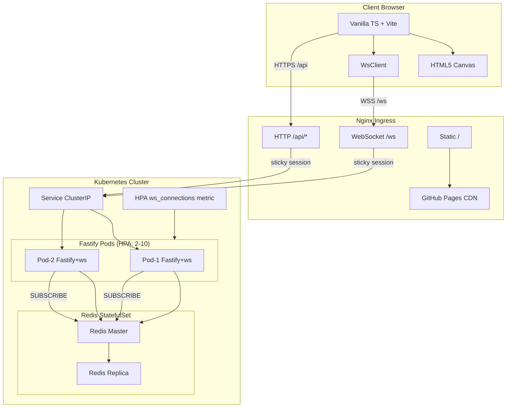
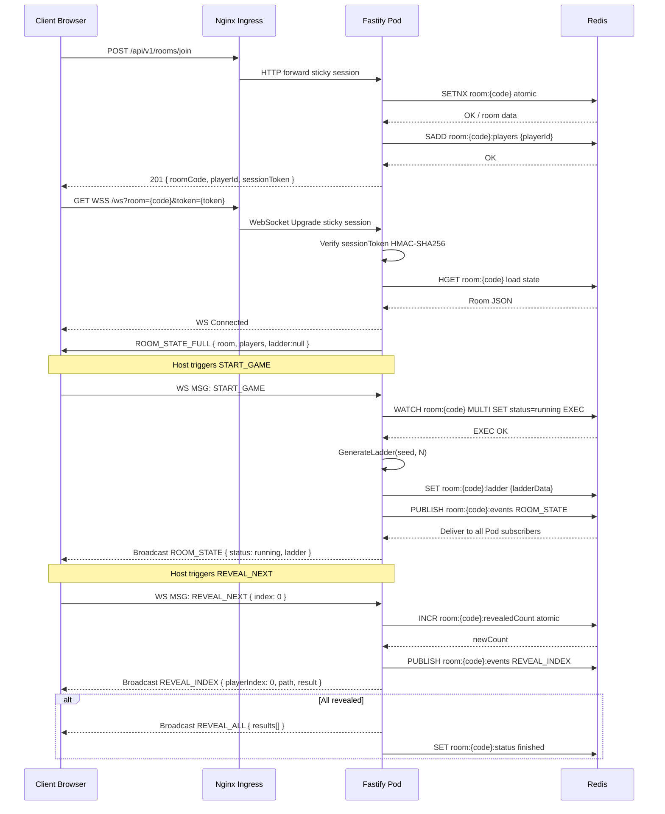
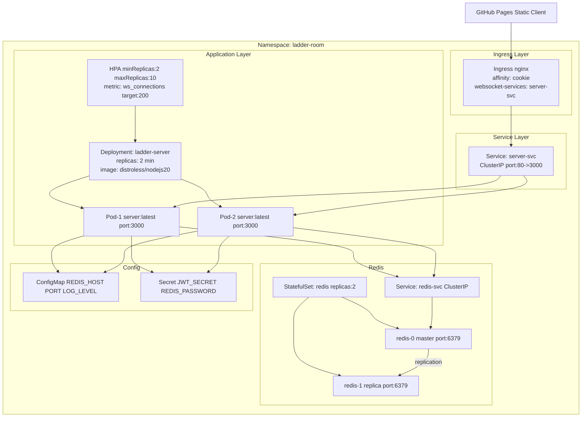
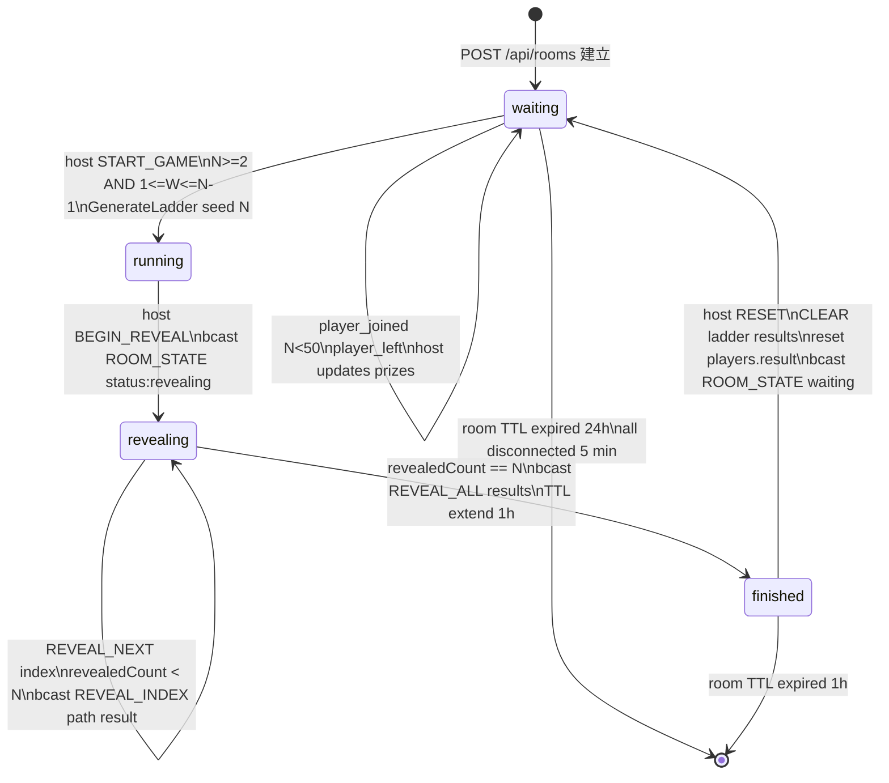
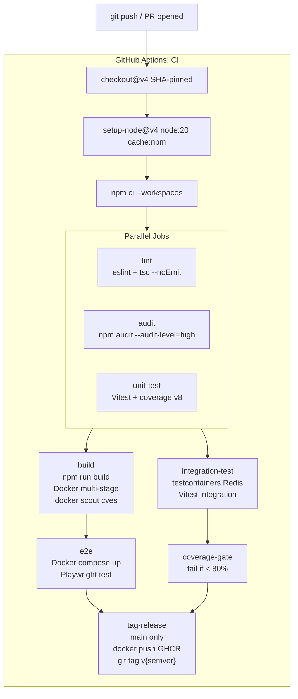
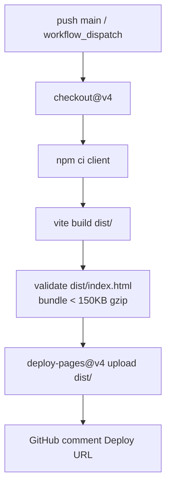

# EDD — Ladder Room Online

## 1. 系統概覽

Ladder Room Online 是一款基於 HTML5 Canvas 的多人線上爬樓梯抽獎系統，採用 WebSocket 長連接驅動即時遊戲狀態同步，支援最多 50 名玩家共享同一房間。後端以 Fastify 處理 HTTP REST 操作，ws 原生 WebSocket 處理即時通訊，Redis 同時承擔分散式狀態鎖（原子操作）、房間資料持久化與跨 Pod Pub/Sub 廣播的角色；前端以 Vanilla TypeScript + Vite 建構，透過 HTML5 Canvas 逐段繪製梯子揭示動畫，全程無任何 UI 框架依賴，確保最小 JS bundle。

整體系統遵循 Clean Architecture 分層原則，核心遊戲邏輯（PRNG、狀態機、梯子生成）封裝於 `packages/shared` 並在前後端共用，保證演算法一致性可驗證；部署層透過 Kubernetes HPA 依 WebSocket 連線數自動水平擴展後端 Pod，Nginx Ingress 做 sticky session 確保同一房間玩家路由至同一 Pod，Redis 作為唯一共享狀態層解耦 Pod 間狀態依賴。

---

## 2. 架構設計

### 2.1 Clean Architecture（SOLID + 分層 + DI）

```
ladder-room-online/                       # monorepo root
├── packages/
│   ├── shared/                           # 前後端共用純邏輯（零 I/O）
│   │   ├── src/
│   │   │   ├── domain/
│   │   │   │   ├── entities/
│   │   │   │   │   ├── Room.ts           # Room aggregate root
│   │   │   │   │   ├── Player.ts         # Player value object
│   │   │   │   │   └── Ladder.ts         # Ladder + Segment entities
│   │   │   │   ├── value-objects/
│   │   │   │   │   ├── RoomCode.ts       # 6-char code validation
│   │   │   │   │   └── RoomStatus.ts     # enum: waiting/running/revealing/finished
│   │   │   │   └── errors/
│   │   │   │       └── DomainError.ts    # base typed error
│   │   │   ├── use-cases/
│   │   │   │   ├── GenerateLadder.ts     # 梯子生成 use case（pure）
│   │   │   │   ├── ValidateGameStart.ts  # N>=2, 1<=W<=N-1 驗證
│   │   │   │   └── ComputeResults.ts     # 路徑追蹤 -> ResultSlot[]
│   │   │   ├── prng/
│   │   │   │   ├── mulberry32.ts         # PRNG 實作
│   │   │   │   ├── djb2.ts               # seed hash
│   │   │   │   └── fisherYates.ts        # 洗牌
│   │   │   └── types/
│   │   │       └── index.ts              # 共用 TypeScript interface
│   │   └── package.json
│   │
│   ├── server/                           # Fastify 後端
│   │   ├── src/
│   │   │   ├── infrastructure/
│   │   │   │   ├── redis/
│   │   │   │   │   ├── RedisClient.ts    # ioredis singleton
│   │   │   │   │   ├── RoomRepository.ts # Redis CRUD
│   │   │   │   │   └── PubSubBroker.ts   # Redis Pub/Sub
│   │   │   │   └── websocket/
│   │   │   │       ├── WsServer.ts       # ws Server 封裝
│   │   │   │       └── WsSession.ts      # 單一連線 session 管理
│   │   │   ├── application/
│   │   │   │   ├── services/
│   │   │   │   │   ├── RoomService.ts    # 業務邏輯協調
│   │   │   │   │   └── GameService.ts    # 開局/揭示/結束流程
│   │   │   │   └── handlers/
│   │   │   │       ├── WsMessageHandler.ts
│   │   │   │       └── PubSubHandler.ts
│   │   │   ├── presentation/
│   │   │   │   ├── routes/
│   │   │   │   │   ├── rooms.ts
│   │   │   │   │   └── players.ts
│   │   │   │   ├── schemas/
│   │   │   │   └── plugins/
│   │   │   │       ├── auth.ts
│   │   │   │       └── cors.ts
│   │   │   ├── container.ts              # DI 容器
│   │   │   └── main.ts
│   │   ├── Dockerfile
│   │   └── package.json
│   │
│   └── client/                           # Vanilla TS + Vite
│       ├── src/
│       │   ├── canvas/
│       │   │   ├── LadderRenderer.ts
│       │   │   └── AnimationController.ts
│       │   ├── ws/
│       │   │   ├── WsClient.ts
│       │   │   └── EventBus.ts
│       │   ├── state/
│       │   │   └── RoomStore.ts
│       │   ├── ui/
│       │   │   └── components/
│       │   └── main.ts
│       ├── index.html
│       └── package.json
│
├── k8s/
├── .github/workflows/
│   ├── ci.yaml
│   └── pages.yaml
└── package.json                          # workspace root
```

**分層職責：**

| 層級 | 職責 | 依賴方向 |
|------|------|----------|
| Domain (shared) | Entity、Value Object、純業務規則、DomainError | 無外部依賴 |
| Use Cases (shared) | 協調 Domain 物件完成業務流程，返回純資料結構 | 僅依賴 Domain |
| Application (server) | 呼叫 Use Cases、協調 Repository、發布 WS 事件 | 依賴 Use Cases + Interfaces |
| Infrastructure (server) | Redis 實作、WebSocket 封裝、外部 SDK | 實作 Application 定義的 Interface |
| Presentation (server) | HTTP Route、Schema 驗證、WS 訊息分派 | 依賴 Application Service |

**DI 策略：** constructor injection，`container.ts` 以工廠函式組裝所有依賴。測試時直接傳入 mock 實作，不需要 DI 框架即可達成可測試性。

---

### 2.2 系統架構圖



---

### 2.3 資料流圖（加入房間流程）



---

### 2.4 部署架構圖



---

### 2.5 房間狀態機圖



---

## 3. 資料模型設計

```typescript
// packages/shared/src/types/index.ts

export type RoomStatus = "waiting" | "running" | "revealing" | "finished";

export type WsEventType =
  | "ROOM_STATE" | "ROOM_STATE_FULL" | "REVEAL_INDEX" | "REVEAL_ALL"
  | "PLAYER_KICKED" | "SESSION_REPLACED" | "ERROR";

export type WsMsgType =
  | "START_GAME" | "BEGIN_REVEAL" | "REVEAL_NEXT"
  | "RESET_ROOM" | "KICK_PLAYER" | "PING";

export interface Player {
  readonly id: string;           // UUID v4
  readonly nickname: string;     // 1-20 chars, sanitized
  readonly colorIndex: number;   // 0-49
  readonly isHost: boolean;
  isOnline: boolean;
  readonly joinedAt: number;     // Unix ms
  result?: string | null;        // filled after reveal
}

export interface LadderSegment {
  readonly row: number;    // 0-indexed
  readonly col: number;    // col <-> col+1 has a rung
}

export interface LadderData {
  readonly seed: number;          // Mulberry32 seed (djb2 hash)
  readonly rowCount: number;      // clamp(N*3, 20, 60)
  readonly colCount: number;      // = N (all players incl. offline)
  readonly segments: readonly LadderSegment[];
}

export interface PathStep {
  readonly row: number;
  readonly col: number;
  readonly direction: "down" | "left" | "right";
}

export interface ResultSlot {
  readonly playerIndex: number;
  readonly startCol: number;
  readonly endCol: number;
  readonly prize: string;
  readonly path: readonly PathStep[];
}

export interface Room {
  readonly code: string;           // 6-char room code
  status: RoomStatus;
  readonly hostId: string;
  players: readonly Player[];      // max 50, incl. offline
  prizes: readonly string[];       // W prizes (1 <= W <= N-1)
  ladder: LadderData | null;
  results: readonly ResultSlot[] | null;
  revealedCount: number;
  readonly createdAt: number;
  updatedAt: number;
}

// WS Envelope
export interface WsEnvelope<T = unknown> {
  readonly type: WsEventType | WsMsgType;
  readonly ts: number;
  readonly payload: T;
}

export interface RoomStatePayload {
  readonly room: Omit<Room, "ladder" | "results">;
  readonly onlineCount: number;
}

export interface RoomStateFullPayload extends RoomStatePayload {
  readonly ladder: LadderData | null;
  readonly results: readonly ResultSlot[] | null;
  readonly selfPlayerId: string;
}

export interface RevealIndexPayload {
  readonly playerIndex: number;
  readonly result: ResultSlot;
  readonly revealedCount: number;
  readonly totalCount: number;
}

export interface ErrorPayload {
  readonly code: string;
  readonly message: string;
  readonly requestId?: string;
}

// HTTP DTOs
export interface CreateRoomRequest {
  readonly hostNickname: string;
  readonly prizes: string[];
}

export interface CreateRoomResponse {
  readonly roomCode: string;
  readonly playerId: string;
  readonly sessionToken: string;
}

export interface JoinRoomRequest {
  readonly nickname: string;
}

export interface JoinRoomResponse {
  readonly playerId: string;
  readonly sessionToken: string;
  readonly colorIndex: number;
}
```

---

## 4. API 設計（HTTP）

所有端點掛載於 `/api/v1`，統一 envelope：
`{ "success": boolean, "data": T | null, "error": { "code": string, "message": string } | null }`

| Method | Path | 描述 | 成功 | 錯誤 |
|--------|------|------|------|------|
| `POST` | `/api/v1/rooms` | 建立房間 | `201 CreateRoomResponse` | `400 INVALID_PRIZES`, `429 RATE_LIMIT` |
| `GET` | `/api/v1/rooms/:code` | 查詢房間摘要 | `200 RoomStatePayload` | `404 ROOM_NOT_FOUND` |
| `POST` | `/api/v1/rooms/:code/players` | 加入房間 | `201 JoinRoomResponse` | `404/409/410` |
| `DELETE` | `/api/v1/rooms/:code/players/:id` | 踢出玩家（需 host token） | `204` | `403/404` |
| `POST` | `/api/v1/rooms/:code/start` | 開始遊戲（需 host token） | `200 { ladder }` | `400/409` |
| `POST` | `/api/v1/rooms/:code/reset` | 重設房間（需 host token） | `200` | `403/409` |
| `GET` | `/api/v1/health` | 健康檢查 | `200 { redis: ok, wsCount }` | — |

**Rate Limiting：**
- POST /rooms：10 req/min/IP
- POST /rooms/:code/players：20 req/min/IP
- 其他：100 req/min/IP

---

## 5. WebSocket 事件設計

**連線端點：** `WSS /ws?room={code}&token={sessionToken}`

Server Upgrade 階段驗證 token，失敗直接 403。

### Server → Client

```typescript
// ROOM_STATE — 房間狀態摘要（玩家加入/離線/踢出）
{ type: "ROOM_STATE", ts, payload: RoomStatePayload }

// ROOM_STATE_FULL — 新連線時發給該連線（含 ladder + results + selfPlayerId）
{ type: "ROOM_STATE_FULL", ts, payload: RoomStateFullPayload }

// REVEAL_INDEX — 單一玩家揭示
{ type: "REVEAL_INDEX", ts, payload: RevealIndexPayload }

// REVEAL_ALL — 全部揭示完畢
{ type: "REVEAL_ALL", ts, payload: { results: ResultSlot[] } }

// PLAYER_KICKED — 玩家被踢
{ type: "PLAYER_KICKED", ts, payload: { kickedPlayerId: string, reason: string } }

// SESSION_REPLACED — 同一 playerId 從新裝置登入
{ type: "SESSION_REPLACED", ts, payload: { message: string } }

// ERROR — 操作失敗（僅發給觸發方）
{ type: "ERROR", ts, payload: ErrorPayload }
```

### Client → Server

```typescript
{ type: "START_GAME", ts, payload: {} }
{ type: "BEGIN_REVEAL", ts, payload: {} }
{ type: "REVEAL_NEXT", ts, payload: { index: number } }
{ type: "RESET_ROOM", ts, payload: {} }
{ type: "KICK_PLAYER", ts, payload: { targetPlayerId: string } }
{ type: "PING", ts, payload: {} }
```

### Pub/Sub 跨 Pod 廣播

```typescript
interface PubSubMessage {
  readonly roomCode: string;
  readonly event: WsEnvelope<unknown>;
  readonly excludeSessionId?: string;
}
```

每 Pod SUBSCRIBE `room:*:events`；任一 Pod PUBLISH → 所有 Pod 對同房間 WsSession 廣播。

---

## 6. Security 設計（OWASP Top 10）

| OWASP | 威脅 | 對應措施 |
|-------|------|---------|
| A01 Broken Access Control | 非 host 操作 | sessionToken HMAC-SHA256 驗證，包含 { playerId, roomCode, role, exp } |
| A02 Cryptographic Failures | 弱加密 | Token HS256，Redis TLS，Nginx HTTPS + HSTS max-age=31536000 |
| A03 Injection | 輸入注入 | Fastify JSON Schema AJV 驗證；nickname DOMPurify sanitize；roomCode 正則 `[A-HJ-NP-Z2-9]{6}` |
| A05 Security Misconfiguration | 過度曝露 | 隱藏 Server header；CSP `default-src 'self' connect-src wss://domain`；k8s runAsNonRoot readOnlyRootFilesystem |
| A06 Vulnerable Components | 舊依賴 | npm audit --audit-level=high 阻斷 PR；Dependabot 週更新；Distroless image 月重建 |
| A07 Authentication Failures | 重複連線 | 同 playerId 新連線觸發 SESSION_REPLACED，舊連線強制關閉 |
| A08 Software Integrity | Supply chain | CI Docker image SHA256 digest 引用；npm ci lockfile；actions pinned SHA |
| A09 Logging Failures | 無可觀測性 | pino 記錄所有 HTTP + WS 事件；fluent-bit DaemonSet 集中 log；5xx > 1% 觸發告警 |
| A10 SSRF | 外部 HTTP 請求 | 後端零 outbound HTTP；connect-src CSP 限制瀏覽器端 |

---

## 7. PRNG 算法設計

### 7.1 djb2 Hash

```typescript
// packages/shared/src/prng/djb2.ts
export function djb2(str: string): number {
  let hash = 5381;
  for (let i = 0; i < str.length; i++) {
    hash = (Math.imul(hash, 33) + str.charCodeAt(i)) | 0;
  }
  return hash >>> 0; // unsigned 32-bit
}
// seed 來源: djb2(`${roomCode}:${timestamp}`)
```

### 7.2 Mulberry32

```typescript
// packages/shared/src/prng/mulberry32.ts
export function createMulberry32(seed: number): () => number {
  let s = seed >>> 0;
  return function next(): number {
    s += 0x6d2b79f5;
    let t = Math.imul(s ^ (s >>> 15), 1 | s);
    t ^= t + Math.imul(t ^ (t >>> 7), 61 | t);
    return ((t ^ (t >>> 14)) >>> 0) / 0x100000000;
  };
}
```

### 7.3 Fisher-Yates

```typescript
// packages/shared/src/prng/fisherYates.ts
export function fisherYatesShuffle<T>(arr: readonly T[], rng: () => number): T[] {
  const result = [...arr];
  for (let i = result.length - 1; i > 0; i--) {
    const j = Math.floor(rng() * (i + 1));
    [result[i], result[j]] = [result[j], result[i]];
  }
  return result;
}
```

### 7.4 梯子生成

```typescript
// packages/shared/src/use-cases/GenerateLadder.ts
export function generateLadder(seed: number, N: number): LadderData {
  const rng = createMulberry32(seed);
  const rowCount = Math.min(Math.max(N * 3, 20), 60);
  const colCount = N;
  const maxBarsPerRow = Math.max(1, Math.round(N / 4));
  const segments: LadderSegment[] = [];

  for (let row = 0; row < rowCount; row++) {
    const usedCols = new Set<number>();
    const attempts = Math.floor(rng() * maxBarsPerRow) + 1;
    for (let b = 0; b < attempts; b++) {
      let col = Math.floor(rng() * (colCount - 1));
      let retry = 0;
      while ((usedCols.has(col) || usedCols.has(col + 1)) && retry < colCount) {
        col = (col + 1) % (colCount - 1);
        retry++;
      }
      if (!usedCols.has(col) && !usedCols.has(col + 1)) {
        usedCols.add(col);
        usedCols.add(col + 1);
        segments.push({ row, col });
      }
    }
  }
  return { seed, rowCount, colCount, segments };
}
```

### 7.5 測試策略

| 類型 | 覆蓋 |
|------|------|
| Unit | djb2 已知輸入輸出；Mulberry32 序列可重現；Fisher-Yates 無元素遺失 |
| Property-based | 同 row 無重疊橫槓；所有玩家路徑不共享 endCol（bijection） |
| Determinism | 相同 seed+N 兩次呼叫輸出完全一致（snapshot test） |
| Edge | N=2, N=50, seed=0, seed=0xFFFFFFFF；rowCount 三邊界值 |

---

## 8. BDD 設計

Feature 檔案位於 `packages/server/test/features/`，工具：`@cucumber/cucumber` TypeScript。

```gherkin
Feature: 房間生命週期

  @AC-ROOM-001
  Scenario: 成功建立房間
    When 玩家 "Alice" 發送 POST /api/v1/rooms 帶獎項 ["A", "B"]
    Then 回應狀態碼為 201
    And 回應包含 6 碼 roomCode（字元集 A-HJ-NP-Z2-9）
    And Redis 中存在 key "room:{roomCode}"

  @AC-GAME-001
  Scenario: N < 2 時開始遊戲失敗
    Given 房間僅有 Host 一人
    When 房主送出 START_GAME
    Then WS ERROR { code: "INSUFFICIENT_PLAYERS" }

  @AC-GAME-003
  Scenario: rowCount 邊界驗證
    Given 房間有 3 位玩家（N=3）
    When 房主成功開始遊戲
    Then ladder.rowCount 等於 20（clamp(9, 20, 60)）

  @AC-REVEAL-001
  Scenario: 逐一揭示至 REVEAL_ALL
    Given 房間狀態為 revealing，N=2
    When 房主送出 REVEAL_NEXT { index: 0 }
    Then 所有玩家收到 REVEAL_INDEX { playerIndex: 0 }
    When 房主送出 REVEAL_NEXT { index: 1 }
    Then 所有玩家收到 REVEAL_ALL
    And 房間狀態為 finished

  @AC-SECURITY-001
  Scenario: 再玩一局後 kickedPlayerIds 清空
    Given 玩家 "Bob" 在上局被踢除
    When 房主送出 RESET_ROOM
    Then Bob 可使用新暱稱重新加入新局
```

PRD AC → Gherkin Tag 對應表：

| PRD AC | Tag | Feature File |
|--------|-----|--------------|
| AC-H01 建立房間 | @AC-ROOM-001 | room-lifecycle.feature |
| AC-H03-4 N<2 | @AC-GAME-001 | game-flow.feature |
| AC-H03-5 rowCount | @AC-GAME-003 | game-flow.feature |
| AC-H07-4/5 kickedPlayerIds | @AC-SECURITY-001 | host-actions.feature |
| AC-P04 揭示結果 | @AC-REVEAL-001 | reveal-flow.feature |
| PRNG 一致性 | @AC-PRNG-001 | prng.feature |

---

## 9. TDD 設計（測試金字塔）

### 9.1 Unit Tests（70%）— Vitest

| 模組 | 重點 |
|------|------|
| djb2 | 已知輸入輸出，空字串，長字串 |
| mulberry32 | 序列可重現，範圍 [0,1) |
| fisherYates | 元素完整性，長度不變 |
| generateLadder | rowCount clamp，同 row 無重疊 |
| validateGameStart | N<2, W=0, W>=N, W=N-1 |
| computeResults | 路徑唯一性，endCol 覆蓋所有 prize |
| RoomRepository | Mock RedisClient，CRUD |
| GameService | Mock IRoomRepository |
| HTTP Schemas | AJV valid/invalid |

覆蓋率目標：shared ≥ 90%；server application/domain ≥ 80%

### 9.2 Integration Tests（20%）— testcontainers

- RoomRepository 對真實 Redis CRUD、TTL、原子 INCR
- Pub/Sub：PUBLISH/SUBSCRIBE 跨 handler 傳遞
- Fastify 路由：supertest HTTP 請求
- WS 連線建立、認證失敗（403）、ROOM_STATE_FULL 接收

### 9.3 E2E Tests（10%）— Playwright

1. 完整流程（2 玩家）：建立 → 加入 → 開始 → 揭示 → 結束
2. 踢除玩家：被踢者收到 PLAYER_KICKED
3. 斷線重連：WS 重連後收到 ROOM_STATE_FULL
4. 50 人上限：第 51 人嘗試加入回傳 409

---

## 10. SCALE 設計

### 10.1 容量估算

| 參數 | 數值 |
|------|------|
| 最大玩家/房間 | 50 |
| 目標同時上線房間 | 200 |
| 目標同時 WS 連線 | 10,000 |
| 峰值 HTTP QPS | 500 |
| 峰值 WS 訊息 QPS | 2,000 msg/s |

### 10.2 QPS 推算

```
加入房間高峰（前 5 分鐘）：
  200 房 × 50 人 / 300s = 33 QPS

WebSocket 廣播（揭示階段）：
  200 房 × 1 揭示/s × 50 人 = 10,000 WS 發送/s

Redis 操作：
  GET/SET: 500 ops/s
  PUBLISH: 200 ops/s
  INCR: 200 ops/s
  總計 < 1,000 ops/s（Redis 可承受 100k+ ops/s）
```

### 10.3 HPA 規則

```yaml
minReplicas: 2
maxReplicas: 10
metrics:
  - custom/ws_active_connections: target averageValue 200
  - cpu: target 70%
scaleUp: stabilizationWindow 30s, +2 Pods/60s
scaleDown: stabilizationWindow 300s
Pod resources: req {cpu: 250m, mem: 256Mi} / limits {cpu: 1000m, mem: 512Mi}
```

### 10.4 Redis 記憶體估算

```
單房間：
  Room JSON (50 players × 200 bytes)  ~10 KB
  Ladder data (N=50, 600 segments)    ~5 KB
  Results (50 players × 120 steps)    ~72 KB
  小計                                ~90 KB

200 房間：200 × 90 KB = 18 MB
Pub/Sub overhead: ~2 MB
System overhead: ~50 MB
總計 < 100 MB（maxmemory: 512mb）
```

### 10.5 Load Test 門檻（k6）

| 情境 | 設定 | 通過門檻 |
|------|------|---------|
| 一般負載 | 100 WS，5 min | P95 延遲 < 100ms，error < 0.1% |
| 峰值負載 | 500 WS，2 min ramp | P99 延遲 < 300ms，error < 1% |
| HTTP 壓力 | 500 QPS join | P95 < 200ms，0 5xx |
| 大房間廣播 | 1 房 50 人，50 次揭示 | 所有端 1000ms 內收到 REVEAL_ALL |
| 記憶體洩漏 | 200 房，1h | 記憶體增長 < 50MB/h |

---

## 11. CI/CD 設計

### 11.1 CI Workflow



### 11.2 Pages Workflow



---

## 12. 錯誤處理設計

### 12.1 HTTP 錯誤碼

| 錯誤碼 | HTTP | 說明 |
|--------|------|------|
| `ROOM_NOT_FOUND` | 404 | 房間不存在或已過期 |
| `ROOM_FULL` | 409 | 已達 50 人上限 |
| `ROOM_NOT_ACCEPTING` | 410 | 房間狀態非 waiting |
| `NICKNAME_TAKEN` | 409 | nickname 重複 |
| `PLAYER_NOT_FOUND` | 404 | 玩家不存在 |
| `PLAYER_NOT_HOST` | 403 | 需要房主權限 |
| `AUTH_INVALID_TOKEN` | 401 | Token 無效 |
| `AUTH_TOKEN_EXPIRED` | 401 | Token 過期 |
| `INSUFFICIENT_PLAYERS` | 400 | N < 2 |
| `INVALID_PRIZES_COUNT` | 400 | W < 1 或 W >= N |
| `WRONG_STATUS` | 409 | 操作不符合當前狀態 |
| `SYS_INTERNAL_ERROR` | 500 | 非預期錯誤 |
| `RATE_LIMIT` | 429 | 超過限制 |

### 12.2 WebSocket 錯誤策略

```
Client → Server 錯誤：
  JSON parse 失敗     → ERROR { WS_INVALID_MSG }（保持連線）
  未知 type          → ERROR { WS_UNKNOWN_TYPE }
  權限不足           → ERROR { AUTH_NOT_HOST }
  狀態不符           → ERROR { WRONG_STATUS }

Server 內部錯誤：
  Redis 失敗         → log error + ERROR { SYS_REDIS_ERROR }（僅通知觸發方）
  Pub/Sub 失敗       → 3 次 retry（100ms/200ms/400ms），仍失敗 critical alert

WS 斷線：
  close event        → player.isOnline = false，廣播 ROOM_STATE
  60s grace period   → 若未重連，房主轉移下一個在線玩家
  全部斷線 5 分鐘    → 房間 TTL 設為 5 分鐘後過期
```

### 12.3 前端錯誤策略

| 場景 | 行為 |
|------|------|
| HTTP 4xx | Toast 顯示 error.message |
| HTTP 500 | Toast「系統錯誤」+ requestId |
| WS ERROR | Toast 對應訊息，保持連線 |
| SESSION_REPLACED | Modal 提示，跳回首頁 |
| WS 中斷 | 指數退避重連（1/2/4/8/30s max） |
| 5 次重連失敗 | 顯示「無法連線」，停止重連，手動重試按鈕 |

---

*EDD 版本：v1.0*
*生成時間：2026-04-19*
*基於 PDD v2.1 + PRD v1.1（Ladder Room Online）*
