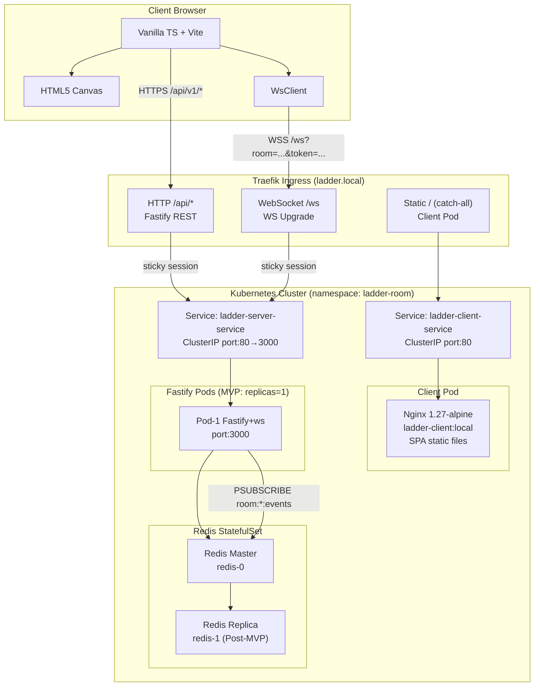
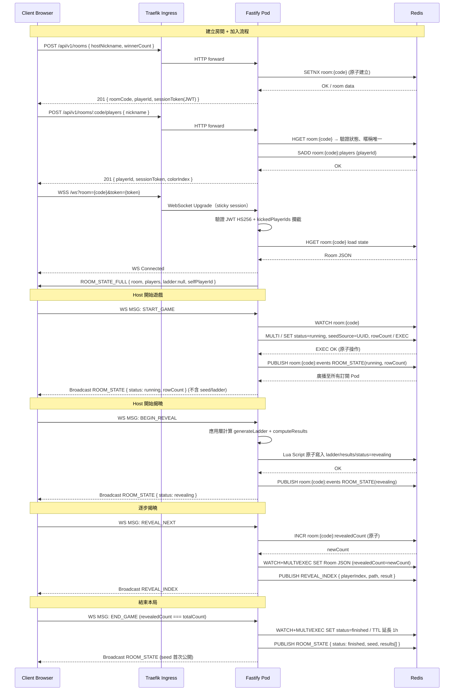
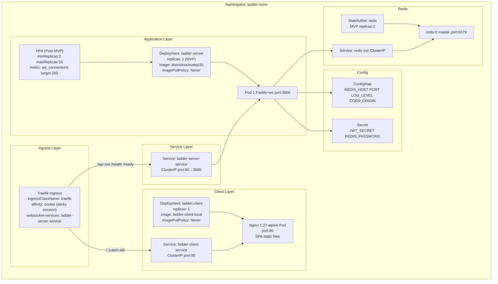
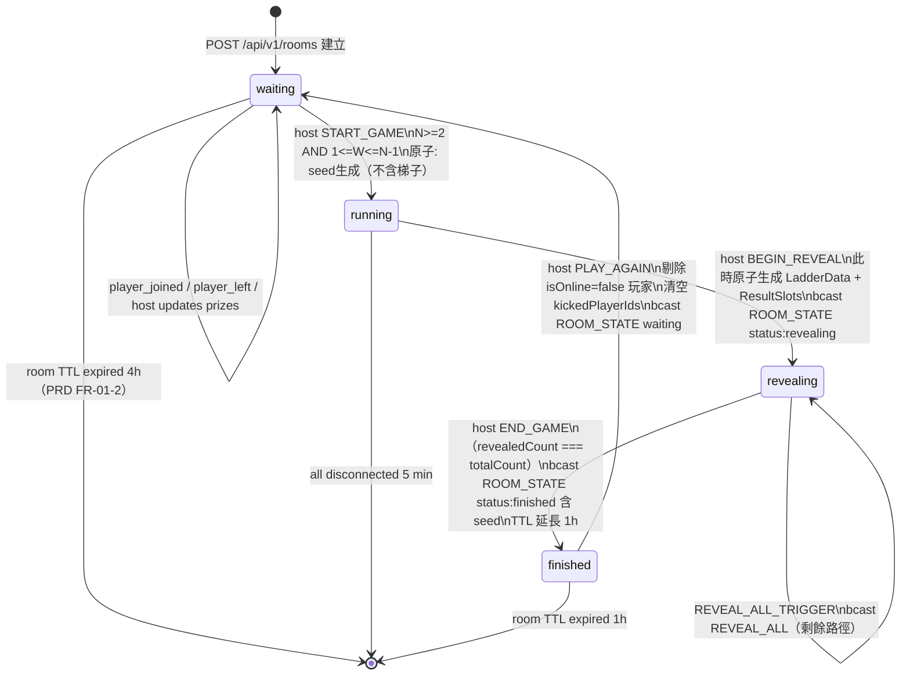
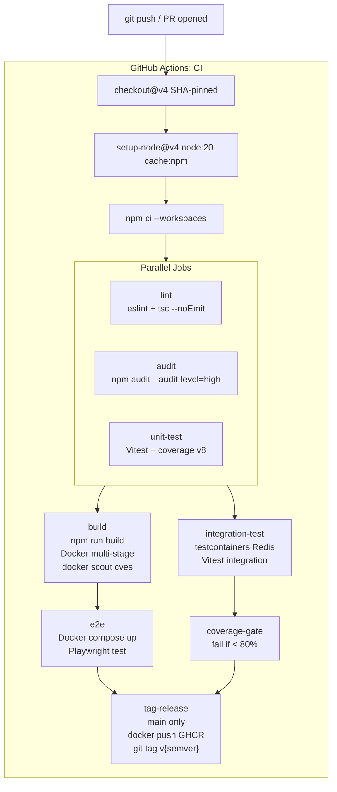

# EDD — Engineering Design Document
# Ladder Room Online 工程設計文件

## Document Control

| 欄位 | 內容 |
|------|------|
| Version | v2.0 |
| Status | Active |
| Date | 2026-04-21 |
| Author | AI EDD Agent（devsop-autodev STEP-07） |
| Based On | BRD v1.0 + PRD v1.0 + legacy-EDD v1.4 + legacy-ARCH v1.2 |
| Stakeholders | 前端工程師、後端工程師、QA、DevOps |

---

## §1 Executive Summary

### §1.1 系統目的

Ladder Room Online 是一款基於 HTML5 Canvas 的多人線上爬樓梯抽獎系統，採用 WebSocket 長連接驅動即時遊戲狀態同步，支援最多 50 名玩家共享同一房間。系統設計目標為取代 LINE 原生爬樓梯的功能限制，支援異地多人同房、主持人掌控揭曉節奏、結果公正可驗證。

### §1.2 技術選型總覽

| 層級 | 技術 | 版本 / 備註 |
|------|------|-------------|
| Runtime | Node.js | 20 LTS |
| 語言 | TypeScript | strict mode，前後端共用 |
| HTTP Server | Fastify | REST API (`/api/*`) |
| WebSocket | ws（原生） | `ws` npm package，`maxPayload: 65536` |
| 快取 / 狀態 | Redis | 原子操作、Pub/Sub、房間持久化 |
| 前端框架 | 無（Vanilla TypeScript + Vite） | 無 UI 框架，零依賴，HTML5 Canvas 渲染 |
| Monorepo 結構 | npm workspaces | `packages/shared`、`packages/server`、`packages/client` |
| 測試 | Vitest + Playwright | Unit/Integration（Vitest）＋E2E（Playwright） |
| CI/CD | GitHub Actions | lint → audit → test → build → e2e → deploy |
| 容器 | Docker（Distroless Node.js 20 / Nginx 1.27-alpine） | 多階段建構；server + client 各自獨立 image |
| 編排 | Kubernetes（Traefik Ingress） | Rancher Desktop 本機開發；HPA 為 Post-MVP |
| 前端部署（本機） | Nginx Pod（ladder-client:local） | `Dockerfile.client` 建構，`imagePullPolicy: Never` |
| 前端部署（生產） | GitHub Pages CDN | Vite 建構產物，bundle < 150KB gzip |
| 本機開發腳本 | `./scripts/dev-k8s.sh [up\|down\|restart\|logs]` | 一鍵啟動完整 k8s 環境，http://ladder.local |

**client_type**: `web`（瀏覽器端，HTML5 Canvas + Vanilla TypeScript）

### §1.3 關鍵設計決策摘要

1. **Vanilla TypeScript + Vite**（無 UI 框架）— 確保最小 JS bundle，無框架冗餘依賴
2. **WebSocket（ws 原生）**（非 Socket.IO）— 雙向通訊，標準協定，無 polling fallback 需求
3. **Redis 作為唯一持久層**（非 in-memory）— Pod 重啟後狀態存活，跨 Pod Pub/Sub 廣播
4. **Clean Architecture + packages/shared**（核心邏輯前後端共用）— 算法一致性可驗證，結果可事後審計
5. **Mulberry32 PRNG + djb2 seed + Fisher-Yates**（確定性 PRNG）— 100% 客戶端結果一致，無舞弊空間
6. **Kubernetes 兩 Pod 架構**（server pod + client nginx pod）— 本機與生產環境統一，前後端分離部署

---

## §2 System Architecture

### §2.1 High-Level Architecture

系統採用四層架構：Client → Ingress → Fastify/WS Server → Redis。

- **Client**（Vanilla TypeScript + Vite + HTML5 Canvas）：瀏覽器端，透過 HTTPS 呼叫 REST API，透過 WSS 長連接接收即時事件。Canvas 2D 渲染梯子動畫。
- **Nginx Ingress（Traefik）**：TLS 終止、HTTPS/WSS 路由分派、sticky session（/ws 與 /api 路徑）、catch-all 路由至 Client Nginx Pod（/）。
- **Fastify + ws（Server Pod）**：HTTP REST（`/api/v1/*`）及 WebSocket（`/ws`）共用進程。Fastify 處理 REST；ws 原生 WebSocket 處理即時通訊。
- **Redis（StatefulSet）**：房間狀態持久化（CRUD）、原子操作（WATCH/MULTI/EXEC）、Pub/Sub 跨 Pod 廣播。

### §2.2 Component Diagram



### §2.3 Data Flow Diagram



### §2.4 Deployment Architecture

**Kubernetes 部署（namespace: ladder-room）：**



**本機開發環境（Rancher Desktop）：**

- 使用 Rancher Desktop 作為本機 Kubernetes 環境（containerd runtime）
- `/etc/hosts` 設定 `127.0.0.1 ladder.local`，透過 Traefik Ingress 存取 `http://ladder.local`
- 一鍵開發腳本：`./scripts/dev-k8s.sh [up|down|restart|logs]`
  - `up`：docker build + kubectl apply（server + client image）
  - `down`：kubectl delete + image 清理
  - `restart`：重新 build 並 rolling restart
  - `logs`：串流所有 Pod 日誌
- Docker image 策略：
  - Server：`Dockerfile`（Distroless Node.js 20，多階段建構，`imagePullPolicy: Never`）
  - Client：`Dockerfile.local`（Nginx 1.27-alpine，多階段建構，`imagePullPolicy: Never`）

---

## §3 Technology Stack

| 類別 | 技術 | 版本 | 說明 |
|------|------|------|------|
| Runtime | Node.js | 20 LTS | 後端執行環境 |
| 語言 | TypeScript | strict mode | 前後端共用，`.js` 副檔名 ESM 輸出 |
| HTTP Framework | Fastify | 4.x | REST API，AJV Schema 驗證 |
| WebSocket | ws | 8.x | 原生 WS，maxPayload: 65536（64KB） |
| 快取 / 狀態 | Redis | 6+ | WATCH/MULTI/EXEC 原子操作、Pub/Sub、TTL |
| Redis Client | ioredis | 5.x | singleton + duplicate（Pub/Sub 專用） |
| JWT | jose | 5.x | HS256 簽章，Web Crypto API 相容 |
| 前端框架 | Vanilla TypeScript | — | 無 UI 框架，零依賴 |
| Build Tool | Vite | 5.x | 前端建構，HMR 開發伺服器 |
| Canvas | HTML5 Canvas 2D | — | 梯子渲染，requestAnimationFrame 驅動 |
| Monorepo | npm workspaces | — | packages/shared、packages/server、packages/client |
| Unit Test | Vitest | 1.x | 前後端共用測試框架 |
| Integration Test | testcontainers | — | 真實 Redis 容器整合測試 |
| E2E Test | Playwright | 1.x | 全流程 E2E 測試 |
| Container | Docker | — | Distroless Node.js 20（server）、Nginx 1.27-alpine（client） |
| Orchestration | Kubernetes | 1.28+ | Rancher Desktop 本機；Traefik Ingress |
| CI/CD | GitHub Actions | — | lint → audit → test → build → e2e → deploy |
| Log | pino | 9.x | Structured JSON 日誌 |
| Metrics | prom-client | — | Prometheus 指標（ws_active_connections 等） |

---

## §4 Module Design

### §4.1 Server Modules

**整體目錄結構（Clean Architecture 分層）：**

```
packages/server/src/
├── infrastructure/
│   ├── redis/
│   │   ├── RedisClient.ts        # ioredis singleton
│   │   ├── RoomRepository.ts     # Redis CRUD + TTL + 原子操作
│   │   └── PubSubBroker.ts       # Redis Pub/Sub 封裝
│   └── websocket/
│       ├── WsServer.ts           # ws Server 封裝、JWT 驗證、kickedPlayerIds 攔截
│       └── WsSession.ts          # 單一連線 session 管理、心跳、速率限制
├── application/
│   ├── services/
│   │   ├── RoomService.ts        # 業務邏輯協調（建立/加入/踢除/再玩一局）
│   │   └── GameService.ts        # 遊戲流程（START_GAME/BEGIN_REVEAL/REVEAL/END_GAME）
│   └── handlers/
│       ├── WsMessageHandler.ts   # 解析 ClientEnvelope，二次驗證，分派 Service
│       └── PubSubHandler.ts      # 訂閱 Redis 頻道，轉發廣播至本地 WsSession
├── presentation/
│   ├── routes/
│   │   ├── rooms.ts              # POST /rooms、GET /rooms/:code、game endpoints
│   │   └── players.ts            # POST /rooms/:code/players、DELETE .../players/:id
│   ├── schemas/                  # Fastify AJV JSON Schema
│   └── plugins/
│       ├── auth.ts               # JWT 驗證 Fastify plugin
│       └── cors.ts               # CORS plugin
├── container.ts                  # DI 工廠，組裝所有依賴
└── main.ts                       # 啟動入口：Fastify + WsServer + PubSubBroker
```

**各模組單句職責：**

| 模組 | 職責 |
|------|------|
| `RedisClient.ts` | 建立並匯出 ioredis 單例（含連線重試設定） |
| `RoomRepository.ts` | 實作 IRoomRepository：對 Redis 進行 Room 的 CRUD、TTL 管理；WATCH/MULTI/EXEC 原子操作；BEGIN_REVEAL 使用 Lua Script |
| `PubSubBroker.ts` | 封裝 Redis PUBLISH 與 PSUBSCRIBE，抽象跨 Pod 廣播細節 |
| `WsServer.ts` | 封裝 ws.Server，處理 HTTP Upgrade、JWT 驗證、kickedPlayerIds 攔截（close 4003）、Origin 驗證 |
| `WsSession.ts` | 管理單一 WebSocket 連線生命週期：心跳（ws 內建 ping/pong 30s）、序列化/反序列化、速率限制（60 msg/min）、斷線計時 |
| `RoomService.ts` | 協調房間建立、加入、踢出等業務流程，呼叫 RoomRepository 並發布 ROOM_STATE 廣播 |
| `GameService.ts` | 協調遊戲開局（START_GAME）、開始揭曉（BEGIN_REVEAL）、逐一揭曉（REVEAL_NEXT）、全揭（REVEAL_ALL_TRIGGER）、結束（END_GAME）、再玩一局（PLAY_AGAIN）流程 |
| `WsMessageHandler.ts` | 解析 ClientEnvelope，執行二次 role + room.hostId 驗證，分派至對應 Service 方法 |
| `PubSubHandler.ts` | 訂閱 Redis `room:*:events` 頻道，將收到的 PubSubMessage 轉發至房間內所有本地 WsSession |
| `container.ts` | 以工廠函式組裝所有依賴（DI 根），回傳完整注入樹，不含業務邏輯 |
| `main.ts` | 啟動 Fastify 伺服器、掛載 WsServer、初始化 PubSubBroker，設定 graceful shutdown |

### §4.2 Client Modules

```
packages/client/src/
├── ui/
│   ├── lobby.ts              # 大廳頁面：建立/加入房間 UI 邏輯
│   ├── waitingRoom.ts        # 等待大廳：玩家列表、複製邀請連結、主持人控制
│   └── gameView.ts           # 遊戲視圖：Canvas 容器、揭曉控制按鈕、結果展示
├── canvas/
│   ├── LadderRenderer.ts     # Canvas 2D 梯子繪製（rails、rungs、paths、winner stars）
│   └── AnimationController.ts # requestAnimationFrame 驅動、FPS 控制、動畫狀態機
├── state/
│   ├── RoomStore.ts          # 客戶端房間狀態（基於 ROOM_STATE_FULL / ROOM_STATE 更新）
│   └── LocalStorageService.ts # localStorage 讀寫（playerId、ladder_last_nickname）
├── ws/
│   ├── WsClient.ts           # WebSocket 連線管理、指數退避重連（1/2/4/8/30s）
│   └── EventBus.ts           # 事件訂閱/發布，UI 元件解耦
└── main.ts                   # 入口：初始化 WsClient、EventBus、UI 模組
```

**localStorage Keys：**

| Key | 型別 | 用途 | 生命週期 |
|-----|------|------|---------|
| `playerId` | `string` (UUID v4) | 玩家身份識別，用於斷線重連 | 永久（被踢除後 clearPlayerId） |
| `ladder_last_nickname` | `string` (1-20 chars) | 記憶上次使用的暱稱，下次加入時自動預填 | 永久（每次成功加入時更新） |

**邀請連結規格：**
- 格式：`{window.location.origin}/?room={roomCode}`
- 複製機制：優先 `navigator.clipboard.writeText()`；Fallback：`<input>` 全選手動複製

### §4.3 Shared Package（packages/shared）

```
packages/shared/src/
├── domain/
│   ├── entities/
│   │   ├── Room.ts           # Room aggregate root
│   │   ├── Player.ts         # Player value object
│   │   └── Ladder.ts         # Ladder + Segment entities
│   ├── value-objects/
│   │   ├── RoomCode.ts       # 6-char code validation
│   │   └── RoomStatus.ts     # enum: waiting/running/revealing/finished
│   └── errors/
│       └── DomainError.ts    # base typed error
├── use-cases/
│   ├── GenerateLadder.ts     # 梯子生成 use case（pure function）
│   ├── ValidateGameStart.ts  # N>=2, 1<=W<=N-1 驗證
│   └── ComputeResults.ts     # 路徑追蹤 → ResultSlot[]
├── prng/
│   ├── mulberry32.ts         # Mulberry32 PRNG 實作
│   ├── djb2.ts               # seed hash（string → uint32）
│   └── fisherYates.ts        # Fisher-Yates 洗牌
└── types/
    └── index.ts              # 所有共用 TypeScript interface/type
```

**主要匯出類型：**

| 類型 | 說明 |
|------|------|
| `RoomStatus` | `"waiting" \| "running" \| "revealing" \| "finished"` |
| `Player` | `{ id, nickname, colorIndex, isHost, isOnline, joinedAt, result }` |
| `LadderData` | `{ seed, seedSource, rowCount, colCount, segments }` |
| `LadderDataPublic` | `{ rowCount, colCount, segments }`（省略 seed，revealing 狀態使用） |
| `PathStep` | `{ row, col, direction: "down" \| "left" \| "right" }` |
| `ResultSlot` | `{ playerIndex, playerId, startCol, endCol, isWinner, path }` |
| `ResultSlotPublic` | `Omit<ResultSlot, "path">`（REVEAL_ALL payload 使用，符合 64KB 限制） |
| `Room` | 完整房間物件（含 players, ladder, results, kickedPlayerIds 等） |
| `ServerEnvelope<T>` | `{ type: WsEventType, ts, payload: T }` |
| `ClientEnvelope<T>` | `{ type: WsMsgType, ts, payload: T }` |

**Import 規則：**
- `packages/client` 可 import shared 的全部匯出
- `packages/server` 可 import shared 的全部匯出
- `packages/shared` 不得 import client 或 server；不得 import Node.js 內建 I/O 模組（fs、net、http 等）
- client 與 server 之間無直接 import（透過 WS/HTTP 通訊）

---

## §5 Key Algorithms

### §5.1 Ladder Generation Algorithm

**函式：** `packages/shared/src/use-cases/GenerateLadder.ts`

**核心邏輯：**

```typescript
export function generateLadder(seedSource: string, N: number): LadderData {
  const seed = djb2(seedSource);
  const rng = createMulberry32(seed);

  const rowCount = Math.min(Math.max(N * 3, 20), 60);
  const colCount = N;
  const maxBarsPerRow = Math.max(1, Math.round(N / 4));

  // Bar density — fewer possible positions → lower density to preserve randomness
  // N=2 has only 1 position; without skipping, every row would be identical
  const possiblePositions = N - 1;
  const barDensity = possiblePositions <= 1 ? 0.50
    : possiblePositions <= 2 ? 0.65
    : possiblePositions <= 3 ? 0.75
    : 0.90;

  const segments: LadderSegment[] = [];

  for (let row = 0; row < rowCount; row++) {
    if (rng() > barDensity) continue;           // skip row if rng > barDensity

    const usedCols = new Set<number>();
    let barsPlaced = 0;

    for (let attempt = 0; attempt < maxBarsPerRow; attempt++) {
      let col = Math.floor(rng() * (N - 1));

      // Retry: linear scan up to N-1 attempts to find a free column
      let found = false;
      for (let retry = 0; retry < N - 1; retry++) {
        const candidate = (col + retry) % (N - 1);
        if (!usedCols.has(candidate) && !usedCols.has(candidate + 1)) {
          col = candidate;
          found = true;
          break;
        }
      }

      if (!found) break;

      usedCols.add(col);
      usedCols.add(col + 1);
      segments.push({ row, col });
      barsPlaced++;
      if (barsPlaced >= maxBarsPerRow) break;
    }
  }

  return { seed, seedSource, rowCount, colCount, segments };
}
```

**關鍵參數：**

| 參數 | 公式 | 說明 |
|------|------|------|
| `rowCount` | `clamp(N×3, 20, 60)` | N=2→20，N=10→30，N=21→60（最小 20，最大 60） |
| `colCount` | = N | 含所有玩家（含 isOnline=false） |
| `maxBarsPerRow` | `max(1, round(N/4))` | 每 row 最多橫槓數 |
| `possiblePositions` | N - 1 | 可能的橫槓位置數量 |
| `barDensity` | N-1=1:0.50, N-1=2:0.65, N-1=3:0.75, N-1≥4:0.90 | 每 row 出現橫槓的機率 |
| Segment 衝突防護 | `usedCols.has(col) \|\| usedCols.has(col+1)` | 同 row 橫槓不重疊，最多重試 N-1 次 |

**seed 生成：**
- `seedSource`：`crypto.randomUUID()`（START_GAME 時在 Server 端生成，UUID v4 hex 字串）
- `seed`：`djb2(seedSource) >>> 0`（轉為 unsigned 32-bit integer）
- 安全邊界：seed 及完整樓梯資料在 `status=finished` 前禁止傳送給任何客戶端（PRD NFR-05）

### §5.2 Path Calculation Algorithm

**函式：** `packages/shared/src/use-cases/ComputeResults.ts`

從頂部追蹤到底部，遇到橫槓段（segment）則切換欄位：

```typescript
for (let startCol = 0; startCol < colCount; startCol++) {
  let col = startCol;
  const path: PathStep[] = [];
  for (let row = 0; row < rowCount; row++) {
    if (segmentSet.has(`${row}:${col}`)) {
      path.push({ row, col, direction: "right" });  // 右側有橫槓 → 向右
      col++;
    } else if (col > 0 && segmentSet.has(`${row}:${col - 1}`)) {
      path.push({ row, col, direction: "left" });   // 左側有橫槓 → 向左
      col--;
    } else {
      path.push({ row, col, direction: "down" });   // 無橫槓 → 向下
    }
  }
  paths.push(path);
  endCols.push(col);
}
```

**中獎指派（Fisher-Yates bijection）：**

```typescript
// Step 3: Fisher-Yates 洗牌決定哪些 endCol 為中獎（消耗 colCount 次 rng）
const indices = Array.from({ length: colCount }, (_, i) => i);
const shuffled = fisherYatesShuffle(indices, rng);
const winnerEndCols = new Set(shuffled.slice(0, winnerCount));
```

- **bijection 保證**：N 個起點對應 N 個唯一終點，無共用 endCol
- **startColumn 指派**：玩家依 `joinedAt` 由早到晚排序（相同時以 `playerId` 字典序升冪），依序指派打亂後的 startColumn

### §5.3 Canvas Rendering

**函式：** `packages/client/src/canvas/LadderRenderer.ts`

**繪製流程（drawLadder）：**

1. **Rails（垂直柱）**：從頂到底繪製每條垂直線（N 條）
2. **Rungs（橫段）**：依 `segments[]` 繪製所有橫槓（連接 col 與 col+1）
3. **Revealed paths（已揭曉路徑）**：依 `PathStep[]` 逐格繪製走線動畫
   - 自己的路徑：高亮色（每人一色）
   - 他人路徑：對應色，`globalAlpha=0.6`（半透明）
   - 未揭曉路徑：灰色虛線
4. **Player names（玩家名稱）**：頂部各列顯示玩家暱稱
5. **Winner stars（中獎標記）**：中獎者 `shadowBlur=10` 金色光暈效果

**顏色系統：**
- `colorFromIndex(i)`：每位玩家一個不重複色（最多 50 色）
- `colorFromIndexDim(i)`：淡化版（他人路徑，`globalAlpha=0.6`）

**FPS 目標：**
- 桌機（1080p Chrome）：≥ 30fps
- 手機（Chrome DevTools Moto G4 throttling，10 秒平均）：≥ 24fps

**PRNG 實作（djb2 + Mulberry32 + Fisher-Yates）：**

```typescript
// djb2 hash
export function djb2(str: string): number {
  let hash = 5381;
  for (let i = 0; i < str.length; i++) {
    hash = (Math.imul(hash, 33) + str.charCodeAt(i)) | 0;
  }
  return hash >>> 0;
}

// Mulberry32 PRNG
export function createMulberry32(seed: number): () => number {
  let s = seed >>> 0;
  return function next(): number {
    s += 0x6d2b79f5;
    let t = Math.imul(s ^ (s >>> 15), 1 | s);
    t ^= t + Math.imul(t ^ (t >>> 7), 61 | t);
    return ((t ^ (t >>> 14)) >>> 0) / 0x100000000;
  };
}

// Fisher-Yates shuffle
export function fisherYatesShuffle<T>(arr: readonly T[], rng: () => number): T[] {
  const result = [...arr];
  for (let i = result.length - 1; i > 0; i--) {
    const j = Math.floor(rng() * (i + 1));
    [result[i], result[j]] = [result[j], result[i]];
  }
  return result;
}
```

---

## §6 WebSocket Protocol

### §6.1 Message Types

**連線端點：** `WSS /ws?room={code}&token={sessionToken}`

Server Upgrade 階段驗證 JWT token，失敗直接 403。

**Server → Client 事件（WsEventType）：**

| 事件 | 觸發時機 | 說明 |
|------|---------|------|
| `ROOM_STATE` | 房間狀態變更 | 廣播至所有玩家（摘要，不含 ladder/results） |
| `ROOM_STATE_FULL` | WS 連線成功後 unicast | 含 ladder + results + selfPlayerId；新連線與重連均觸發 |
| `REVEAL_INDEX` | 手動/自動揭曉單一玩家 | `{ playerIndex, result（含 path）, revealedCount, totalCount }` |
| `REVEAL_ALL` | 一鍵全揭 | `{ results: ResultSlotPublic[] }`（省略 path，符合 64KB 限制） |
| `PLAYER_KICKED` | 玩家被踢除 | unicast 給被踢玩家；WS close code 4003 |
| `SESSION_REPLACED` | 同一 playerId 新連線登入 | 發給被替換的舊連線 |
| `PONG` | 回應客戶端 PING | RTT 量測用途 |
| `ERROR` | 操作失敗 | `{ code, message, requestId? }`；unicast 給觸發方 |

**Client → Server 訊息（WsMsgType）：**

| 訊息 | 說明 |
|------|------|
| `START_GAME` | Host 開始遊戲（waiting→running） |
| `BEGIN_REVEAL` | Host 開始揭曉（running→revealing） |
| `REVEAL_NEXT` | Host 手動揭曉下一位 |
| `REVEAL_ALL_TRIGGER` | Host 一鍵全揭 |
| `SET_REVEAL_MODE` | 切換手動/自動模式；auto 時 intervalSec 必填（1-30 整數） |
| `END_GAME` | Host 結束本局（revealing→finished，需 revealedCount===totalCount） |
| `PLAY_AGAIN` | Host 再玩一局（finished→waiting） |
| `KICK_PLAYER` | Host 踢除玩家（waiting 狀態限定） |
| `UPDATE_WINNER_COUNT` | Host 更新中獎名額 W（waiting 狀態限定，1≤W≤N-1） |
| `UPDATE_TITLE` | Host 更新房間名稱（waiting 狀態限定，0-50 字元） |
| `PING` | 應用層心跳，Server 回 PONG |

**訊息格式：**

```typescript
// Server → Client
interface ServerEnvelope<T = unknown> {
  readonly type: WsEventType;
  readonly ts: number;
  readonly payload: T;
}

// Client → Server
interface ClientEnvelope<T = unknown> {
  readonly type: WsMsgType;
  readonly ts: number;
  readonly payload: T;
}
```

**安全限制：**
- `maxPayload: 65536`（64KB），超過則拒絕並關閉連線（PRD NFR-05）
- 速率限制：60 msg/min/連線，超限 WS close code 4029

### §6.2 Connection Lifecycle

```
connect
  → JWT 驗證（WsServer.handleUpgrade）
  → kickedPlayerIds 攔截（close 4003 if kicked）
  → Origin 驗證（CORS_ORIGIN 白名單）
  → WsSession 建立
  → unicast ROOM_STATE_FULL

game loop
  JOIN_ROOM → ROOM_STATE（廣播）
  START_GAME → ROOM_STATE（running）
  BEGIN_REVEAL → ROOM_STATE（revealing）
  REVEAL_NEXT / auto-timer → REVEAL_INDEX（廣播）
  REVEAL_ALL_TRIGGER → REVEAL_ALL（廣播）
  END_GAME → ROOM_STATE（finished，seed 公開）

disconnect handling
  ws close event → player.isOnline = false → 廣播 ROOM_STATE
  60s grace period → HOST_TRANSFERRED（Post-MVP）
  最後一位斷線 5 分鐘 → EXPIRE room:{code} 300

reconnect
  帶 playerId → ROOM_STATE_FULL（狀態快照）
  同一 playerId 新連線 → SESSION_REPLACED 至舊連線
  kickedPlayerId → close 4003

WS 重連策略（Client）
  指數退避：1s / 2s / 4s / 8s / 30s（上限）
  5 次失敗後停止，顯示「無法連線」+ 手動重試按鈕
```

---

## §7 Data Models

### §7.1 Redis Key Schema

| Redis Key | 類型 | 內容 | TTL |
|-----------|------|------|-----|
| `room:{code}` | String（JSON） | Room 完整物件 | waiting/running: 24h；finished: 1h；最後一人斷線: 5min |
| `room:{code}:ladder` | String（JSON） | LadderData（含 seed、seedSource、segments、results）；BEGIN_REVEAL 時才創建 | 同 room:{code} |
| `room:{code}:revealedCount` | Integer | INCR 原子遞增，唯一計數真相來源 | 同 room:{code} |

### §7.2 Room Object

```typescript
interface Room {
  readonly code: string;           // 6-char room code
  title: string | null;            // optional room name (0-50 chars)
  status: RoomStatus;              // waiting/running/revealing/finished
  hostId: string;                  // Host playerId
  players: readonly Player[];      // max 50，含 isOnline=false 的斷線玩家
  winnerCount: number | null;      // W（1 <= W <= N-1）；null 直到 Host 設定
  ladder: LadderData | null;       // null 直到 BEGIN_REVEAL
  results: readonly ResultSlot[] | null;
  revealedCount: number;           // 已揭曉數（快照；唯一計數來源為 :revealedCount key）
  revealMode: "manual" | "auto";
  autoRevealIntervalSec: number | null;  // 1-30s；null 為手動模式
  kickedPlayerIds: readonly string[];    // 本局被踢玩家 playerId，PLAY_AGAIN 後清空
  readonly createdAt: number;
  updatedAt: number;
}
```

### §7.3 Player Object

```typescript
interface Player {
  readonly id: string;           // UUID v4
  readonly nickname: string;     // 1-20 chars
  readonly colorIndex: number;   // 0-49
  readonly isHost: boolean;      // 派生：id === room.hostId
  isOnline: boolean;
  readonly joinedAt: number;     // Unix ms
  result: 'win' | 'lose' | null; // null 直到揭曉
}
```

### §7.4 Game State 生命週期



---

## §8 API Design Overview

### §8.1 HTTP REST Endpoints

所有端點掛載於 `/api/v1/`，回應格式為直接 JSON（無 success/data/error 包裝）。

JWT TTL：**6 小時**（`exp = iat + 21600`）。

| Method | Path | 描述 | 成功碼 | 主要錯誤碼 |
|--------|------|------|--------|-----------|
| `POST` | `/api/v1/rooms` | 建立房間（hostNickname, winnerCount） | 201 | 400 INVALID_PRIZES_COUNT, 429 RATE_LIMIT |
| `GET` | `/api/v1/rooms/:code` | 查詢房間公開摘要（unauthenticated） | 200 | 404 ROOM_NOT_FOUND |
| `POST` | `/api/v1/rooms/:code/players` | 加入房間（nickname） | 201 | 404/409 |
| `DELETE` | `/api/v1/rooms/:code/players/:id` | 踢出玩家（需 token；waiting 狀態限定） | 204 | 401/403/404/409 |
| `POST` | `/api/v1/rooms/:code/game/start` | 開始遊戲（需 token） | 200 | 400/409 |
| `POST` | `/api/v1/rooms/:code/game/end` | 結束本局（需 token；revealing 狀態，所有路徑已揭曉） | 200 | 403/409 |
| `POST` | `/api/v1/rooms/:code/game/play-again` | 再玩一局（需 token；finished 狀態限定） | 200 | 400/403/409 |
| `GET` | `/health` | 健康檢查（liveness） | 200 | — |
| `GET` | `/ready` | 就緒檢查（readiness）；redis="error" 時回傳 503 | 200 | 503 |

**Rate Limiting：**
- POST /rooms：10 req/min/IP
- POST /rooms/:code/players：20 req/min/IP
- 其他：100 req/min/IP

### §8.2 Authentication

- **JWT HS256**（`jose` 套件），payload：`{ playerId, roomCode, role: "host" | "player", exp }`
- Host 操作雙重驗證：JWT `role=host` AND Redis `room.hostId === playerId`（防止 token 偽造或 host 轉移後舊 token 濫用）
- WS Upgrade：JWT 驗證在 `WsServer.handleUpgrade()` 完成；WS 連線建立後不重驗 exp（MVP 接受的安全取捨）

---

## §9 Performance Design

### §9.1 Redis Usage

| 操作 | Redis 命令 | 用途 |
|------|-----------|------|
| 房間建立 | SETNX（原子） | 確保 Room Code 唯一性 |
| 狀態讀取 | GET `room:{code}` | 取得完整 Room JSON |
| 狀態更新 | WATCH + MULTI/EXEC | 樂觀鎖，防 concurrent update |
| BEGIN_REVEAL | Lua Script | 原子寫入 ladder/results/status=revealing |
| revealedCount 遞增 | INCR `room:{code}:revealedCount` | 原子計數，防 race condition |
| 跨 Pod 廣播 | PUBLISH/PSUBSCRIBE `room:*:events` | at-most-once 廣播語意 |
| Room Code 唯一性重試 | 最多 10 次，超過回傳 ROOM_CODE_GENERATION_FAILED | — |

**TTL 策略：**

| 房間狀態 | TTL |
|---------|-----|
| waiting / running | 24h（活動時 EXPIRE 重置） |
| finished | 1h（END_GAME 後 EXPIRE 更新） |
| 最後一位玩家斷線 | 5 分鐘（close event 觸發原子 EXPIRE 300） |

**Redis 記憶體估算（100 並發房間）：**

```
單房間：
  Room JSON (50 players × 200 bytes)  ~10 KB
  Ladder data (N=50, ~600 segments)   ~5 KB
  Results (50 players × 120 steps)    ~72 KB
  小計                                ~90 KB

100 房間：100 × 90 KB = 9 MB
Pub/Sub overhead: ~1 MB
總計 ~10 MB（maxmemory: 512mb 配置）
```

### §9.2 WebSocket Scaling

**MVP（單 Pod）：**
- 目標：100 並發房間 × 50 人 = 5,000 WS 連線
- 自動揭示 timer 由 `GameService` 的 `setInterval` 管理（Pod 本地記憶體）
- Redis Pub/Sub 退化為本地自訂閱，overhead 可忽略

**Post-MVP（HPA 多 Pod）：**
- Kubernetes HPA：`minReplicas: 2, maxReplicas: 10`，metric: `ws_active_connections` 目標 200
- Traefik sticky session（cookie affinity）確保同一房間玩家路由至同一 Pod
- 自動揭示 timer 以 Redis SETNX 分散式鎖確保單一 Pod 持有計時器
- Redis StatefulSet 升級至 2 replicas（master + replica）

**WebSocket QPS 推算：**

```
加入房間高峰（前 5 分鐘）：100 房 × 50 人 / 300s ≈ 17 HTTP QPS
揭示階段廣播：100 房 × 1 揭示/s × 50 人 = 5,000 WS 發送/s
Redis 操作：< 500 ops/s（Redis 可承受 100k+ ops/s）
```

---

## §10 Security Design

### §10.1 OWASP Top 10 對應措施

| OWASP | 威脅 | 對應措施 |
|-------|------|---------|
| A01 Broken Access Control | 非 host 操作 | JWT HS256 驗證（jose），role 欄位；雙重驗證（JWT role + Redis room.hostId） |
| A02 Cryptographic Failures | 弱加密 | JWT HS256（RFC 7519）；Redis TLS；Nginx HTTPS + HSTS max-age=31536000 |
| A03 Injection | 輸入注入 | Fastify JSON Schema AJV 驗證；nickname AJV pattern `^[^\x00-\x1F\x7F]{1,20}$`；roomCode 正則 `[A-HJ-NP-Z2-9]{6}` |
| A04 Insecure Design | WS 訊息洪泛 | `ws` maxPayload: 65536（64KB）；per-connection rate limit 60 msg/min，超限 close 4029 |
| A05 Security Misconfiguration | 過度曝露 | 隱藏 Server header；CSP `default-src 'self' connect-src wss://domain`；k8s runAsNonRoot readOnlyRootFilesystem；GET /rooms/:code 僅回傳 RoomSummaryPayload（不含 hostId） |
| A06 Vulnerable Components | 舊依賴 | npm audit --audit-level=high 阻斷 PR；Dependabot 週更新；Distroless image 月重建 |
| A07 Authentication Failures | 重複連線/踢除重連 | 同 playerId 新連線觸發 SESSION_REPLACED；kickedPlayerIds 在 WS Upgrade 階段攔截（close 4003） |
| A08 Software Integrity | Supply chain | CI Docker image SHA256 digest；npm ci lockfile；actions pinned SHA |
| A09 Logging Failures | 無可觀測性 | pino structured log；fluent-bit DaemonSet；HTTP 5xx > 1%/5min 告警 |
| A10 SSRF | 外部 HTTP 請求 | 後端零 outbound HTTP；connect-src CSP 限制瀏覽器端 |

### §10.2 Seed 防洩漏機制

| 狀態 | seed 暴露範圍 |
|------|-------------|
| waiting / running | seed 不存在（尚未生成） |
| revealing | seed 存在於 Redis，但 ROOM_STATE_FULL 以 `LadderDataPublic`（省略 seed）傳送客戶端 |
| finished | seed 首次對客戶端公開（含於 ROOM_STATE 廣播）；可供事後驗算 |

### §10.3 JWT Security

- Token 有效期：6 小時（`exp = iat + 21600`）
- WS 連線建立後不重驗 exp（MVP 取捨：房間生命週期通常遠低於 6h）
- host 轉移後舊 token 仍需以 `room.hostId` 雙重驗證，防舊 token 濫用
- WS Upgrade 前 Origin 驗證（CORS_ORIGIN 環境變數白名單）

---

## §11 Error Handling Strategy

### §11.1 HTTP 錯誤碼

| 錯誤碼 | HTTP | 說明 |
|--------|------|------|
| `ROOM_NOT_FOUND` | 404 | 房間不存在或已過期 |
| `ROOM_FULL` | 409 | 已達 50 人上限 |
| `ROOM_NOT_ACCEPTING` | 409 | 房間狀態非 waiting（改用 409，房間可能 reset 後重新接受） |
| `NICKNAME_TAKEN` | 409 | nickname 重複 |
| `PLAYER_NOT_FOUND` | 404 | 玩家不存在 |
| `PLAYER_NOT_HOST` | 403 | 需要房主權限 |
| `AUTH_INVALID_TOKEN` | 401 | JWT Token 無效 |
| `AUTH_TOKEN_EXPIRED` | 401 | JWT Token 過期 |
| `INSUFFICIENT_PLAYERS` | 400 | N < 2（開始遊戲時） |
| `INSUFFICIENT_ONLINE_PLAYERS` | 400 | 再玩一局時在線玩家 < 2 |
| `PRIZES_NOT_SET` | 400 | W 尚未設定 |
| `INVALID_PRIZES_COUNT` | 400 | W < 1 或 W >= N |
| `INVALID_STATE` | 409 | 操作不符合當前狀態 |
| `CANNOT_KICK_HOST` | 400 | 踢除操作目標為 Host 本身 |
| `INVALID_NICKNAME` | 400 | 暱稱格式不合法 |
| `ROOM_CODE_GENERATION_FAILED` | 500 | Room Code 碰撞重試超過 10 次 |
| `TITLE_UPDATE_NOT_ALLOWED_IN_STATE` | 409 | 在非 waiting 狀態嘗試更新 title |
| `INVALID_AUTO_REVEAL_INTERVAL` | 400 | intervalSec 不為整數或超出 1-30 範圍 |
| `SYS_INTERNAL_ERROR` | 500 | 非預期錯誤 |
| `RATE_LIMIT` | 429 | 超過速率限制 |

### §11.2 WebSocket 重連策略

| 場景 | 行為 |
|------|------|
| WS 中斷 | 指數退避重連（1/2/4/8/30s max）|
| 5 次重連失敗 | 顯示「無法連線」，停止重連，手動重試按鈕 |
| SESSION_REPLACED | Modal 提示，跳回首頁 |
| WS ERROR | Toast 對應訊息，保持連線 |
| HTTP 4xx | Toast 顯示 error.message |
| HTTP 500 | Toast「系統錯誤」+ requestId |

### §11.3 Redis 失敗降級策略

- `RoomRepository` 所有方法拋出 `SYS_REDIS_ERROR`
- 觸發方收到 `ERROR { code: "SYS_REDIS_ERROR" }` 並保持 WS 連線
- 新的 HTTP 加入請求回傳 `503 Service Unavailable`
- `GET /ready` 回傳 `{ redis: "error" }` 讓 Kubernetes readinessProbe 立即移除 Pod
- ioredis 內建指數退避重連；WS 客戶端重連後收到最新 `ROOM_STATE_FULL`

---

## §12 Testing Strategy

### §12.1 測試金字塔

| 層級 | 工具 | 比例 | 涵蓋範圍 |
|------|------|------|---------|
| Unit Tests | Vitest | 70% | djb2、Mulberry32、Fisher-Yates、GenerateLadder、ValidateGameStart、ComputeResults、RoomRepository（mock Redis）、GameService（mock IRoomRepository）、HTTP Schemas（AJV） |
| Integration Tests | Vitest + testcontainers | 20% | RoomRepository 對真實 Redis CRUD/TTL/原子 INCR；Pub/Sub PUBLISH/SUBSCRIBE；Fastify 路由 HTTP 請求；WS 連線建立、認證失敗（403）、ROOM_STATE_FULL 接收 |
| E2E Tests | Playwright | 10% | 完整流程（2 玩家）建立→加入→開始→揭示→結束；踢除玩家；斷線重連；50 人上限 |

### §12.2 覆蓋率目標

| 套件 | 目標 |
|------|------|
| `packages/shared` | ≥ 90% |
| `packages/server`（application/domain） | ≥ 80% |
| `packages/client`（Canvas 渲染邏輯、WS 事件解析） | ≥ 70% |

### §12.3 關鍵測試案例

| 類型 | 測試案例 |
|------|---------|
| Unit | djb2 已知輸入輸出；Mulberry32 序列可重現；Fisher-Yates 無元素遺失 |
| Property-based | 同 row 無重疊橫槓；所有玩家路徑 endCol 唯一（bijection） |
| Determinism | 相同 seed+N 兩次呼叫輸出完全一致（snapshot test） |
| Edge | N=2, N=50, seed=0, seed=0xFFFFFFFF；rowCount 三邊界值（N=3→20, N=10→30, N=21→60） |
| Security | seed 在 `finished` 前不出現在任何廣播 payload |
| Load | k6：100 房間 × 50 人 WS 並發，成功率 > 99.5%（加入）；P95 延遲 < 2s |

### §12.4 測試基準線

現有 Vitest 測試：**171 tests**（截至 2026-04-21）

CI 覆蓋率閘門：

```yaml
coverage-gate:
  runs-on: ubuntu-latest
  needs: [unit-test, integration-test]
  steps:
    - name: Check coverage >= 80%
      run: npx vitest --coverage --reporter=json
```

---

## §13 Deployment & Operations

### §13.1 Kubernetes 本機開發流程

**Prerequisites：**
- Rancher Desktop（containerd runtime，kubectl + nerdctl 可用）
- `/etc/hosts`：`127.0.0.1 ladder.local`

**一鍵操作：**

```bash
# 啟動完整環境（build images + apply manifests）
./scripts/dev-k8s.sh up

# 停止並清理
./scripts/dev-k8s.sh down

# 重新 build 並 rolling restart
./scripts/dev-k8s.sh restart

# 串流所有 Pod 日誌
./scripts/dev-k8s.sh logs
```

**手動步驟（等效）：**

```bash
# 1. build server image
docker build -t ladder-server:local packages/server/

# 2. build client image
docker build -t ladder-client:local -f Dockerfile.local packages/client/

# 3. load images to Rancher Desktop
nerdctl image load -i <(docker save ladder-server:local)
nerdctl image load -i <(docker save ladder-client:local)

# 4. apply k8s manifests
kubectl apply -f k8s/

# 5. 驗證
kubectl get pods -n ladder-room
curl http://ladder.local/api/v1/health
```

### §13.2 兩個獨立 Pod 架構

| Pod | Image | Port | 說明 |
|-----|-------|------|------|
| `ladder-server-*` | `distroless/nodejs20`（多階段建構） | 3000 | Fastify + ws，REST API + WebSocket |
| `ladder-client-*` | `nginx:1.27-alpine`（多階段建構） | 80 | SPA 靜態資源服務，catch-all → index.html |

### §13.3 CI/CD Pipeline



### §13.4 環境變數

| 變數 | 說明 | 本地預設值 |
|------|------|-----------|
| `NODE_ENV` | `development` / `production` | `development` |
| `PORT` | Fastify 監聽埠 | `3000` |
| `JWT_SECRET` | HS256 簽章金鑰（≥ 32 bytes） | `dev-secret-do-not-use-in-prod` |
| `REDIS_URL` | ioredis 連線字串 | `redis://localhost:6379` |
| `REDIS_PASSWORD` | Redis 驗證密碼（生產必填，k8s Secret 注入） | —（本地不設定） |
| `LOG_LEVEL` | pino log level | `debug` |
| `CORS_ORIGIN` | 允許的 HTTP Origin（WS Upgrade Origin 驗證） | `http://localhost:5173` |

---

## Appendix: ADR（Architecture Decision Records）

### ADR-001: Vanilla TypeScript over React/Vue

**決策：** 前端採用 Vanilla TypeScript + Vite，不使用任何 UI 框架。

**理由：**
- 無框架冗餘依賴，確保 JS bundle < 80KB gzip（首頁）/ < 150KB gzip（遊戲頁）
- HTML5 Canvas 渲染邏輯本質上是命令式，React/Vue 的宣告式模型反而增加 overhead
- 目標瀏覽器（Chrome 110+）完整支援 Vanilla TS 所需的 Web API

**取捨：** 需手動管理 DOM 操作與事件處理，測試需自行模擬 Canvas API；後續加入 UI 框架的遷移成本相對較高。

---

### ADR-002: WebSocket over SSE

**決策：** 即時通訊採用 WebSocket（ws 原生套件），不使用 Server-Sent Events（SSE）。

**理由：**
- 遊戲狀態需要雙向通訊：客戶端發送 `START_GAME`、`REVEAL_NEXT` 等操作，SSE 為單向（Server→Client）
- 主持人控制操作（踢人、揭曉控制）需要低延遲雙向通道
- 所有目標瀏覽器均原生支援 WebSocket，無需 polling fallback

**取捨：** 需自行實作心跳、重連、房間廣播邏輯；透過 `WsSession` 封裝後複雜度可控。

---

### ADR-003: Redis over In-Memory State

**決策：** 所有房間狀態儲存於 Redis，Pod 本地記憶體不快取業務狀態。

**理由：**
- Pod 重啟（rolling update、崩潰恢復）後狀態存活，客戶端指數退避重連後可恢復
- Post-MVP 多 Pod 水平擴展時，Redis 作為唯一共享狀態層，無需額外同步機制
- Redis WATCH/MULTI/EXEC 原子操作天然解決 concurrent update（多玩家同時加入等）

**取捨：** Redis 單節點為 MVP SPOF；Redis 失敗時所有操作降級（503）；ioredis 內建重連機制在 Redis 重啟後自動恢復。

---

### ADR-004: packages/shared 前後端共用算法

**決策：** PRNG（Mulberry32、djb2、Fisher-Yates）、GenerateLadder、ComputeResults 封裝於 `packages/shared`，前後端共用相同實作。

**理由：**
- 確保算法一致性：前端 Canvas 渲染路徑動畫 = 後端計算結果，100% 一致（PRD NFR-03）
- 結果可事後審計：seed 公開後，任何人可用相同算法驗證本局結果
- 1,000 次 seed 自動化驗證 CI 閘門確保 bijection 特性

**取捨：** `packages/shared` 必須保持零 I/O（不得 import Node.js 內建模組），限制了可在共用層處理的邏輯。

---

### ADR-005: JWT HS256 over Session Cookie

**決策：** Host 身份驗證採用 JWT HS256（jose 套件），而非 Session Cookie。

**理由：**
- 無狀態驗證：每個請求自帶 `{ playerId, roomCode, role, exp }`，不需額外 Redis 查詢
- WS Upgrade 場景：JWT 可附在 URL query parameter，Cookie 在跨域 WS 場景較複雜
- `jose` 支援 Web Crypto API，瀏覽器端未來可直接驗證（可審計性）

**取捨：** JWT 一旦簽發無法提前撤銷；host 轉移後舊 token 在 exp 前仍有效，須以 `room.hostId` 雙重驗證。WS 連線建立後不重驗 exp（MVP 取捨：連線生命週期通常遠低於 6h）。

---

### ADR-006: Traefik over NGINX Ingress（Rancher Desktop 本機環境）

**決策：** 本機 Kubernetes 環境採用 Traefik Ingress（Rancher Desktop 內建），不採用 NGINX Ingress Controller。

**理由：**
- Rancher Desktop 預設內建 Traefik，零額外安裝步驟
- Traefik 原生支援 WebSocket upgrade（無需額外 annotation）
- sticky session（cookie affinity）在 Traefik 與 NGINX 均可實現，切換成本低

**取捨：** 生產環境可能使用 NGINX Ingress；k8s manifest 中保留 NGINX 備選設定（已註解）供遷移參考。Post-MVP 升級時若切換 Ingress Controller，需驗證 sticky session 行為一致性。

---

*EDD 版本：v2.0*
*生成時間：2026-04-21（devsop-autodev STEP-07：從 BRD v1.0 + PRD v1.0 + legacy-EDD v1.4 + legacy-ARCH v1.2 整合重建）*
*基於 BRD v1.0 + PRD v1.0 + legacy-EDD v1.4 + legacy-ARCH v1.3（Ladder Room Online）*

## 變更追蹤

### ECR-20260420-001：HOST copy 邀請 link（含 6 碼房號）+ localStorage 暱稱記憶，一鍵加入
- **狀態**：✅ DONE
- **分類**：ECR / 需求面
- **日期**：2026-04-20
- **描述**：HOST 開好房間後可 COPY 邀請 link（含 6 碼房號），受邀者點 link 自動帶入房號，名字欄位自動帶入上次輸入過的名字，一鍵加入。
- **影響範圍**：§4.2 Client Modules（LocalStorageService）、邀請連結規格
- **commit**：70b1e66
