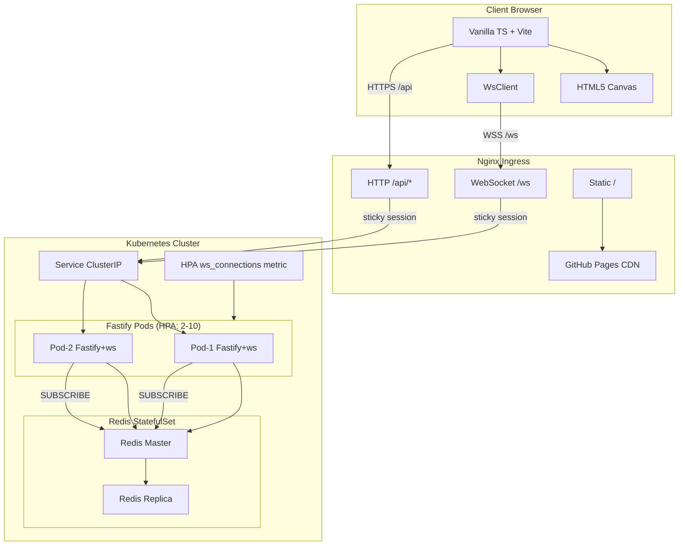
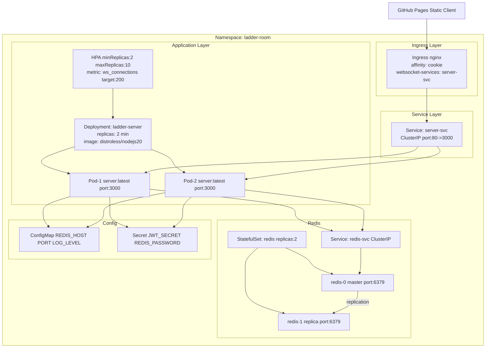
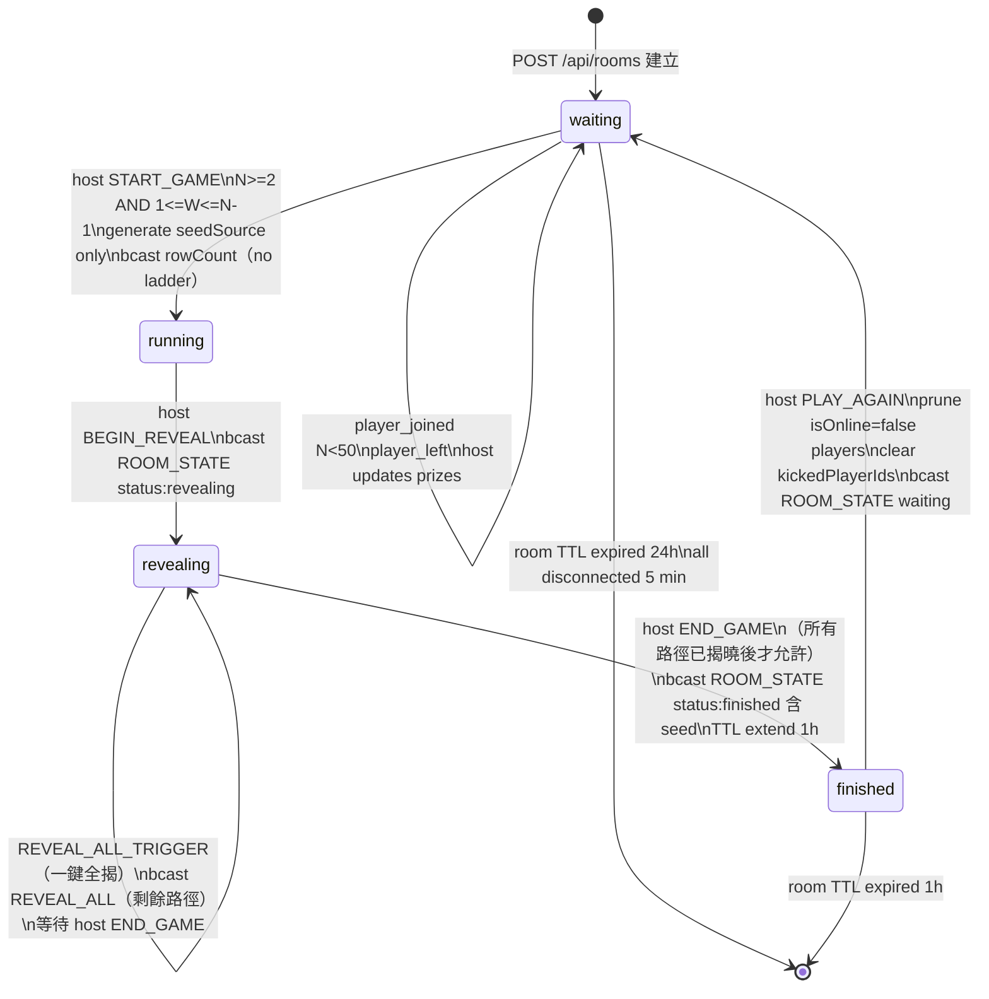
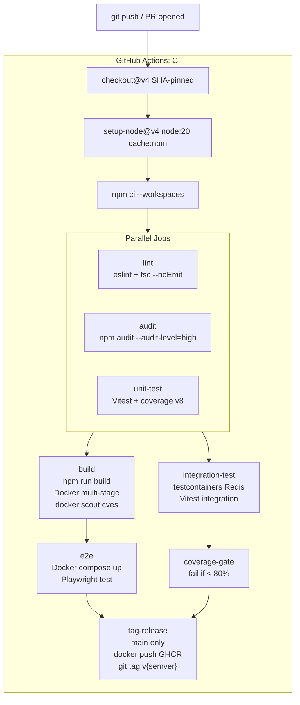
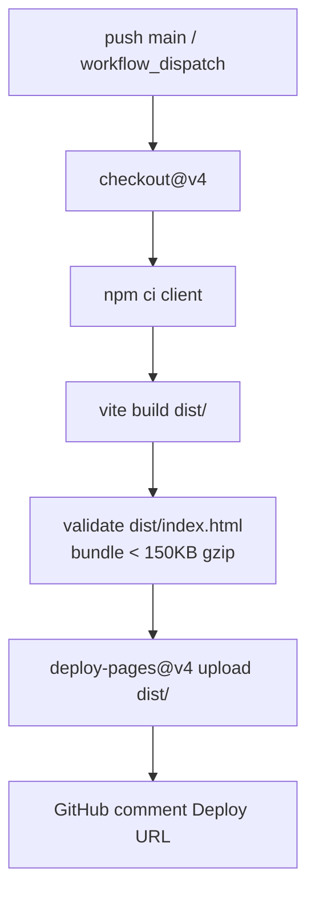

# EDD — Ladder Room Online

## 0. 技術棧（Tech Stack）

| 層級 | 技術 | 版本 / 備註 |
|------|------|-------------|
| Runtime | Node.js | 20 LTS |
| 語言 | TypeScript | strict mode，前後端共用 |
| HTTP Server | Fastify | REST API (`/api/*`) |
| WebSocket | ws（原生） | `ws` npm package，`maxPayload: 65536` |
| 快取 / 狀態 | Redis | 原子操作、Pub/Sub、房間持久化 |
| 前端框架 | 無（Vanilla TypeScript + Vite） | 無 UI 框架，零依賴，HTML5 Canvas 渲染 |
| Monorepo 結構 | npm workspaces | `packages/shared`、`packages/server`、`packages/client` |
| 測試 | Vitest | Unit（70%）＋Integration（20%，testcontainers）＋E2E（10%，Playwright） |
| CI/CD | GitHub Actions | lint → audit → test → build → e2e → deploy |
| 容器 | Docker（Distroless Node.js 20） | 多階段建構 |
| 編排 | Kubernetes（HPA）+ Nginx Ingress | sticky session，Post-MVP 多 Pod |
| 靜態部署 | GitHub Pages | Vite 建構產物，bundle < 150KB gzip |

**client_type**: `web`（瀏覽器端，HTML5 Canvas + Vanilla TypeScript）

---

## 1. 系統概覽

Ladder Room Online 是一款基於 HTML5 Canvas 的多人線上爬樓梯抽獎系統，採用 WebSocket 長連接驅動即時遊戲狀態同步，支援最多 50 名玩家共享同一房間。後端以 Fastify 處理 HTTP REST 操作，ws 原生 WebSocket 處理即時通訊，Redis 同時承擔分散式狀態鎖（原子操作）、房間資料持久化與跨 Pod Pub/Sub 廣播的角色；前端以 Vanilla TypeScript + Vite 建構，透過 HTML5 Canvas 逐段繪製梯子揭示動畫，全程無任何 UI 框架依賴，確保最小 JS bundle。

整體系統遵循 Clean Architecture 分層原則，核心遊戲邏輯（PRNG、狀態機、梯子生成）封裝於 `packages/shared` 並在前後端共用，保證演算法一致性可驗證；部署層透過 Kubernetes HPA 依 WebSocket 連線數自動水平擴展後端 Pod，Nginx Ingress 做 sticky session 確保同一房間玩家路由至同一 Pod，Redis 作為唯一共享狀態層解耦 Pod 間狀態依賴。

---

## 2. 架構設計

### 2.1 Clean Architecture（SOLID + 分層 + DI）

```
ladder-room-online/                       # monorepo root
├── packages/
│   ├── shared/                           # 前後端共用純邏輯（零 I/O）
│   │   ├── src/
│   │   │   ├── domain/
│   │   │   │   ├── entities/
│   │   │   │   │   ├── Room.ts           # Room aggregate root
│   │   │   │   │   ├── Player.ts         # Player value object
│   │   │   │   │   └── Ladder.ts         # Ladder + Segment entities
│   │   │   │   ├── value-objects/
│   │   │   │   │   ├── RoomCode.ts       # 6-char code validation
│   │   │   │   │   └── RoomStatus.ts     # enum: waiting/running/revealing/finished
│   │   │   │   └── errors/
│   │   │   │       └── DomainError.ts    # base typed error
│   │   │   ├── use-cases/
│   │   │   │   ├── GenerateLadder.ts     # 梯子生成 use case（pure）
│   │   │   │   ├── ValidateGameStart.ts  # N>=2, 1<=W<=N-1 驗證
│   │   │   │   └── ComputeResults.ts     # 路徑追蹤 -> ResultSlot[]
│   │   │   ├── prng/
│   │   │   │   ├── mulberry32.ts         # PRNG 實作
│   │   │   │   ├── djb2.ts               # seed hash
│   │   │   │   └── fisherYates.ts        # 洗牌
│   │   │   └── types/
│   │   │       └── index.ts              # 共用 TypeScript interface
│   │   └── package.json
│   │
│   ├── server/                           # Fastify 後端
│   │   ├── src/
│   │   │   ├── infrastructure/
│   │   │   │   ├── redis/
│   │   │   │   │   ├── RedisClient.ts    # ioredis singleton
│   │   │   │   │   ├── RoomRepository.ts # Redis CRUD
│   │   │   │   │   └── PubSubBroker.ts   # Redis Pub/Sub
│   │   │   │   └── websocket/
│   │   │   │       ├── WsServer.ts       # ws Server 封裝
│   │   │   │       └── WsSession.ts      # 單一連線 session 管理
│   │   │   ├── application/
│   │   │   │   ├── services/
│   │   │   │   │   ├── RoomService.ts    # 業務邏輯協調
│   │   │   │   │   └── GameService.ts    # 開局/揭示/結束流程
│   │   │   │   └── handlers/
│   │   │   │       ├── WsMessageHandler.ts
│   │   │   │       └── PubSubHandler.ts
│   │   │   ├── presentation/
│   │   │   │   ├── routes/
│   │   │   │   │   ├── rooms.ts
│   │   │   │   │   └── players.ts
│   │   │   │   ├── schemas/
│   │   │   │   └── plugins/
│   │   │   │       ├── auth.ts
│   │   │   │       └── cors.ts
│   │   │   ├── container.ts              # DI 容器
│   │   │   └── main.ts
│   │   ├── Dockerfile
│   │   └── package.json
│   │
│   └── client/                           # Vanilla TS + Vite
│       ├── src/
│       │   ├── canvas/
│       │   │   ├── LadderRenderer.ts
│       │   │   └── AnimationController.ts
│       │   ├── ws/
│       │   │   ├── WsClient.ts
│       │   │   └── EventBus.ts
│       │   ├── state/
│       │   │   └── RoomStore.ts
│       │   ├── ui/
│       │   │   └── components/
│       │   └── main.ts
│       ├── index.html
│       └── package.json
│
├── k8s/
├── .github/workflows/
│   ├── ci.yaml
│   └── pages.yaml
└── package.json                          # workspace root
```

**分層職責：**

| 層級 | 職責 | 依賴方向 |
|------|------|----------|
| Domain (shared) | Entity、Value Object、純業務規則、DomainError | 無外部依賴 |
| Use Cases (shared) | 協調 Domain 物件完成業務流程，返回純資料結構 | 僅依賴 Domain |
| Application (server) | 呼叫 Use Cases、協調 Repository、發布 WS 事件 | 依賴 Use Cases + Interfaces |
| Infrastructure (server) | Redis 實作、WebSocket 封裝、外部 SDK | 實作 Application 定義的 Interface |
| Presentation (server) | HTTP Route、Schema 驗證、WS 訊息分派 | 依賴 Application Service |

**DI 策略：** constructor injection，`container.ts` 以工廠函式組裝所有依賴。測試時直接傳入 mock 實作，不需要 DI 框架即可達成可測試性。

---

### 2.2 系統架構圖



---

### 2.3 資料流圖（加入房間流程）

```mermaid
sequenceDiagram
    participant C as Client Browser
    participant N as Nginx Ingress
    participant F as Fastify Pod
    participant R as Redis

    C->>N: POST /api/v1/rooms/join
    N->>F: HTTP forward sticky session
    F->>R: SETNX room:{code} atomic
    R-->>F: OK / room data
    F->>R: SADD room:{code}:players {playerId}
    R-->>F: OK
    F-->>C: 201 { roomCode, playerId, sessionToken }

    C->>N: GET WSS /ws?room={code}&token={token}
    N->>F: WebSocket Upgrade sticky session
    F->>F: Verify sessionToken HMAC-SHA256
    F->>R: HGET room:{code} load state
    R-->>F: Room JSON
    F-->>C: WS Connected
    F->>C: ROOM_STATE_FULL { room, players, ladder:null }

    Note over C,F: Host triggers START_GAME

    C->>F: WS MSG: START_GAME
    F->>R: WATCH room:{code} MULTI SET status=running seedSource=uuid EXEC
    R-->>F: EXEC OK
    Note over F: seed generated (djb2 hash), stored in Redis<br/>ladderMap NOT yet generated (deferred to BEGIN_REVEAL)<br/>seed NOT sent to clients until status=finished
    F->>R: PUBLISH room:{code}:events ROOM_STATE
    R-->>F: Deliver to all Pod subscribers
    F-->>C: Broadcast ROOM_STATE { status: running, rowCount } (no ladder, no seed)

    Note over C,F: Host triggers BEGIN_REVEAL

    C->>F: WS MSG: BEGIN_REVEAL
    F->>F: GenerateLadder(seedSource, N) → ladderMap + resultSlots (atomic)
    F->>R: Lua script: SET status=revealing, ladder, results atomically
    R-->>F: OK
    F->>R: PUBLISH room:{code}:events ROOM_STATE
    F-->>C: Broadcast ROOM_STATE { status: revealing }

    Note over C,F: Host triggers REVEAL_NEXT (manual mode)

    C->>F: WS MSG: REVEAL_NEXT {}
    F->>R: INCR room:{code}:revealedCount atomic
    R-->>F: newCount
    F->>R: PUBLISH room:{code}:events REVEAL_INDEX
    F-->>C: Broadcast REVEAL_INDEX { playerIndex, path, result, revealedCount, totalCount }

    Note over C,F: All paths revealed; Host triggers END_GAME

    C->>F: WS MSG: END_GAME
    F->>R: SET room:{code}:status finished (broadcast seed now allowed)
    F->>R: PUBLISH room:{code}:events ROOM_STATE
    F-->>C: Broadcast ROOM_STATE { status: finished, seed, results[] }
```

---

### 2.4 部署架構圖



---

### 2.5 房間狀態機圖



---

## 3. 資料模型設計

```typescript
// packages/shared/src/types/index.ts

export type RoomStatus = "waiting" | "running" | "revealing" | "finished";

export type WsEventType =
  | "ROOM_STATE" | "ROOM_STATE_FULL" | "REVEAL_INDEX" | "REVEAL_ALL"
  | "PLAYER_KICKED" | "SESSION_REPLACED"
  | "HOST_TRANSFERRED" // future consideration, not MVP
  | "ERROR";

export type WsMsgType =
  | "START_GAME" | "BEGIN_REVEAL" | "REVEAL_NEXT" | "REVEAL_ALL_TRIGGER"
  | "END_GAME"           // host only, revealing state only; all paths must be revealed; transitions revealing→finished
  | "PLAY_AGAIN"         // host only, finished state only; re-initializes room to waiting (replaces RESET_ROOM)
  | "SET_REVEAL_MODE" | "KICK_PLAYER" | "PING"
  | "UPDATE_TITLE"        // host only, waiting state only; updates room.title (0-50 chars)
  | "UPDATE_WINNER_COUNT"; // host only, waiting state only; validates 1 ≤ N ≤ playerCount-1

export interface Player {
  readonly id: string;           // UUID v4
  readonly nickname: string;     // 1-20 chars, sanitized
  readonly colorIndex: number;   // 0-49
  // isHost is derived at read time by comparing id === room.hostId; not stored redundantly
  readonly isHost: boolean;
  isOnline: boolean;
  readonly joinedAt: number;     // Unix ms
  result: 'win' | 'lose' | null; // null until revealed; 'win'/'lose' after reveal (no named prizes per PRD Out-of-Scope #5)
}

export interface LadderSegment {
  readonly row: number;    // 0-indexed
  readonly col: number;    // col <-> col+1 has a rung
}

export interface LadderData {
  readonly seed: number;          // Mulberry32 seed = djb2(seedSource) >>> 0
  readonly seedSource: string;    // UUID v4 hex generated at START_GAME, stored for auditability
  readonly rowCount: number;      // clamp(N*3, 20, 60)
  readonly colCount: number;      // = N (all players incl. offline)
  readonly segments: readonly LadderSegment[];
}

export interface PathStep {
  readonly row: number;
  readonly col: number;
  readonly direction: "down" | "left" | "right";
}

export interface ResultSlot {
  readonly playerIndex: number;   // positional index for Canvas column rendering
  readonly playerId: string;      // stable identity reference (UUID v4)
  readonly startCol: number;
  readonly endCol: number;
  readonly isWinner: boolean;     // PRD Out-of-Scope #5: only win/lose, no named prizes
  readonly path: readonly PathStep[];
}

export interface Room {
  readonly code: string;           // 6-char room code
  title: string | null;            // optional room name (0-50 chars); null if not set
  status: RoomStatus;
  hostId: string;                  // mutable: host transfer on 60s disconnect grace
  players: readonly Player[];      // max 50, incl. offline
  winnerCount: number | null;      // W (1 <= W <= N-1); null until host sets it; reset to null on play-again if W >= new N
  ladder: LadderData | null;
  results: readonly ResultSlot[] | null;
  revealedCount: number;
  revealMode: "manual" | "auto";
  autoRevealIntervalSec: number | null;  // 1-30s; null in manual mode
  kickedPlayerIds: readonly string[];    // persisted in Redis; cleared on PLAY_AGAIN (PRD AC-H07-5)
  readonly createdAt: number;
  updatedAt: number;
}

// WS Envelopes (separate types prevent cross-direction type confusion)
export interface ServerEnvelope<T = unknown> {
  readonly type: WsEventType;
  readonly ts: number;
  readonly payload: T;
}
export interface ClientEnvelope<T = unknown> {
  readonly type: WsMsgType;
  readonly ts: number;
  readonly payload: T;
}

export interface RoomSummaryPayload {
  // Public GET /rooms/:code — unauthenticated, minimal exposure
  readonly code: string;
  readonly status: RoomStatus;
  readonly playerCount: number;
  readonly onlineCount: number;
  readonly maxPlayers: 50;
}

export interface RoomStatePayload {
  // Broadcast to all WS clients on state changes (excludes ladder/results for brevity)
  readonly room: Omit<Room, "ladder" | "results" | "kickedPlayerIds">;
  readonly onlineCount: number;
}

/**
 * LadderDataPublic — sent to clients during "revealing" state (seed omitted for security).
 * Full LadderData (with seed) is only sent when status === "finished" (PRD AC-H03-1, NFR-05).
 */
export interface LadderDataPublic {
  readonly rowCount: number;
  readonly colCount: number;
  readonly segments: readonly LadderSegment[];
  // seed and seedSource intentionally omitted — only sent at status=finished
}

export interface RoomStateFullPayload extends RoomStatePayload {
  // Unicast to newly connected client only
  // When status is waiting/running: ladder = null
  // When status is revealing: ladder = LadderDataPublic (no seed, PRD AC-H03-1, NFR-05)
  // When status is finished: ladder = LadderData (seed + seedSource included for auditability)
  readonly ladder: LadderDataPublic | LadderData | null;
  readonly results: readonly ResultSlot[] | null;
  readonly selfPlayerId: string;
}

export interface RevealIndexPayload {
  readonly playerIndex: number;
  readonly result: ResultSlot;  // includes path (single player, safe within 64KB)
  readonly revealedCount: number;
  readonly totalCount: number;
}

/** ResultSlotPublic — used in REVEAL_ALL payload; path omitted to stay within 64KB maxPayload (PRD NFR-05) */
export type ResultSlotPublic = Omit<ResultSlot, "path">;

export interface RevealAllPayload {
  // Contains all remaining (unrevealed) paths; path omitted — frontend computes animation from LadderDataPublic
  readonly results: readonly ResultSlotPublic[];
}

export interface HostTransferredPayload {
  readonly newHostId: string;
  readonly reason: "disconnect_timeout";
}

export interface ErrorPayload {
  readonly code: string;
  readonly message: string;
  readonly requestId?: string;
}

// HTTP DTOs
export interface CreateRoomRequest {
  readonly hostNickname: string;
  readonly winnerCount: number;    // W (1 <= W; upper bound validated after players join)
}

export interface CreateRoomResponse {
  readonly roomCode: string;
  readonly playerId: string;
  readonly sessionToken: string;
}

export interface JoinRoomRequest {
  readonly nickname: string;
}

export interface JoinRoomResponse {
  readonly playerId: string;
  readonly sessionToken: string;
  readonly colorIndex: number;
}
```

---

## 4. API 設計（HTTP）

所有端點掛載於 `/api/`，回應格式為**直接 JSON 物件，無 success/data/error 包裝**：
- 成功：直接回傳 DTO（如 `{ roomCode, playerId, token, room }`）
- 失敗：`{ "error": string, "message": string }`

JWT TTL：**6 小時**（`exp = iat + 21600`）。

| Method | Path | 描述 | 成功 | 錯誤 |
|--------|------|------|------|------|
| `POST` | `/api/rooms` | 建立房間（含 hostNickname, winnerCount） | `201 CreateRoomResponse` | `400 INVALID_PRIZES_COUNT`, `429 RATE_LIMIT` |
| `GET` | `/api/rooms/:code` | 查詢房間公開摘要（unauthenticated） | `200 RoomSummaryPayload` | `404 ROOM_NOT_FOUND` |
| `POST` | `/api/rooms/:code/players` | 加入房間 | `201 JoinRoomResponse` | `404 ROOM_NOT_FOUND / 409 ROOM_FULL,NICKNAME_TAKEN,ROOM_NOT_ACCEPTING` |
| `DELETE` | `/api/rooms/:code/players/:id` | 踢出玩家（需 token；waiting 狀態限定） | `204` | `401 AUTH_INVALID_TOKEN,AUTH_TOKEN_EXPIRED / 403 PLAYER_NOT_HOST / 404 / 409 INVALID_STATE,CANNOT_KICK_HOST` |
| `POST` | `/api/rooms/:code/game/start` | 開始遊戲（需 token） | `200 Room` | `400 INSUFFICIENT_PLAYERS,PRIZES_NOT_SET,INVALID_PRIZES_COUNT / 409 INVALID_STATE` |
| `POST` | `/api/rooms/:code/game/end` | 結束本局（需 token；revealing 狀態、所有路徑已揭曉） | `200 Room` | `403 PLAYER_NOT_HOST / 409 INVALID_STATE` |
| `POST` | `/api/rooms/:code/game/play-again` | 再玩一局（需 token；finished 狀態限定） | `200 Room` | `403 / 409 INVALID_STATE / 400 INSUFFICIENT_ONLINE_PLAYERS` |
| `GET` | `/health` | 健康檢查（liveness） | `200 { status, redis, wsCount, uptime }` | — |
| `GET` | `/ready` | 就緒檢查（readiness）；redis="error" 時回傳 503 | `200 { status, redis, wsCount, uptime }` | `503` |

**Rate Limiting：**
- POST /rooms：10 req/min/IP
- POST /rooms/:code/players：20 req/min/IP
- 其他：100 req/min/IP

---

## 5. WebSocket 事件設計

**連線端點：** `WSS /ws?room={code}&token={sessionToken}`

Server Upgrade 階段驗證 JWT token，失敗直接 403。

**踢除玩家重連特殊處理：** 若 playerId 在 `kickedPlayerIds` 清單中，WS Upgrade 在 HTTP 101 握手之前關閉，使用 WS close code `4003`（Application-level: Player Kicked），並在關閉前發送 JSON frame `{ type: "PLAYER_KICKED", ts, payload: { code: "PLAYER_KICKED", message: "你已被移出此房間" } }`，讓前端可區分一般認證失敗（403）與被踢（4003）。

### Server → Client

```typescript
// ROOM_STATE — 房間狀態摘要（玩家加入/離線/踢出/中獎名額變更）
{ type: "ROOM_STATE", ts, payload: RoomStatePayload }

// ROOM_STATE_FULL — WS 連線成功後 unicast 給連線玩家（含 ladder + results + selfPlayerId）；新連線與重連均觸發
{ type: "ROOM_STATE_FULL", ts, payload: RoomStateFullPayload }

// REVEAL_INDEX — 單一玩家路徑揭示
{ type: "REVEAL_INDEX", ts, payload: RevealIndexPayload }

// REVEAL_ALL — 全部（或剩餘全部）揭示完畢
// NOTE: ResultSlot 含完整 path（N×rowCount PathStep）；N=50, rowCount=60 時
//   原始 JSON ≈ 50×60×50B ≈ 150KB，超過 maxPayload 64KB。
//   伺服器須以 REVEAL_ALL 分批廣播或壓縮路徑：
//   Option A（MVP）：REVEAL_ALL payload 省略 path 欄位（前端以 startCol/endCol/segments 自行重算路徑）
//   Option B（Post-MVP）：ws.perMessageDeflate: true（ws 內建壓縮，通常 5-10x 壓縮比）
//   MVP 採 Option A：REVEAL_ALL 只含 results（不含 path），前端以已收到的 ladderData 計算動畫路徑
{ type: "REVEAL_ALL", ts, payload: RevealAllPayload }
// REVEAL_INDEX 仍含完整 ResultSlot（含 path，單一玩家，資料量小）；REVEAL_ALL 省略 path 以符合 64KB 限制

// PLAYER_KICKED — unicast 給被踢玩家（若仍在線）；其他玩家透過後續 ROOM_STATE 廣播得知名單變更
{ type: "PLAYER_KICKED", ts, payload: { kickedPlayerId: string, reason: string } }

// SESSION_REPLACED — 同一 playerId 從新裝置登入，發給被替換的舊連線
{ type: "SESSION_REPLACED", ts, payload: { message: string } }

// HOST_TRANSFERRED — 房主 60s 斷線後自動移交給下一位在線玩家
{ type: "HOST_TRANSFERRED", ts, payload: HostTransferredPayload }

// ERROR — 操作失敗（僅 unicast 給觸發方）
{ type: "ERROR", ts, payload: ErrorPayload }
```

### Client → Server

```typescript
{ type: "START_GAME", ts, payload: {} }
{ type: "BEGIN_REVEAL", ts, payload: {} }

// REVEAL_NEXT — 手動模式逐一揭示；伺服器以 revealedCount 決定 index，payload 不含 index
{ type: "REVEAL_NEXT", ts, payload: {} }

// REVEAL_ALL_TRIGGER — 一鍵全揭；伺服器廣播 REVEAL_ALL 含所有剩餘路徑
{ type: "REVEAL_ALL_TRIGGER", ts, payload: {} }

// SET_REVEAL_MODE — 切換手動/自動揭示模式（揭示中可隨時切換）
// mode="auto" 時 intervalSec 必填（正整數 1-30）；缺少或不合法回傳 INVALID_AUTO_REVEAL_INTERVAL（PRD AC-H05-3）
// mode="manual" 時 intervalSec 忽略
{ type: "SET_REVEAL_MODE", ts, payload: { mode: "manual"; intervalSec?: never } | { mode: "auto"; intervalSec: number } }

// END_GAME — Host only, revealing state only; all paths must be revealed (revealedCount === totalCount)
// Transitions revealing→finished; broadcasts ROOM_STATE { status: finished, seed, results }
// Seed is exposed to clients only at this point (PRD AC-H04-4, FR-04-4)
{ type: "END_GAME", ts, payload: {} }

// PLAY_AGAIN — Host only, finished state only; re-initializes room (replaces RESET_ROOM)
// Prunes isOnline=false players, clears kickedPlayerIds, resets all game fields → waiting
{ type: "PLAY_AGAIN", ts, payload: {} }

{ type: "KICK_PLAYER", ts, payload: { targetPlayerId: string } }
{ type: "PING", ts, payload: {} }

// UPDATE_WINNER_COUNT — Host only, waiting 狀態限定
// 驗證：1 ≤ winnerCount ≤ playerCount-1（playerCount 含 isOnline=false）
// 失敗：INVALID_PRIZES_COUNT（範圍不合法）或 UPDATE_WINNER_COUNT_NOT_ALLOWED_IN_STATE（非 waiting）
// 成功：廣播 ROOM_STATE（含更新後 winnerCount）
{ type: "UPDATE_WINNER_COUNT", ts, payload: { winnerCount: number } }

// UPDATE_TITLE — Host only, waiting 狀態限定
// 驗證：title 為 0-50 字元（空字串代表清除）；非 waiting 回傳 TITLE_UPDATE_NOT_ALLOWED_IN_STATE
// 成功：廣播 ROOM_STATE（含更新後 title）
{ type: "UPDATE_TITLE", ts, payload: { title: string } }
```

### Pub/Sub 跨 Pod 廣播

```typescript
interface PubSubMessage {
  readonly roomCode: string;
  readonly event: WsEnvelope<unknown>;
  readonly excludeSessionId?: string;
}
```

每 Pod SUBSCRIBE `room:*:events`；任一 Pod PUBLISH → 所有 Pod 對同房間 WsSession 廣播。

---

## 6. Security 設計（OWASP Top 10）

| OWASP | 威脅 | 對應措施 |
|-------|------|---------|
| A01 Broken Access Control | 非 host 操作 | JWT HS256 驗證（`jose` 庫），payload: `{ playerId, roomCode, role: "host" \| "player", exp }`；`role` 欄位區分 host 與 player（建立房間時 role="host"，加入房間時 role="player"）；非 host 發送 host-only 操作 → ERROR AUTH_NOT_HOST；雙重驗證：JWT role="host" AND Redis room.hostId === playerId（防止 JWT 偽造或 host 轉移後舊 token 濫用） |
| A02 Cryptographic Failures | 弱加密 | JWT HS256（標準 RFC 7519）；Redis TLS；Nginx HTTPS + HSTS max-age=31536000 |
| A03 Injection | 輸入注入 | Fastify JSON Schema AJV 驗證；nickname AJV `pattern: "^[^\x00-\x1F\x7F]{1,20}$"`（禁 null/控制字元，非 DOMPurify）；roomCode 正則 `[A-HJ-NP-Z2-9]{6}` |
| A04 Insecure Design | WS 訊息洪泛 | `ws` Server `maxPayload: 65536`（64KB，PRD NFR-05）；per-connection rate limit 60 msg/min，超限 WS close code 4029；host-only 操作雙重驗證（JWT role + Redis room.hostId 比對） |
| A05 Security Misconfiguration | 過度曝露 | 隱藏 Server header；CSP `default-src 'self' connect-src wss://domain`；k8s runAsNonRoot readOnlyRootFilesystem；GET /rooms/:code 僅回傳 RoomSummaryPayload（不含 hostId/prizes） |
| A06 Vulnerable Components | 舊依賴 | npm audit --audit-level=high 阻斷 PR；Dependabot 週更新；Distroless image 月重建 |
| A07 Authentication Failures | 重複連線/踢除者重連 | 同 playerId 新連線觸發 SESSION_REPLACED 舊連線強制關閉；kickedPlayerIds 在 WS Upgrade 階段攔截（close 4003） |
| A08 Software Integrity | Supply chain | CI Docker image SHA256 digest 引用；npm ci lockfile；actions pinned SHA |
| A09 Logging Failures | 無可觀測性 | pino structured log（schema: `{ roomCode, playerId, wsSessionId, eventType, durationMs, errorCode }`）；fluent-bit DaemonSet 集中 log；HTTP 5xx > 1%/5min 觸發告警；WS ERROR > 0.1%/1min 告警；Redis 失敗 > 0/30s 告警 |
| A10 SSRF | 外部 HTTP 請求 | 後端零 outbound HTTP；connect-src CSP 限制瀏覽器端 |

---

## 7. PRNG 算法設計

### 7.1 djb2 Hash

```typescript
// packages/shared/src/prng/djb2.ts
export function djb2(str: string): number {
  let hash = 5381;
  for (let i = 0; i < str.length; i++) {
    hash = (Math.imul(hash, 33) + str.charCodeAt(i)) | 0;
  }
  return hash >>> 0; // unsigned 32-bit
}
// seedSource: UUID v4 hex string generated with `crypto.randomUUID()` at START_GAME time
// seed = djb2(seedSource) >>> 0
// seedSource stored in LadderData for independent result auditability (PRD FR-03-1)
```

### 7.2 Mulberry32

```typescript
// packages/shared/src/prng/mulberry32.ts
export function createMulberry32(seed: number): () => number {
  let s = seed >>> 0;
  return function next(): number {
    s += 0x6d2b79f5;
    let t = Math.imul(s ^ (s >>> 15), 1 | s);
    t ^= t + Math.imul(t ^ (t >>> 7), 61 | t);
    return ((t ^ (t >>> 14)) >>> 0) / 0x100000000;
  };
}
```

### 7.3 Fisher-Yates

```typescript
// packages/shared/src/prng/fisherYates.ts
export function fisherYatesShuffle<T>(arr: readonly T[], rng: () => number): T[] {
  const result = [...arr];
  for (let i = result.length - 1; i > 0; i--) {
    const j = Math.floor(rng() * (i + 1));
    [result[i], result[j]] = [result[j], result[i]];
  }
  return result;
}
```

### 7.4 梯子生成

```typescript
// packages/shared/src/use-cases/GenerateLadder.ts
export function generateLadder(seedSource: string, N: number): LadderData {
  const seed = djb2(seedSource);
  const rng = createMulberry32(seed);
  const rowCount = Math.min(Math.max(N * 3, 20), 60);
  const colCount = N;
  const maxBarsPerRow = Math.max(1, Math.round(N / 4));
  const segments: LadderSegment[] = [];

  for (let row = 0; row < rowCount; row++) {
    const usedCols = new Set<number>();
    const attempts = Math.floor(rng() * maxBarsPerRow) + 1;
    for (let b = 0; b < attempts; b++) {
      let col = Math.floor(rng() * (colCount - 1));
      let retry = 0;
      while ((usedCols.has(col) || usedCols.has(col + 1)) && retry < colCount * 10) {
        col = (col + 1) % (colCount - 1);
        retry++;
      }
      // retry limit = N×10 (PRD FR-03-2: 每條橫槓最多嘗試 N×10 次)
      if (!usedCols.has(col) && !usedCols.has(col + 1)) {
        usedCols.add(col);
        usedCols.add(col + 1);
        segments.push({ row, col });
      }
    }
  }
  return { seed, seedSource, rowCount, colCount, segments };
}
```

### 7.5 ComputeResults — 路徑追蹤與 Fisher-Yates 中獎指派

```typescript
// packages/shared/src/use-cases/ComputeResults.ts
// PRD FR-03-3: bijection（N 起點對應 N 唯一終點）+ Fisher-Yates 指派 W 個中獎槽
export function computeResults(ladder: LadderData, winnerCount: number, rng: () => number): ResultSlot[] {
  const { rowCount, colCount, segments } = ladder;

  // Step 1: 建立 segment lookup（row→cols 有橫槓）
  const segmentSet = new Set(segments.map(s => `${s.row}:${s.col}`));

  // Step 2: 追蹤每個起始欄的路徑（bijection 保證 endCol 唯一）
  const paths: PathStep[][] = [];
  const endCols: number[] = [];

  for (let startCol = 0; startCol < colCount; startCol++) {
    let col = startCol;
    const path: PathStep[] = [];
    for (let row = 0; row < rowCount; row++) {
      // 判斷向左或向右移動（橫槓優先向右，被左側橫槓勾走向左）
      if (segmentSet.has(`${row}:${col}`)) {
        path.push({ row, col, direction: "right" });
        col++;
      } else if (col > 0 && segmentSet.has(`${row}:${col - 1}`)) {
        path.push({ row, col, direction: "left" });
        col--;
      } else {
        path.push({ row, col, direction: "down" });
      }
    }
    paths.push(path);
    endCols.push(col);
  }

  // Step 3: Fisher-Yates 洗牌決定哪些 endCol 為中獎（消耗 N 次 rng，PRD FR-03-3）
  const indices = Array.from({ length: colCount }, (_, i) => i);
  const shuffled = fisherYatesShuffle(indices, rng); // 消耗 colCount 次 rng
  const winnerEndCols = new Set(shuffled.slice(0, winnerCount));

  // Step 4: 組裝 ResultSlot[]
  return paths.map((path, playerIndex) => ({
    playerIndex,
    playerId: "", // 由 Server 在 BEGIN_REVEAL 時填入對應玩家 playerId
    startCol: playerIndex,
    endCol: endCols[playerIndex],
    isWinner: winnerEndCols.has(endCols[playerIndex]),
    path,
  }));
}
```

> **注意**：`computeResults` 在 `packages/shared` 中為純函式（零 I/O），
> Server 端 GameService 於 BEGIN_REVEAL 時呼叫，並填入 `playerId`（依 players 陣列順序）。

### 7.6 測試策略

| 類型 | 覆蓋 |
|------|------|
| Unit | djb2 已知輸入輸出；Mulberry32 序列可重現；Fisher-Yates 無元素遺失 |
| Property-based | 同 row 無重疊橫槓；所有玩家路徑不共享 endCol（bijection） |
| Determinism | 相同 seed+N 兩次呼叫輸出完全一致（snapshot test） |
| Edge | N=2, N=50, seed=0, seed=0xFFFFFFFF；rowCount 三邊界值 |

---

## 8. BDD 設計

Feature 檔案位於 `packages/server/test/features/`，工具：`@cucumber/cucumber` TypeScript。

```gherkin
Feature: 房間生命週期

  @AC-ROOM-001
  Scenario: 成功建立房間
    When 玩家 "Alice" 發送 POST /api/rooms 帶 hostNickname="Alice", winnerCount=1
    Then 回應狀態碼為 201
    And 回應包含 6 碼 roomCode（字元集 ABCDEFGHJKLMNPQRSTUVWXYZ23456789）
    And 回應包含 playerId（UUID v4）及 sessionToken（JWT）
    And Redis 中存在 key "room:{roomCode}"

  @AC-GAME-001
  Scenario: N < 2 時開始遊戲失敗
    Given 房間僅有 Host 一人
    When 房主送出 START_GAME
    Then WS ERROR { code: "INSUFFICIENT_PLAYERS" }

  @AC-GAME-003
  Scenario: rowCount 邊界驗證
    Given 房間有 3 位玩家（N=3）
    When 房主成功開始遊戲
    Then ladder.rowCount 等於 20（clamp(9, 20, 60)）

  @AC-REVEAL-001
  Scenario: 逐一揭示至 END_GAME
    Given 房間狀態為 revealing，N=2
    When 房主送出 REVEAL_NEXT {}
    Then 所有玩家收到 REVEAL_INDEX { playerIndex: 0, revealedCount: 1, totalCount: 2 }
    When 房主送出 REVEAL_NEXT {}
    Then 所有玩家收到 REVEAL_INDEX { playerIndex: 1, revealedCount: 2, totalCount: 2 }
    When 房主送出 END_GAME
    Then 所有玩家收到 ROOM_STATE { status: finished, seed, results[] }
    And 房間狀態為 finished

  @AC-REVEAL-002
  Scenario: REVEAL_ALL_TRIGGER 後 END_GAME 完成局次
    Given 房間狀態為 revealing，N=3，revealedCount=1
    When 房主送出 REVEAL_ALL_TRIGGER
    Then 所有玩家收到 REVEAL_ALL（含剩餘 2 條路徑）
    And 房間狀態仍為 revealing（等待 END_GAME）
    When 房主送出 END_GAME
    Then 所有玩家收到 ROOM_STATE { status: finished, seed }

  @AC-SECURITY-001
  Scenario: 再玩一局後 kickedPlayerIds 清空
    Given 玩家 "Bob" 在上局被踢除
    When 房主送出 PLAY_AGAIN
    Then Bob 可使用任意暱稱以新 playerId 重新加入新局
```

PRD AC → Gherkin Tag 對應表：

| PRD AC | Tag | Feature File |
|--------|-----|--------------|
| AC-H01 建立房間 | @AC-ROOM-001 | room-lifecycle.feature |
| AC-H03-2 W未設定 | @AC-GAME-002 | game-flow.feature |
| AC-H03-4 N<2 | @AC-GAME-001 | game-flow.feature |
| AC-H03-5 rowCount | @AC-GAME-003 | game-flow.feature |
| AC-H05 自動揭示 | @AC-AUTO-001 | reveal-flow.feature |
| AC-H06 一鍵全揭 | @AC-AUTO-002 | reveal-flow.feature |
| AC-H07-3 狀態拒踢 | @AC-KICK-001 | host-actions.feature |
| AC-H07-4/5 kickedPlayerIds | @AC-SECURITY-001 | host-actions.feature |
| AC-H08-1/3 PLAY_AGAIN | @AC-RESET-001 | host-actions.feature |
| AC-P04 揭示結果 | @AC-REVEAL-001 | reveal-flow.feature |
| AC-H06-2 REVEAL_ALL+END_GAME | @AC-REVEAL-002 | reveal-flow.feature |
| PRNG 一致性 | @AC-PRNG-001 | prng.feature |

---

## 9. TDD 設計（測試金字塔）

### 9.1 Unit Tests（70%）— Vitest

| 模組 | 重點 |
|------|------|
| djb2 | 已知輸入輸出，空字串，長字串 |
| mulberry32 | 序列可重現，範圍 [0,1) |
| fisherYates | 元素完整性，長度不變 |
| generateLadder | rowCount clamp，同 row 無重疊 |
| validateGameStart | N<2, W=0, W>=N, W=N-1 |
| computeResults | 路徑唯一性，endCol 覆蓋所有 prize |
| RoomRepository | Mock RedisClient，CRUD |
| GameService | Mock IRoomRepository |
| HTTP Schemas | AJV valid/invalid |

覆蓋率目標：shared ≥ 90%；server application/domain ≥ 80%；client（Canvas 渲染邏輯、WS 事件解析）≥ 70%（PRD NFR-07）

### 9.2 Integration Tests（20%）— testcontainers

- RoomRepository 對真實 Redis CRUD、TTL、原子 INCR
- Pub/Sub：PUBLISH/SUBSCRIBE 跨 handler 傳遞
- Fastify 路由：supertest HTTP 請求
- WS 連線建立、認證失敗（403）、ROOM_STATE_FULL 接收

### 9.3 E2E Tests（10%）— Playwright

1. 完整流程（2 玩家）：建立 → 加入 → 開始 → 揭示 → 結束
2. 踢除玩家：被踢者收到 PLAYER_KICKED
3. 斷線重連：WS 重連後收到 ROOM_STATE_FULL
4. 50 人上限：第 51 人嘗試加入回傳 409

---

## 10. SCALE 設計

> **MVP 部署說明（PRD Out of Scope #9）：** MVP 以單一 Node.js 實例部署，不啟用 HPA 及多 Pod。Redis 以單節點模式運行（不啟用 Sentinel/Cluster）。下方容量設計以 PRD NFR-02 的「100 並發房間 × 50 人 = 5,000 WS 連線」為目標。多 Pod、Redis HA 設計預留於此文件供 Post-MVP 擴展使用。

### 10.1 容量估算（MVP 目標）

| 參數 | MVP 目標 | Post-MVP 目標 |
|------|----------|--------------|
| 最大玩家/房間 | 50 | 50 |
| 目標同時上線房間 | 100 | 200 |
| 目標同時 WS 連線 | **5,000**（PRD NFR-02）| 10,000 |
| 峰值 HTTP QPS | 250 | 500 |
| 峰值 WS 訊息 QPS | 1,000 msg/s | 2,000 msg/s |

### 10.2 QPS 推算

```
// 基準：PRD NFR-02 = 100 並發房間 × 50 人 = 5,000 WS 連線（MVP 目標）
加入房間高峰（前 5 分鐘）：
  100 房 × 50 人 / 300s ≈ 17 QPS

WebSocket 廣播（揭示階段）：
  100 房 × 1 揭示/s × 50 人 = 5,000 WS 發送/s

Redis 操作：
  GET/SET: 250 ops/s
  PUBLISH: 100 ops/s
  INCR: 100 ops/s
  總計 < 500 ops/s（Redis 可承受 100k+ ops/s）
```

### 10.3 HPA 規則

```yaml
minReplicas: 2
maxReplicas: 10
metrics:
  - custom/ws_active_connections: target averageValue 200
  - cpu: target 70%
scaleUp: stabilizationWindow 30s, +2 Pods/60s
scaleDown: stabilizationWindow 300s
Pod resources: req {cpu: 250m, mem: 256Mi} / limits {cpu: 1000m, mem: 512Mi}
```

### 10.4 Redis 記憶體估算

```
單房間：
  Room JSON (50 players × 200 bytes)  ~10 KB
  Ladder data (N=50, 600 segments)    ~5 KB
  Results (50 players × 120 steps)    ~72 KB
  小計                                ~90 KB

200 房間：200 × 90 KB = 18 MB
Pub/Sub overhead: ~2 MB
System overhead: ~50 MB
總計 < 100 MB（maxmemory: 512mb）
```

### 10.5 分散式計時器與 Pod 崩潰恢復（Post-MVP 注意事項）

**MVP（單 Pod）：** 自動揭示 timer 由 GameService 的 `setInterval` 管理，無需分散式鎖。

**Post-MVP（多 Pod）：** 自動揭示 timer 須以 Redis SETNX 分散式鎖確保僅一個 Pod 持有計時器：
- `SET room:{code}:auto_timer_lock {podId} EX {intervalSec+2} NX`
- 持鎖 Pod 定期 EXTEND TTL；Pod 崩潰後 TTL 自然過期，其他 Pod 搶鎖接續
- 10 秒 Rollback Timeout（§12.4）在多 Pod 環境中須以 Redis key `room:{code}:reveal_watchdog EX 10` 實作，
  任一 Pod 於 SUBSCRIBE 中偵測 expired key 事件後執行 rollback

### 10.6 Load Test 門檻（k6）

| 情境 | 設定 | 通過門檻 |
|------|------|---------|
| 一般負載 | 100 WS，5 min | P95 延遲 < 100ms，error < 0.1% |
| 峰值負載 | 500 WS，2 min ramp | P99 延遲 < 300ms，error < 1% |
| HTTP 壓力 | 500 QPS join | P95 < 200ms，0 5xx |
| 大房間廣播 | 1 房 50 人，50 次揭示 | 所有端 1000ms 內收到 REVEAL_ALL |
| 記憶體洩漏 | 200 房，1h | 記憶體增長 < 50MB/h |

### 10.7 可觀測性指標（Prometheus）

```typescript
// main.ts — prom-client 初始化
import { register, Gauge, Counter, Histogram } from 'prom-client';

// WS 連線數（HPA 擴展依據，Post-MVP）
const wsActiveConnections = new Gauge({
  name: 'ws_active_connections',
  help: 'Number of active WebSocket connections',
});

// HTTP 請求
const httpRequestDuration = new Histogram({
  name: 'http_request_duration_ms',
  help: 'HTTP request duration in milliseconds',
  labelNames: ['method', 'route', 'status'],
  buckets: [10, 50, 100, 200, 500, 1000],
});

// WS ERROR 廣播計數（告警觸發源）
const wsErrorCount = new Counter({
  name: 'ws_error_total',
  help: 'Total WebSocket ERROR events sent',
  labelNames: ['code'],
});

// /metrics 掛載於獨立 port（8080，不對外）
fastify.get('/metrics', async (_, reply) => {
  reply.header('Content-Type', register.contentType);
  return register.metrics();
});
```

---

## 11. CI/CD 設計

### 11.1 CI Workflow



### 11.2 Pages Workflow



---

## 12. 錯誤處理設計

### 12.1 HTTP 錯誤碼

| 錯誤碼 | HTTP | 說明 |
|--------|------|------|
| `ROOM_NOT_FOUND` | 404 | 房間不存在或已過期 |
| `ROOM_FULL` | 409 | 已達 50 人上限 |
| `ROOM_NOT_ACCEPTING` | 409 | 房間狀態非 waiting（改用 409 而非 410，房間可能 reset 後重新接受） |
| `NICKNAME_TAKEN` | 409 | nickname 重複 |
| `PLAYER_NOT_FOUND` | 404 | 玩家不存在 |
| `PLAYER_NOT_HOST` | 403 | 需要房主權限 |
| `AUTH_INVALID_TOKEN` | 401 | JWT Token 無效 |
| `AUTH_TOKEN_EXPIRED` | 401 | JWT Token 過期 |
| `INSUFFICIENT_PLAYERS` | 400 | N < 2（開始遊戲時） |
| `INSUFFICIENT_ONLINE_PLAYERS` | 400 | 再玩一局時在線玩家 < 2（AC-H08-3） |
| `PRIZES_NOT_SET` | 400 | W 尚未設定（AC-H03-2，回傳訊息：「請先設定中獎名額」） |
| `INVALID_PRIZES_COUNT` | 400 | W < 1 或 W >= N |
| `INVALID_STATE` | 409 | 操作不符合當前狀態（統一用此碼，PRD FR-04-3/FR-09-3） |
| `CANNOT_KICK_HOST` | 400 | 踢除操作目標為 Host 本身，不允許（PRD AC-H07-3b） |
| `INVALID_NICKNAME` | 400 | 暱稱格式不合法（長度超限、含禁止字元）（PRD AC-P01-3） |
| `INVALID_NAME` | 400 | title 格式不合法（長度超限、含禁止字元）；與 INVALID_NICKNAME 分開以區分語意 |
| `ROOM_CODE_GENERATION_FAILED` | 500 | Room Code 碰撞重試超過 10 次，無法生成唯一碼 |
| `TITLE_UPDATE_NOT_ALLOWED_IN_STATE` | 409 | 在非 waiting 狀態嘗試更新 title |
| `UPDATE_WINNER_COUNT_NOT_ALLOWED_IN_STATE` | 409 | 在非 waiting 狀態嘗試更新 winnerCount |
| `INVALID_AUTO_REVEAL_INTERVAL` | 400 | SET_REVEAL_MODE 中 intervalSec 不為整數或超出 1-30 範圍 |
| `SYS_INTERNAL_ERROR` | 500 | 非預期錯誤 |
| `RATE_LIMIT` | 429 | 超過速率限制 |

### 12.2 WebSocket 錯誤策略

```
Client → Server 錯誤：
  JSON parse 失敗          → ERROR { WS_INVALID_MSG }（保持連線）
  未知 type               → ERROR { WS_UNKNOWN_TYPE }
  權限不足（非 host）       → ERROR { AUTH_NOT_HOST }
  踢除自己（host kick self）→ ERROR { CANNOT_KICK_HOST }（PRD AC-H07-3b）
  狀態不符                → ERROR { INVALID_STATE }
  REVEAL_NEXT 超出        → ERROR { INVALID_STATE }（server-side: reject if revealedCount >= totalCount）
  KICK_PLAYER 在非 waiting → ERROR { INVALID_STATE, KICK_NOT_ALLOWED_IN_STATE }（PRD AC-H07-3）

WS Upgrade 特殊拒絕：
  kickedPlayerIds 命中 → close code 4003，發送 PLAYER_KICKED frame 後斷線（讓前端區分一般 403）

Server 內部錯誤：
  Redis 讀取失敗（取狀態）  → ERROR { SYS_REDIS_ERROR } 給觸發方；無法廣播一致狀態時記錄 critical 告警
  Redis 寫入失敗（中途）   → WATCH/MULTI/EXEC 失敗時重試最多 3 次；仍失敗則回退並發 ERROR { SYS_REDIS_ERROR } 給觸發方
  Pub/Sub 失敗           → 3 次 retry（100ms/200ms/400ms），仍失敗 critical alert

WS 斷線：
  close event        → player.isOnline = false，廣播 ROOM_STATE
  60s grace period   → 若未重連，HOST_TRANSFERRED 廣播（新 host = 下一個 isOnline=true 玩家）
                       若無其他在線玩家（無法轉移），room 進入 「無 host 等待」狀態，等待 5 分鐘 TTL 清理
  最後一位斷線 5 分鐘 → EXPIRE room:{code} 300（在最後一個 close 事件觸發時執行原子設定）
```

### 12.3 PLAY_AGAIN 完整流程（對應 PRD FR-08，取代舊 RESET_ROOM）

```
1. 驗證 JWT role=host 且 room.hostId 比對
2. 驗證 status === "finished"，否則 INVALID_STATE
3. 計算 onlinePlayers = players.filter(p => p.isOnline)
4. 若 onlinePlayers.length < 2 → INSUFFICIENT_ONLINE_PLAYERS（PRD AC-H08-3）
5. 清除 kickedPlayerIds → []（再玩一局後被踢者可用新 playerId 加入新局，PRD AC-H07-5）
6. 若 winnerCount >= onlinePlayers.length → winnerCount = null，通知 host 重新設定（PRD AC-H08-2）
7. 原子更新（MULTI/EXEC）：
     room.players = onlinePlayers
     room.status = "waiting"
     room.seedSource = null, room.ladder = null, room.results = null, room.revealedCount = 0
     room.revealMode = "manual", room.autoRevealIntervalSec = null
     room.kickedPlayerIds = []
     room.winnerCount = 調整後的值
8. 廣播 ROOM_STATE（status: waiting）
```

### 12.4 START_GAME / BEGIN_REVEAL / END_GAME 原子性

**START_GAME（`waiting → running`）：**

```
// START_GAME 僅寫入 status="running" 及 seedSource；不生成 ladder，不廣播 seed
const seedSource = crypto.randomUUID();
// seed = djb2(seedSource) >>> 0（計算後存入 Redis，但 rowCount 此時已可廣播）
// ladder（ladderMap、resultSlots）延遲至 BEGIN_REVEAL 階段原子生成

WATCH room:{code}
MULTI
  SET room:{code} {...room, status: "running", seedSource, rowCount: clamp(N*3,20,60)}
EXEC
// EXEC null 代表被 WATCH 修改，需重試（最多 3 次）
// 成功後廣播 ROOM_STATE（status: "running", rowCount）— 不含 seed、不含 ladder
// PRD AC-H03-1：seed 在 status=finished 前禁止傳送給任何客戶端
```

**BEGIN_REVEAL（`running → revealing`）— Lua Script 保證原子性：**

```lua
-- eval lua_script 1 room:{code} {room_json}
-- 在單一 Lua 腳本中：生成完整 ResultSlots（純計算已在 Server 端完成）、
-- 更新 room.status = "revealing"、寫入 ladder/results/startColumn/endColumn/result
-- Lua 腳本在 Redis 中原子執行，無法被其他命令插入
local room = cjson.decode(ARGV[1])
room.status = "revealing"
-- room.ladder, room.results 已由 Server 計算填入 ARGV[1]
redis.call('SET', KEYS[1], cjson.encode(room))
redis.call('DEL', KEYS[1] .. ':revealedCount')  -- 重置揭示計數器
return 1
```

**10 秒 Rollback Timeout（PDD §7.1）：**
若 BEGIN_REVEAL 後 10 秒內 Server 未收到任何 REVEAL_NEXT/REVEAL_ALL_TRIGGER，
GameService 自動將 status 回退為 `running`，廣播 ROOM_STATE 通知客戶端重試。
此保護避免 Server 崩潰後房間永久卡在 `revealing` 初始化狀態。

**END_GAME（`revealing → finished`）：**

```
// PRD AC-H04-4, AC-H06-2：END_GAME 由 Host 在所有路徑揭曉後手動觸發
// REVEAL_ALL 本身不自動觸發 finished（維持揭曉節奏控制）
// 僅在 revealedCount === totalCount 時允許（否則回傳 INVALID_STATE）

WATCH room:{code}
MULTI
  SET room:{code} {...room, status: "finished"}
EXEC
// 成功後廣播 ROOM_STATE（status: "finished"，含 seed、完整 results[]）
// seed 至此首次對客戶端公開（PRD AC-H03-1, NFR-05）
// EXEC null 代表被 WATCH 修改，需重試（最多 3 次）
// TTL 延長至 1 小時（finished 狀態保留結果）
```

### 12.5 前端錯誤策略

| 場景 | 行為 |
|------|------|
| HTTP 4xx | Toast 顯示 error.message |
| HTTP 500 | Toast「系統錯誤」+ requestId |
| WS ERROR | Toast 對應訊息，保持連線 |
| SESSION_REPLACED | Modal 提示，跳回首頁 |
| WS 中斷 | 指數退避重連（1/2/4/8/30s max） |
| 5 次重連失敗 | 顯示「無法連線」，停止重連，手動重試按鈕 |

---

*EDD 版本：v1.2*
*生成時間：2026-04-19（STEP-05 devsop-autodev 修訂）*
*修訂重點（v1.2 vs v1.1）：*
*1. 樓梯生成時機修正：START_GAME 僅生成 seed（不生成 ladder）；GenerateLadder 移至 BEGIN_REVEAL 原子操作*
*2. END_GAME 新增：revealing→finished 需 Host 明確送出 END_GAME；REVEAL_ALL 不自動觸發 finished（PRD AC-H04-4, AC-H06-2）*
*3. PLAY_AGAIN 取代 RESET_ROOM：WsMsgType、狀態機、流程說明全面更新（PRD FR-04-1, FR-08-1）*
*4. seed 保密設計強化：RoomStateFullPayload、序列圖、START_GAME 原子性說明均明確標注 seed 在 finished 前禁止傳送（PRD AC-H03-1, NFR-05）*
*5. 序列圖重繪：正確呈現 START_GAME→BEGIN_REVEAL→REVEAL_NEXT→END_GAME 四段流程*
*6. BDD Gherkin 修正：REVEAL_NEXT payload 去除 index（server 決定），新增 @AC-REVEAL-002（REVEAL_ALL+END_GAME）*
*7. HTTP API 新增 POST /game/end 端點（END_GAME）；/game/reset 更名為 /game/play-again*
*基於 PDD v2.2 + PRD v1.3（Ladder Room Online）*
