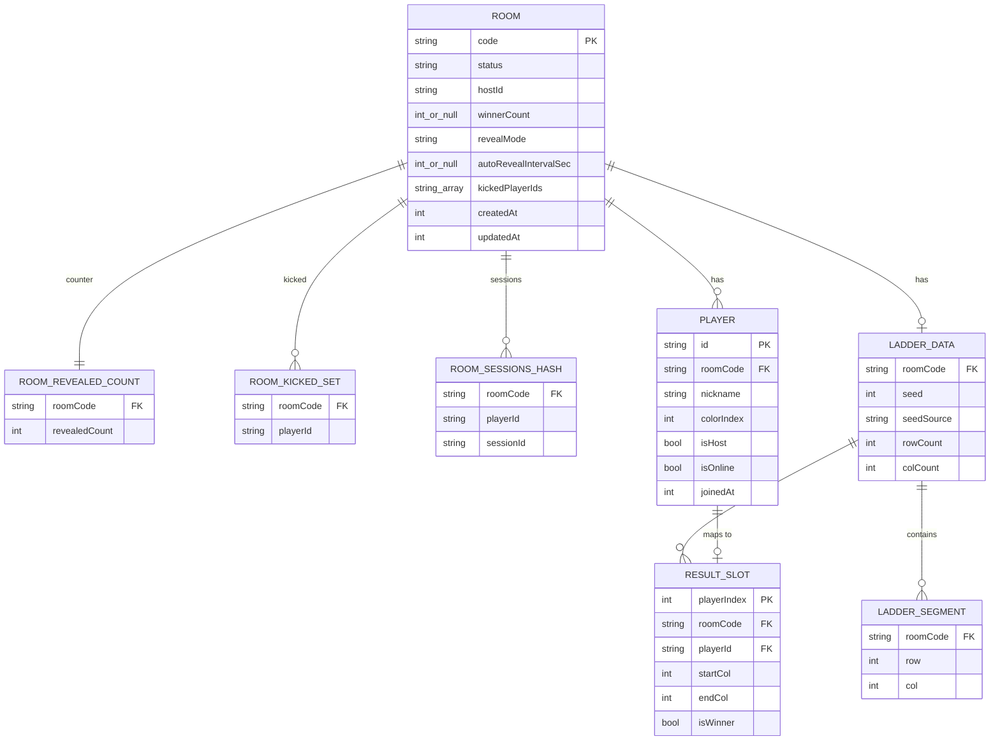

# SCHEMA.md — Ladder Room Online Redis Schema Design

> Version: v1.1 | 2026-04-19 | Based on EDD v1.3
> Redis is the sole persistence layer. There is no SQL database. All state lives in Redis key-value structures with explicit TTLs.

---

## 1. 資料儲存概覽

### 持久層選擇

Ladder Room Online 使用 **Redis 作為唯一的持久層**。選擇 Redis 的原因：

- 房間生命週期短（數分鐘到數小時），天然適合 TTL 驅動的資料管理
- WebSocket 廣播需要低延遲讀寫，Redis 的亞毫秒響應完全符合
- 原子操作（INCR、SETNX、MULTI/EXEC、WATCH）消除競態條件，無需分散式鎖服務
- 記憶體用量可預測（每房間 ~88 KB，100 房間僅 ~8.8 MB）

### 儲存的資料類型

| 類別 | 儲存內容 |
|------|---------|
| 房間狀態 | status、hostId、winnerCount（number \| null）、revealMode、autoRevealIntervalSec、createdAt、updatedAt |
| 玩家狀態 | players 陣列（nickname、colorIndex、isHost、isOnline） |
| 梯子資料 | seed（number）、seedSource（UUID hex）、rowCount、colCount、segments 陣列 |
| 揭示計數 | revealedCount 原子計數器 |
| 踢除名單 | kickedPlayerIds Set（同時冗余儲存於 Room JSON） |
| Session 對應 | playerId → sessionId Hash |

### TTL 策略

| 房間狀態 | TTL | 觸發條件 |
|---------|-----|---------|
| `waiting` / `running` / `revealing` | 24h | 建立或任何狀態變更時重設 |
| `finished` | 1h | 轉換至 finished 狀態時設定 |
| 所有玩家離線 | 5min (300s) | 最後一個 WS 連線關閉時 EXPIRE |
| Pod 重啟 | 維持現有 TTL | 無連線的房間不重設，自然過期 |

所有 `room:{code}:*` 子鍵與主鍵使用相同的 TTL，並在主鍵更新時一起重設。

### 序列化策略

- **複雜物件**（Room、LadderData）序列化為 JSON 字串，儲存在 Redis String 鍵
- **revealedCount** 使用 Redis 原生計數器（INCR），值為整數字串如 `"3"`
- **kickedPlayerIds** 使用 Redis Set，成員為 playerId 字串
- **sessions** 使用 Redis Hash，field 為 playerId，value 為 sessionId

---

## 2. Redis Key Schema

### 完整鍵清單

| Key 模式 | Type | Value | TTL | 用途 |
|---------|------|-------|-----|------|
| `room:{code}` | String (JSON) | 序列化的 Room 物件（含 players 陣列） | 24h（每次狀態變更重設） | 房間主狀態 |
| `room:{code}:ladder` | String (JSON) | LadderData JSON（seed、segments、results） | 與主鍵同步 | 梯子結構與結果 |
| `room:{code}:revealedCount` | String (counter) | 整數字串，如 `"0"` 到 `"N"` | 與主鍵同步 | 揭示進度原子計數器 |
| `room:{code}:kicked` | Set | `{ playerId1, playerId2, ... }` | 與主鍵同步 | 踢除玩家 ID 集合，用於重連檢查 |
| `room:{code}:sessions` | Hash | `{ playerId: sessionId }` | 與主鍵同步 | 追蹤活躍 WebSocket Session |

### 鍵格式說明

- `{code}` 為 6 位大寫英數字房間代碼，例如 `ALPHA1`
- 所有子鍵（`:ladder`、`:revealedCount`、`:kicked`、`:sessions`）的 TTL 與主鍵 `room:{code}` 一致
- 主鍵更新時，使用 `MULTI/EXEC` 批次重設所有子鍵的 EXPIRE

### 範例鍵

```
room:ALPHA1
room:ALPHA1:ladder
room:ALPHA1:revealedCount
room:ALPHA1:kicked
room:ALPHA1:sessions
```

---

## 3. Room 物件 JSON 結構

### Stage 1: waiting（剛建立，等待玩家加入）

```json
{
  "code": "ALPHA1",
  "status": "waiting",
  "hostId": "player-uuid-001",
  "winnerCount": null,
  "revealMode": "manual",
  "autoRevealIntervalSec": null,
  "kickedPlayerIds": [],
  "createdAt": 1745049600000,
  "updatedAt": 1745049600000,
  "players": [
    {
      "id": "player-uuid-001",
      "nickname": "Alice",
      "colorIndex": 0,
      "isHost": true,
      "isOnline": true,
      "joinedAt": 1745049600000
    }
  ]
}
```

`room:ALPHA1:ladder` → `""`（空字串或鍵不存在）
`room:ALPHA1:revealedCount` → `"0"`
`room:ALPHA1:kicked` → 空 Set
`room:ALPHA1:sessions` → `{ "player-uuid-001": "sess-abc123" }`

---

### Stage 2: running（主持人開始遊戲，seedSource 已生成，梯子尚未生成）

> **重要**：START_GAME 只生成 `seedSource`（UUID v4）並計算 `rowCount`，**不生成梯子結構**。
> 梯子（`LadderData`、`ResultSlots`）延遲至 BEGIN_REVEAL 時原子生成（PRD AC-H03-1, NFR-05）。
> `room:{code}:ladder` 鍵在此階段**不存在**。

```json
{
  "code": "ALPHA1",
  "status": "running",
  "hostId": "player-uuid-001",
  "winnerCount": 1,
  "revealMode": "manual",
  "autoRevealIntervalSec": null,
  "kickedPlayerIds": ["player-uuid-004"],
  "createdAt": 1745049600000,
  "updatedAt": 1745049930000,
  "players": [
    {
      "id": "player-uuid-001",
      "nickname": "Alice",
      "colorIndex": 0,
      "isHost": true,
      "isOnline": true,
      "joinedAt": 1745049600000
    },
    {
      "id": "player-uuid-002",
      "nickname": "Bob",
      "colorIndex": 1,
      "isHost": false,
      "isOnline": true,
      "joinedAt": 1745049675000
    },
    {
      "id": "player-uuid-003",
      "nickname": "Carol",
      "colorIndex": 2,
      "isHost": false,
      "isOnline": false,
      "joinedAt": 1745049720000
    }
  ]
}
```

`room:ALPHA1:ladder` → **不存在**（梯子尚未生成；BEGIN_REVEAL 時才創建）
`room:ALPHA1:revealedCount` → `"0"`
`room:ALPHA1:kicked` → `{ "player-uuid-004" }` （被踢玩家）
`room:ALPHA1:sessions` → `{ "player-uuid-001": "sess-abc123", "player-uuid-002": "sess-def456" }`

---

### Stage 3: revealing（揭示進行中，BEGIN_REVEAL 已觸發梯子生成）

房間主鍵 JSON 同 Stage 2，但 `status` 更新：

```json
{
  "code": "ALPHA1",
  "status": "revealing",
  "updatedAt": 1745050200000,
  "...": "其餘欄位同 Stage 2"
}
```

`room:ALPHA1:revealedCount` → `"2"` （已揭示 2 位玩家）

`room:ALPHA1:ladder` → **BEGIN_REVEAL 時原子生成**，此時已存在（含 seed、seedSource、segments、results）。
  - `seed` 存在於 Redis，但 `ROOM_STATE_FULL` 以 **LadderDataPublic**（省略 seed/seedSource）傳送客戶端（PRD AC-H03-1, NFR-05）
  - `seed` 至 END_GAME（status=finished）時才首次對客戶端公開

---

### Stage 4: finished（全部揭示完畢）

```json
{
  "code": "ALPHA1",
  "status": "finished",
  "hostId": "player-uuid-001",
  "winnerCount": 1,
  "revealMode": "manual",
  "autoRevealIntervalSec": null,
  "kickedPlayerIds": ["player-uuid-004"],
  "createdAt": 1745049600000,
  "updatedAt": 1745050542000,
  "players": [
    {
      "id": "player-uuid-001",
      "nickname": "Alice",
      "colorIndex": 0,
      "isHost": true,
      "isOnline": true,
      "joinedAt": 1745049600000
    },
    {
      "id": "player-uuid-002",
      "nickname": "Bob",
      "colorIndex": 1,
      "isHost": false,
      "isOnline": true,
      "joinedAt": 1745049675000
    },
    {
      "id": "player-uuid-003",
      "nickname": "Carol",
      "colorIndex": 2,
      "isHost": false,
      "isOnline": false,
      "joinedAt": 1745049720000
    }
  ]
}
```

此時 TTL 降為 1h，`room:ALPHA1:revealedCount` → `"3"`（等於 players.length）

---

### LadderData JSON（`room:ALPHA1:ladder`）

```json
{
  "seed": 2753483489,
  "seedSource": "a3f8c2e1-d9b7-4f2a-8e6c-1b3d5f7a9c0e",
  "rowCount": 10,
  "colCount": 3,
  "segments": [
    { "row": 0, "col": 0 },
    { "row": 1, "col": 1 },
    { "row": 2, "col": 0 },
    { "row": 3, "col": 1 },
    { "row": 4, "col": 0 },
    { "row": 5, "col": 0 },
    { "row": 6, "col": 1 },
    { "row": 7, "col": 0 },
    { "row": 8, "col": 1 },
    { "row": 9, "col": 0 }
  ],
  "results": [
    {
      "playerIndex": 0,
      "playerId": "player-uuid-001",
      "startCol": 0,
      "endCol": 1,
      "isWinner": true,
      "path": [
        { "row": 0, "col": 0, "direction": "down" },
        { "row": 1, "col": 0, "direction": "right" },
        { "row": 2, "col": 1, "direction": "down" },
        { "row": 3, "col": 1, "direction": "down" },
        { "row": 4, "col": 1, "direction": "down" },
        { "row": 5, "col": 1, "direction": "down" },
        { "row": 6, "col": 1, "direction": "down" },
        { "row": 7, "col": 1, "direction": "down" },
        { "row": 8, "col": 1, "direction": "down" },
        { "row": 9, "col": 1, "direction": "down" }
      ]
    },
    {
      "playerIndex": 1,
      "playerId": "player-uuid-002",
      "startCol": 1,
      "endCol": 2,
      "isWinner": false,
      "path": [
        { "row": 0, "col": 1, "direction": "right" },
        { "row": 1, "col": 2, "direction": "down" },
        { "row": 2, "col": 2, "direction": "down" },
        { "row": 3, "col": 2, "direction": "down" },
        { "row": 4, "col": 2, "direction": "down" },
        { "row": 5, "col": 2, "direction": "down" },
        { "row": 6, "col": 2, "direction": "down" },
        { "row": 7, "col": 2, "direction": "down" },
        { "row": 8, "col": 2, "direction": "down" },
        { "row": 9, "col": 2, "direction": "down" }
      ]
    },
    {
      "playerIndex": 2,
      "playerId": "player-uuid-003",
      "startCol": 2,
      "endCol": 0,
      "isWinner": false,
      "path": [
        { "row": 0, "col": 2, "direction": "down" },
        { "row": 1, "col": 2, "direction": "down" },
        { "row": 2, "col": 2, "direction": "down" },
        { "row": 3, "col": 2, "direction": "down" },
        { "row": 4, "col": 2, "direction": "down" },
        { "row": 5, "col": 2, "direction": "down" },
        { "row": 6, "col": 2, "direction": "down" },
        { "row": 7, "col": 2, "direction": "down" },
        { "row": 8, "col": 2, "direction": "down" },
        { "row": 9, "col": 0, "direction": "down" }
      ]
    }
  ]
}
```

---

## 4. 資料模型（TypeScript → Redis 對應）

### TypeScript 介面

```typescript
interface Room {
  readonly code: string;
  status: 'waiting' | 'running' | 'revealing' | 'finished';
  hostId: string;                         // mutable: host transfer on 60s disconnect grace
  winnerCount: number | null;             // null until host sets it; reset to null on play-again if W >= new N
  revealMode: 'manual' | 'auto';
  autoRevealIntervalSec: number | null;   // 1-30s; null when revealMode is 'manual'
  kickedPlayerIds: readonly string[];     // redundant mirror of room:{code}:kicked Set
  createdAt: number;       // Unix ms
  updatedAt: number;       // Unix ms
  readonly players: readonly Player[];   // immutable reference; modifications return new Room with updated players array
}

interface Player {
  readonly id: string;
  nickname: string;
  colorIndex: number;
  isHost: boolean;
  isOnline: boolean;
  joinedAt: number;        // Unix ms
}

/**
 * LadderData — 完整梯子資料，含 seed/seedSource。
 * 儲存於 Redis room:{code}:ladder。
 * 在 BEGIN_REVEAL 時生成（非 START_GAME）。
 * 僅在 status=finished 時對客戶端公開（含 seed/seedSource）。
 */
interface LadderData {
  readonly seed: number;          // Mulberry32 seed = djb2(seedSource) >>> 0 (uint32)
  readonly seedSource: string;    // UUID v4 hex generated at START_GAME; stored for audit (PRD FR-03-1)
  readonly rowCount: number;      // clamp(N*3, 20, 60)
  readonly colCount: number;      // = N (all players incl. offline)
  readonly segments: readonly LadderSegment[];
  readonly results: readonly ResultSlot[];  // always non-null: room:{code}:ladder 鍵僅在 BEGIN_REVEAL 時原子創建（含完整 results）
  // 注意：在 BEGIN_REVEAL 前，room:{code}:ladder 鍵「不存在」於 Redis；不存在與 results=null 是不同的概念
}

/**
 * LadderDataRaw — 應用層內部用型別，用於表示尚未計算 results 的中間狀態。
 * 此型別不序列化至 Redis（Redis 中只存 LadderData，results 必然已填入）。
 */
interface LadderDataRaw {
  readonly seed: number;
  readonly seedSource: string;
  readonly rowCount: number;
  readonly colCount: number;
  readonly segments: readonly LadderSegment[];
  readonly results: null;  // 計算前的中間狀態，僅存在於應用層記憶體
}

/**
 * LadderDataPublic — 發送給客戶端的公開梯子資料（省略 seed/seedSource）。
 * 在 status=revealing 時透過 ROOM_STATE_FULL unicast 給重連玩家（PRD AC-H03-1, NFR-05）。
 * 前端使用此資料計算 REVEAL_ALL 動畫路徑（REVEAL_ALL payload 使用 ResultSlotPublic 省略 path）。
 */
interface LadderDataPublic {
  readonly rowCount: number;
  readonly colCount: number;
  readonly segments: readonly LadderSegment[];
  // seed 與 seedSource 刻意省略 — 僅在 status=finished 時對客戶端公開
}

interface LadderSegment {
  readonly row: number;
  readonly col: number;             // 橫槓左端的欄位索引（col <-> col+1 has a rung）
}

interface PathStep {
  readonly row: number;
  readonly col: number;
  readonly direction: 'down' | 'left' | 'right';
}

interface ResultSlot {
  readonly playerIndex: number;   // positional index for Canvas column rendering
  readonly playerId: string;      // stable identity reference (UUID v4)
  readonly startCol: number;
  readonly endCol: number;
  readonly isWinner: boolean;     // win/lose only; no named prizes (PRD Out-of-Scope #5)
  readonly path: readonly PathStep[];  // length = rowCount; each step records row, col, direction
}

/**
 * ResultSlotPublic — REVEAL_ALL payload 專用（省略 path 欄位）。
 * N=50, rowCount=60 時完整 path 約 150KB，超過 WebSocket maxPayload 64KB。
 * 前端利用 LadderDataPublic 中的 segments 自行重算動畫路徑（MVP Option A, PRD NFR-05）。
 */
type ResultSlotPublic = Omit<ResultSlot, 'path'>;
```

### TypeScript 欄位 → Redis 鍵對應表

| TypeScript 欄位 | Redis 鍵 | 儲存位置 | 備註 |
|----------------|---------|---------|------|
| `Room.code` | `room:{code}` | JSON 頂層 `code` 欄位 | |
| `Room.status` | `room:{code}` | JSON 頂層 `status` 欄位 | |
| `Room.hostId` | `room:{code}` | JSON 頂層 `hostId` 欄位 | |
| `Room.winnerCount` | `room:{code}` | JSON 頂層 `winnerCount` 欄位 | `number \| null` |
| `Room.revealMode` | `room:{code}` | JSON 頂層 `revealMode` 欄位 | `"manual" \| "auto"` |
| `Room.autoRevealIntervalSec` | `room:{code}` | JSON 頂層 `autoRevealIntervalSec` 欄位 | `number \| null`，manual 時為 null |
| `Room.kickedPlayerIds` | `room:{code}` | JSON 頂層 `kickedPlayerIds` 陣列 | 冗余鏡像，以 Redis Set 為準 |
| `Room.createdAt` | `room:{code}` | JSON 頂層 `createdAt` 欄位 | Unix ms (number) |
| `Room.updatedAt` | `room:{code}` | JSON 頂層 `updatedAt` 欄位 | Unix ms (number) |
| `Room.players[]` | `room:{code}` | JSON 頂層 `players` 陣列 | |
| `Player.id` | `room:{code}` | `players[n].id` | |
| `Player.nickname` | `room:{code}` | `players[n].nickname` | |
| `Player.colorIndex` | `room:{code}` | `players[n].colorIndex` | |
| `Player.isHost` | `room:{code}` | `players[n].isHost` | |
| `Player.isOnline` | `room:{code}` | `players[n].isOnline` | |
| `Player.joinedAt` | `room:{code}` | `players[n].joinedAt` | Unix ms (number) |
| `LadderData.seed` | `room:{code}:ladder` | JSON 頂層 `seed` 欄位 | number (uint32，djb2 output)；**在 revealing 狀態以 LadderDataPublic 傳客戶端時省略** |
| `LadderData.seedSource` | `room:{code}:ladder` | JSON 頂層 `seedSource` 欄位 | UUID v4 hex string；**在 revealing 狀態省略**；finished 後公開 |
| `LadderData.rowCount` | `room:{code}:ladder` | JSON 頂層 `rowCount` 欄位 | LadderDataPublic 中保留 |
| `LadderData.colCount` | `room:{code}:ladder` | JSON 頂層 `colCount` 欄位 | LadderDataPublic 中保留 |
| `LadderData.segments[]` | `room:{code}:ladder` | JSON 頂層 `segments` 陣列 | LadderDataPublic 中保留 |
| `LadderData.results[]` | `room:{code}:ladder` | JSON 頂層 `results` 陣列 | null 直到 **BEGIN_REVEAL**（非 START_GAME）；BEGIN_REVEAL 時原子填入 |
| `ResultSlot.playerIndex` | `room:{code}:ladder` | `results[n].playerIndex` | |
| `ResultSlot.playerId` | `room:{code}:ladder` | `results[n].playerId` | UUID v4 |
| `ResultSlot.startCol` | `room:{code}:ladder` | `results[n].startCol` | ResultSlotPublic 中保留 |
| `ResultSlot.endCol` | `room:{code}:ladder` | `results[n].endCol` | ResultSlotPublic 中保留 |
| `ResultSlot.isWinner` | `room:{code}:ladder` | `results[n].isWinner` | boolean；ResultSlotPublic 中保留 |
| `ResultSlot.path[]` | `room:{code}:ladder` | `results[n].path` | PathStep[]（含 row/col/direction）；**REVEAL_ALL payload 使用 ResultSlotPublic 省略 path** |
| revealedCount | `room:{code}:revealedCount` | Redis String 計數器 | 原子 INCR；與 Room JSON 無冗余 |
| kickedPlayerIds（正本） | `room:{code}:kicked` | Redis Set 成員 | SISMEMBER 用於重連檢查 |
| sessionId 對應 | `room:{code}:sessions` | Redis Hash field/value | |

---

## 5. 原子操作設計

### 5.1 建立房間（`POST /rooms`）

**需要原子性的原因**：並發請求可能生成相同的 6 位房間代碼，必須確保唯一性。

```redis
# SET NX EX 原子地設定鍵值與 TTL，確保唯一性且不遺漏 EXPIRE
# 若回傳 nil（已存在），重新生成代碼並重試，最多重試 10 次
# 使用 SET ... NX EX 取代 SETNX + 後續 EXPIRE（避免兩者之間程序崩潰導致房間無 TTL）
SET room:ALPHA1 "{...roomJson with kickedPlayerIds:[], winnerCount:null, revealMode:'manual'...}" NX EX 86400

# 若上述 SET 返回 OK（成功），原子地初始化子鍵（使用 Lua 確保原子性）
EVAL "
  if redis.call('EXISTS', KEYS[1]) == 0 then return 0 end
  redis.call('SET', KEYS[2], '0', 'EX', ARGV[1])
  return 1
" 2 room:ALPHA1 room:ALPHA1:revealedCount 86400

# 注意：room:ALPHA1:kicked Set 不預先初始化
# SISMEMBER 對不存在的鍵直接返回 0，行為正確，無需建立空 Set
# （若 SADD 寫入空字串 "" 會汙染 Set，導致後續 SISMEMBER "" 誤判為被踢）
# room:ALPHA1:sessions 鍵在首個 WS 連線建立時由 HSET 創建並設 TTL
```

**衝突處理**：最多重試 10 次。若 10 次均衝突（機率極低），回傳 503。

---

### 5.2 開始遊戲（`START_GAME`）

**需要原子性的原因**：必須同時寫入 room status 與 seedSource，防止部分更新導致狀態不一致。

**重要**：START_GAME **不生成梯子**（LadderData、ResultSlots）。梯子在 BEGIN_REVEAL 時才原子生成（PRD AC-H03-1, NFR-05）。`room:{code}:ladder` 鍵在此步驟不存在。

```redis
WATCH room:ALPHA1

# 讀取當前狀態並驗證（status 必須為 waiting，請求者必須是 host，N>=2，1<=W<=N-1）
GET room:ALPHA1

# 應用層生成 seedSource = crypto.randomUUID()；計算 rowCount = clamp(N*3, 20, 60)
# seed = djb2(seedSource)（計算後暫存，不廣播給客戶端）

# 開始 transaction
MULTI
  SET room:ALPHA1 "{...updatedRoomJson with status:running, seedSource:uuid, rowCount:N, ladder:null...}"
  SET room:ALPHA1:revealedCount "0"
  DEL room:ALPHA1:ladder            # 若有舊梯子資料（play-again 後），確保清除
  EXPIRE room:ALPHA1 86400
  EXPIRE room:ALPHA1:revealedCount 86400
  EXPIRE room:ALPHA1:kicked 86400
  EXPIRE room:ALPHA1:sessions 86400
EXEC
# 若 EXEC 返回 nil（WATCH 觸發），表示有並發修改，重試整個流程
# 成功後廣播 ROOM_STATE（status:running, rowCount）— 不含 seed、不含 ladder
```

---

### 5.3-B 開始揭示（`BEGIN_REVEAL`）

**需要原子性的原因**：必須同時生成並寫入 LadderData（含 seed、segments）和 ResultSlots，並將 status 更新為 revealing，防止客戶端看到 half-initialized 的揭示狀態。

```redis
# 應用層（GameService）執行純計算（零 I/O）：
#   ladder = GenerateLadder(room.seedSource, N)
#   results = ComputeResults(ladder, winnerCount, rng)
#   填入 playerId 至各 ResultSlot（依 players 陣列順序）

# Lua Script 保證原子性（Redis 內部原子執行，無法被其他命令插入）:
EVAL "
  local room = cjson.decode(ARGV[1])
  room.status = 'revealing'
  redis.call('SET', KEYS[1], cjson.encode(room))
  redis.call('SET', KEYS[2], ARGV[2])        -- 寫入 LadderData JSON（含 seed）
  redis.call('SET', KEYS[3], '0')            -- 重置揭示計數器為 '0'（DEL 後 EXPIRE 對不存在的鍵是 no-op，應使用 SET）
  redis.call('EXPIRE', KEYS[1], 86400)
  redis.call('EXPIRE', KEYS[2], 86400)
  redis.call('EXPIRE', KEYS[3], 86400)
  return 1
" 3 room:ALPHA1 room:ALPHA1:ladder room:ALPHA1:revealedCount {roomJson} {ladderDataJson}

# 成功後廣播 ROOM_STATE（status:revealing）
# seed 雖已存入 Redis，但不對客戶端公開（直到 END_GAME）
# 新連線或重連玩家收到 ROOM_STATE_FULL，ladder 欄位為 LadderDataPublic（省略 seed/seedSource）
```

---

### 5.4 揭示計數（`REVEAL_NEXT`）

**需要原子性的原因**：多個玩家可能同時觸發揭示，必須保證揭示順序唯一且遞增。

```redis
# 原子遞增，返回新值（即本次揭示的索引 1-based）
INCR room:ALPHA1:revealedCount
# 返回值如 "3" 表示第 3 位玩家揭示完成

# REVEAL_NEXT 後廣播 REVEAL_INDEX（含完整 ResultSlot 含 path，單一玩家，安全在 64KB 內）
# 若 INCR 返回值 == players.length（全部揭示完畢），仍維持 revealing 狀態
# 狀態轉換（revealed → finished）需由 Host 另行發送 END_GAME（PRD AC-H04-4）
```

---

### 5.4-B 結束本局（`END_GAME`）

**需要原子性的原因**：必須原子地將 status 更新為 finished，同時縮短 TTL，防止半轉換狀態。

```redis
WATCH room:ALPHA1
GET room:ALPHA1
# 驗證：status === 'revealing'，revealedCount === totalCount（所有路徑已揭曉），請求者是 host

MULTI
  SET room:ALPHA1 "{...room with status:'finished', updatedAt:now...}"
  EXPIRE room:ALPHA1 3600          # TTL 降至 1h（finished 狀態保留結果）
  EXPIRE room:ALPHA1:ladder 3600
  EXPIRE room:ALPHA1:revealedCount 3600
  EXPIRE room:ALPHA1:kicked 3600
  EXPIRE room:ALPHA1:sessions 3600
EXEC
# 成功後廣播 ROOM_STATE（status:'finished'，含 seed + 完整 results[]）
# seed 至此首次對客戶端公開（PRD AC-H03-1, NFR-05）
# EXEC null → 重試最多 3 次
```

---

### 5.5 踢除玩家（`KICK_PLAYER`）

**需要原子性的原因**：必須同時更新 players 陣列（移除玩家）和 kicked Set（加入 playerId），避免資料不一致。

```redis
WATCH room:ALPHA1

# 讀取當前 room，驗證請求者是 host 且目標玩家存在
GET room:ALPHA1

MULTI
  SET room:ALPHA1 "{...roomJson with player removed from players array...}"
  SADD room:ALPHA1:kicked "player-uuid-003"
  EXPIRE room:ALPHA1 86400
  EXPIRE room:ALPHA1:kicked 86400
EXEC
# EXEC 返回 nil 時重試
```

---

### 5.6 再玩一局（`PLAY_AGAIN`，取代舊版 `RESET_ROOM`）

**需要原子性的原因**：必須原子地清除梯子資料、結果、計數器、踢除名單，並重設 players 狀態，避免重置中途有玩家讀取到半清空的狀態。

**流程（對應 EDD §12.3）**：
1. 驗證 status === 'finished'，請求者是 host
2. 計算 onlinePlayers（過濾 isOnline=false）
3. 若 onlinePlayers.length < 2 → INSUFFICIENT_ONLINE_PLAYERS
4. 若 winnerCount >= onlinePlayers.length → winnerCount = null
5. kickedPlayerIds 清空（PRD AC-H07-5：被踢者可用新 playerId 重新加入）

```redis
WATCH room:ALPHA1

# 讀取當前 room，過濾掉離線玩家（prune offline players）
GET room:ALPHA1

MULTI
  SET room:ALPHA1 "{...roomJson with status:'waiting', players:onlinePlayers, winnerCount:adjusted, ladder:null, results:null, revealedCount:0, revealMode:'manual', autoRevealIntervalSec:null, kickedPlayerIds:[], seedSource:null...}"
  DEL room:ALPHA1:ladder            # 清除梯子資料（DEL 確保鍵完全移除，非設空字串）
  SET room:ALPHA1:revealedCount "0" # 重設計數器
  DEL room:ALPHA1:kicked            # 清空踢除名單（PRD AC-H07-5）
  EXPIRE room:ALPHA1 86400
  EXPIRE room:ALPHA1:revealedCount 86400
  EXPIRE room:ALPHA1:sessions 86400
EXEC
# 成功後廣播 ROOM_STATE（status:'waiting'）
```

---

## 6. 記憶體估算

估算基準：50 名玩家、梯子 10 列 × 50 欄（約 600 個橫槓 segments）、每位玩家 path 長度 10（rowCount）。

| 物件 | 大小估算 | 說明 |
|------|---------|------|
| Room JSON（50 players） | ~10 KB | 每位玩家約 200 bytes，加上頂層欄位 |
| LadderData segments（~600 segments） | ~5 KB | 每個 segment `{row, col}` 約 20 bytes |
| ResultSlot[]（50 players × path[10]） | ~72 KB | 每個 ResultSlot 含 path 陣列約 1.5 KB |
| kickedPlayerIds Set | < 1 KB | UUID 字串 × 最多數十個被踢玩家 |
| revealedCount counter | 8 bytes | Redis String 計數器 |
| sessions Hash | ~3 KB | 50 個 playerId:sessionId 對 |
| Redis 鍵名 overhead | ~0.5 KB | 5 個鍵名字串 |
| **單房間合計** | **~90 KB** | 含所有子鍵 |
| 100 房間（MVP 目標） | **~9 MB** | 遠低於標準 Redis 實例記憶體限制 |

> 注意：ResultSlot 的 `path` 陣列是最大的記憶體消耗項目。若 rowCount 增加至 120（樓梯遊戲典型高度），ResultSlot[] 估算將增加至 ~72 KB（50 × 120 步 × 12 bytes/步），單房間合計約 88 KB。

---

## 7. ER 圖（Mermaid erDiagram）

> 以下為邏輯 ER 圖，反映 Redis 中各資料集合之間的關係。雖然 Redis 無外鍵約束，但應用層在寫入時強制維護這些關係。



---

## 8. 查詢模式與使用案例（Redis 命令序列）

### 8.1 加入房間流程

```redis
# Step 1: 讀取房間狀態
GET room:ALPHA1
# 若 nil → 房間不存在，回傳 404

# Step 2: 檢查玩家是否被踢除
SISMEMBER room:ALPHA1:kicked "player-uuid-003"
# 若返回 1 → 玩家已被踢，回傳 403

# Step 3: 讀取當前 room JSON，反序列化後加入新玩家
# Step 4: 原子寫入更新後的 room

WATCH room:ALPHA1
MULTI
  SET room:ALPHA1 "{...roomJson with new player appended...}"
  HSET room:ALPHA1:sessions "player-uuid-005" "sess-new-xyz"
  EXPIRE room:ALPHA1 86400
  EXPIRE room:ALPHA1:sessions 86400
EXEC
```

---

### 8.2 開始遊戲流程（START_GAME）

**注意**：START_GAME 不生成梯子。梯子由 BEGIN_REVEAL 生成（見 §5.3-B）。

```redis
# Step 1: 讀取並驗證
WATCH room:ALPHA1
GET room:ALPHA1
# 驗證 status == 'waiting' 且 hostId == 請求者，N>=2，1<=W<=N-1

# Step 2: 應用層生成 seedSource = crypto.randomUUID()，計算 rowCount
# (不生成 LadderData，梯子延遲至 BEGIN_REVEAL)

# Step 3: 原子寫入（不含 ladder）
MULTI
  SET room:ALPHA1 "{...status:running, seedSource:uuid, rowCount:N, ladder:null, updatedAt:now...}"
  SET room:ALPHA1:revealedCount "0"
  DEL room:ALPHA1:ladder            # 確保舊梯子資料清除（play-again 後再開始的場景）
  EXPIRE room:ALPHA1 86400
  EXPIRE room:ALPHA1:revealedCount 86400
  EXPIRE room:ALPHA1:kicked 86400
  EXPIRE room:ALPHA1:sessions 86400
EXEC
# nil → 並發衝突，重試
# 成功後廣播 ROOM_STATE（status:running, rowCount）— 不含 seed、不含 ladder
```

---

### 8.3 揭示下一位

```redis
# Step 1: 原子遞增揭示計數
INCR room:ALPHA1:revealedCount
# 返回新的計數值，例如 3

# Step 2: 讀取 ladder results[2]（index = 返回值 - 1）
GET room:ALPHA1:ladder
# 解析 results[2] 並透過 WebSocket 廣播 REVEAL_INDEX 事件

# Step 3: REVEAL_NEXT 後不自動轉 finished（即使 INCR 返回值 == players.length）
# PRD AC-H04-4：狀態轉換（revealing → finished）需由 Host 明確發送 END_GAME 才觸發
# 自動轉 finished 邏輯已移除，見 §5.4-B END_GAME 原子操作
```

---

### 8.4 重連查詢

```redis
# 玩家重連時，一次取得所有需要的狀態

# Step 1: 確認玩家未被踢除
SISMEMBER room:ALPHA1:kicked "player-uuid-002"
# 返回 1 → 拒絕重連（403）

# Step 2: 取得房間主狀態
GET room:ALPHA1

# Step 3: 取得梯子資料（若 status 為 running/revealing/finished）
GET room:ALPHA1:ladder

# Step 4: 取得揭示計數
GET room:ALPHA1:revealedCount

# Step 5: 更新 session 對應
HSET room:ALPHA1:sessions "player-uuid-002" "sess-new-reconnect"
EXPIRE room:ALPHA1:sessions 86400

# Step 6: 更新 player.isOnline = true，廣播 PLAYER_RECONNECTED 事件
WATCH room:ALPHA1
GET room:ALPHA1
MULTI
  SET room:ALPHA1 "{...roomJson with player.isOnline=true...}"
  EXPIRE room:ALPHA1 86400
EXEC
```

---

### 8.5 房間清理（TTL 過期）

Redis TTL 過期時自動刪除鍵，無需主動清理。但若需要提前清理（例如主持人主動解散房間），執行：

```redis
# 刪除所有相關鍵
DEL room:ALPHA1
DEL room:ALPHA1:ladder
DEL room:ALPHA1:revealedCount
DEL room:ALPHA1:kicked
DEL room:ALPHA1:sessions

# 或使用 UNLINK（非同步刪除，避免阻塞）
UNLINK room:ALPHA1 room:ALPHA1:ladder room:ALPHA1:revealedCount room:ALPHA1:kicked room:ALPHA1:sessions
```

**最後玩家離線時（所有連線關閉）**：

```redis
# WS 連線關閉 handler
HDEL room:ALPHA1:sessions "player-uuid-001"

# 檢查 sessions Hash 是否為空
HLEN room:ALPHA1:sessions
# 若返回 0 → 設定 5 分鐘短 TTL
EXPIRE room:ALPHA1 300
EXPIRE room:ALPHA1:ladder 300
EXPIRE room:ALPHA1:revealedCount 300
EXPIRE room:ALPHA1:kicked 300
EXPIRE room:ALPHA1:sessions 300
```

---

## 9. 使用案例 Redis 指令

> 以下五個使用案例以完整的 Redis 指令序列呈現，類比於 SQL 的 use-case query，驗證 key schema 能否滿足所有存取模式。每個案例標注了 Redis 命令複雜度。

---

### 9.1 重連流程（Reconnect Flow）

**前提**：玩家 `player-uuid-002` 的 WS 斷線，正嘗試重建連線。

```redis
# ── Step 1：WS Upgrade 階段，先確認玩家未被踢除 ──────────────────
# O(1) — Set membership test
SISMEMBER room:ALPHA1:kicked "player-uuid-002"
# 返回 0 → 未被踢，繼續；返回 1 → close 4003 拒絕

# ── Step 2：以 pipeline 批次讀取三個鍵，減少 RTT ────────────────
# O(1) each; pipeline 一次往返
GET room:ALPHA1            # 房間主狀態（含 players、revealMode、kickedPlayerIds）
GET room:ALPHA1:ladder     # 梯子資料（status 為 running/revealing/finished 時有值）
GET room:ALPHA1:revealedCount  # 當前揭示計數

# 應用層解析 room JSON，驗證 player.id 存在於 players 陣列中
# 若 room 為 nil → 房間已過期，回傳 404

# ── Step 3：更新 sessions Hash，登記新的 sessionId ───────────────
# O(1)
HSET room:ALPHA1:sessions "player-uuid-002" "sess-new-reconnect-xyz"

# ── Step 4：原子更新 player.isOnline = true，同步重設 TTL ────────
WATCH room:ALPHA1
GET room:ALPHA1
# 應用層修改 players[idx].isOnline = true，updatedAt = Date.now()
MULTI
  SET room:ALPHA1 "{...roomJson with player-uuid-002.isOnline=true, updatedAt:now...}"
  EXPIRE room:ALPHA1 86400
  EXPIRE room:ALPHA1:ladder 86400
  EXPIRE room:ALPHA1:revealedCount 86400
  EXPIRE room:ALPHA1:kicked 86400
  EXPIRE room:ALPHA1:sessions 86400
EXEC
# nil → 並發寫入（另一玩家同時加入/踢除），重試最多 3 次

# ── Step 5：廣播 PLAYER_RECONNECTED 事件給房間 ──────────────────
# O(1) — Pub/Sub publish
PUBLISH room:ALPHA1:events "{...ROOM_STATE payload with updated player online status...}"
```

**覆蓋的存取模式**：SISMEMBER（kicked 檢查）、pipeline GET × 3（狀態讀取）、HSET（session 更新）、WATCH/MULTI/EXEC（isOnline 更新 + TTL 重設）、PUBLISH（廣播）。

---

### 9.2 揭示下一位（Reveal Next）

**前提**：房間狀態為 `revealing`，`revealMode = "manual"`，主持人點選「揭示下一位」。

```redis
# ── Step 1：原子遞增，取得本次揭示的 1-based index ──────────────
# O(1) — atomic increment; 返回值即為 newRevealedCount
INCR room:ALPHA1:revealedCount
# 假設返回 3 → 本次揭示第 3 位玩家（results[2]）
# 若返回值 > players.length → 已全部揭示，應拒絕（INVALID_STATE）
# 邊界保護：應用層在 INCR 前以 GET revealedCount + GET room 做快速預檢，
# 防止惡意客戶端並發觸發超額 INCR（最終由 INCR 返回值做最終一致確認）

# ── Step 2：讀取 LadderData 取得對應 ResultSlot ─────────────────
# O(1)
GET room:ALPHA1:ladder
# 解析 results[2]（index = INCR 返回值 - 1）
# 廣播 REVEAL_INDEX { playerIndex:2, result: ResultSlot（含完整 path）, revealedCount:3, totalCount:N }

# ── Step 3：廣播揭示事件 ──────────────────────────────────────────
# O(1)
PUBLISH room:ALPHA1:events "{type:'REVEAL_INDEX', payload:{playerIndex:2, result:{...含path...}, revealedCount:3, totalCount:3}}"

# ── Step 4（EDD v1.3 重要修正）：REVEAL_NEXT 後不自動轉 finished ─────
# 即使 INCR 返回值 == players.length（全部揭示），房間仍維持 revealing 狀態
# 等待 Host 另行發送 END_GAME 才轉入 finished（PRD AC-H04-4）
# END_GAME 流程見 §5.4-B
```

**關鍵原子性保證**：INCR 本身是 O(1) 原子操作，保證多個 WS 連線同時觸發時每個 INCR 返回唯一遞增值，不存在兩個客戶端取得相同 index 的競態。status 轉換（revealing → finished）需由 Host 的 END_GAME 明確觸發（見 §5.4-B），不自動發生。

---

### 9.3 自動揭示計時器（Auto-Reveal Timer）

**前提**：主持人發送 `SET_REVEAL_MODE { mode: "auto", intervalSec: 3 }`，伺服器啟動計時器。

```redis
# ── Step 1：切換模式時原子更新 room JSON ─────────────────────────
WATCH room:ALPHA1
GET room:ALPHA1
# 應用層修改 revealMode = "auto"，autoRevealIntervalSec = 3
MULTI
  SET room:ALPHA1 "{...room, revealMode:'auto', autoRevealIntervalSec:3, updatedAt:now...}"
  EXPIRE room:ALPHA1 86400
EXEC
# nil → 並發衝突，重試

# ── Step 2（計時器 tick，3 秒後觸發）：讀取模式再次確認 ─────────
# O(1) — 在觸發 INCR 前，必須先確認 revealMode 仍為 "auto"
# 防止用戶在計時期間切回 manual 後計時器仍繼續揭示的競態
GET room:ALPHA1
# 解析 JSON，檢查：
#   1. room.status === 'revealing'（房間仍在揭示中）
#   2. room.revealMode === 'auto'（模式未被切換）
#   3. revealedCount < players.length（尚未全部揭示）
# 任一條件不滿足 → 計時器停止，不執行 INCR

# ── Step 3：確認後執行揭示（同 9.2 Step 1-4）────────────────────
INCR room:ALPHA1:revealedCount
# 後續步驟同 9.2

# ── Step 4（切回 manual 時）：更新 room JSON 停止計時器 ──────────
WATCH room:ALPHA1
GET room:ALPHA1
MULTI
  SET room:ALPHA1 "{...room, revealMode:'manual', autoRevealIntervalSec:null, updatedAt:now...}"
  EXPIRE room:ALPHA1 86400
EXEC
# 應用層在 EXEC 成功後清除 setTimeout/setInterval handle
```

**邊界案例**：計時器 tick 與 REVEAL_ALL_TRIGGER 的競態——兩者均觸發 INCR，INCR 保證原子，第一個 INCR 使 revealedCount == N（觸發 finished），第二個 INCR 返回 N+1，應用層偵測 > N 後丟棄並記錄 warn log。

---

### 9.4 主持人移交（Host Transfer）

**前提**：當前主持人 `player-uuid-001` 斷線超過 60s，伺服器 grace timer 到期，選取下一位 `isOnline=true` 的玩家為新主持人。

```redis
# ── Step 1：選取新主持人（純應用層邏輯，無 Redis 讀取）──────────
# 應用層保有記憶體中的 room 快照（斷線事件時已 GET room），
# 篩選 players.filter(p => p.isOnline && p.id !== oldHostId)，取第一位

# ── Step 2：原子更新 hostId 及所有相關欄位 ────────────────────────
WATCH room:ALPHA1
GET room:ALPHA1
# 應用層再次確認：
#   - 舊主持人仍未重連（player.isOnline === false）
#   - 新主持人仍在線（防止新主持人在 60s 內也斷線）
#   - room.status 仍為 waiting/running/revealing（非 finished）
MULTI
  SET room:ALPHA1 "{...room, hostId:'player-uuid-002', players:[...with isHost updated...], updatedAt:now...}"
  EXPIRE room:ALPHA1 86400
  EXPIRE room:ALPHA1:ladder 86400
  EXPIRE room:ALPHA1:revealedCount 86400
  EXPIRE room:ALPHA1:kicked 86400
  EXPIRE room:ALPHA1:sessions 86400
EXEC
# nil → 另一 Pod 已更新（例如另一個 REVEAL_NEXT 並發），重試讀取 + 再次確認後重試 EXEC

# ── Step 3：廣播 HOST_TRANSFERRED 事件 ──────────────────────────
# O(1)
PUBLISH room:ALPHA1:events "{type:'HOST_TRANSFERRED', payload:{newHostId:'player-uuid-002', reason:'disconnect_timeout'}}"
```

**為何不使用 HSET 只更新 hostId**：Room 物件序列化為整個 JSON 字串（非 Redis Hash），無法做欄位級原子更新。必須讀取整個 JSON、修改後整體回寫，搭配 WATCH 防止並發覆蓋。這是使用 Redis String 儲存複雜物件的固有代價——接受整體讀寫換取序列化彈性。

---

### 9.5 房間清理（Room Cleanup）

**場景 A：主持人主動解散房間**

```redis
# 使用 UNLINK（非同步刪除）一次清理所有子鍵，避免 DEL 阻塞事件迴圈
# O(1) 登記刪除工作，實際刪除非同步在背景線程執行
UNLINK room:ALPHA1 room:ALPHA1:ladder room:ALPHA1:revealedCount room:ALPHA1:kicked room:ALPHA1:sessions

# 廣播解散通知後關閉所有 WS 連線
PUBLISH room:ALPHA1:events "{type:'ROOM_STATE', payload:{status:'disbanded'}}"
# 注意：PUBLISH 在 UNLINK 之前執行，確保訂閱者仍能收到最後一條訊息
# room:ALPHA1:events 頻道本身不是持久化 key，無需 DEL
```

**場景 B：最後一位玩家斷線，縮短 TTL**

```redis
# WS close 事件 handler
# O(1)
HDEL room:ALPHA1:sessions "player-uuid-001"

# O(1)
HLEN room:ALPHA1:sessions
# 返回 0 → 所有玩家均已離線，設定 5 分鐘緊縮 TTL

# 若 HLEN 返回 0，以 pipeline 批次設定所有子鍵 TTL（不需要 MULTI/EXEC，非狀態變更）
EXPIRE room:ALPHA1 300
EXPIRE room:ALPHA1:ladder 300
EXPIRE room:ALPHA1:revealedCount 300
EXPIRE room:ALPHA1:kicked 300
EXPIRE room:ALPHA1:sessions 300
# 300s 後 Redis 自動回收所有鍵，無需主動清理
```

**場景 C：PLAY_AGAIN（再玩一局，取代 RESET_ROOM）部分清理**

```redis
WATCH room:ALPHA1
GET room:ALPHA1
# 應用層篩選 onlinePlayers，調整 winnerCount
MULTI
  SET room:ALPHA1 "{...room, status:'waiting', winnerCount:調整後, revealMode:'manual', autoRevealIntervalSec:null, kickedPlayerIds:[], players:onlinePlayers, seedSource:null, updatedAt:now...}"
  DEL room:ALPHA1:ladder            # 清除梯子（DEL 確保鍵完全移除，而非設為空字串）
  SET room:ALPHA1:revealedCount "0" # 重設計數器
  DEL room:ALPHA1:kicked            # 清空踢除 Set（PRD AC-H07-5；DEL 比 SREM 全員逐一刪除更高效）
  EXPIRE room:ALPHA1 86400
  EXPIRE room:ALPHA1:revealedCount 86400
  EXPIRE room:ALPHA1:sessions 86400
EXEC
# DEL 在 MULTI/EXEC 中是合法指令，確保 kicked Set 與 ladder 原子清空
```

**命令複雜度總覽**

| 使用案例 | 關鍵命令 | 複雜度 | 潛在瓶頸 |
|---------|---------|--------|---------|
| 重連 | SISMEMBER、GET × 3 pipeline、HSET、WATCH/MULTI/EXEC | O(1) | WATCH 重試（高並發房間） |
| 揭示下一位 | INCR、GET、PUBLISH（不自動轉 finished） | O(1) | PUBLISH fan-out（50 訂閱者） |
| 自動揭示計時器 | GET（模式確認）、INCR、WATCH/MULTI/EXEC | O(1) | 計時器與 REVEAL_ALL_TRIGGER 競態 |
| 主持人移交 | WATCH/MULTI/EXEC、PUBLISH | O(1) | WATCH 競態（60s grace 期間並發寫入） |
| 房間清理 | UNLINK × 5 / EXPIRE × 5 / DEL（在 MULTI 中） | O(1) | 無（UNLINK 非同步） |

> **無 O(n) 掃描**：Schema 設計全程避免 KEYS、SCAN、SMEMBERS 等線性掃描命令。kicked Set 的成員列舉僅在 PLAY_AGAIN 時以 DEL 整體清除，不需要逐一 SREM。

---

## 10. TTL 管理策略

### TTL 規則總覽

| 情境 | TTL | 設定時機 | 套用對象 |
|------|-----|---------|---------|
| 房間建立 | 86400s（24h） | `POST /rooms` 成功後 | 所有 `room:{code}:*` 鍵 |
| 狀態變更（任何） | 86400s（24h） | 每次 MULTI/EXEC 成功後 | 所有 `room:{code}:*` 鍵 |
| 轉換至 finished | 3600s（1h） | `END_GAME`（status → finished）的 EXEC 後 | 所有 `room:{code}:*` 鍵 |
| 所有玩家離線 | 300s（5min） | 最後一個 WS `close` 事件後 | 所有 `room:{code}:*` 鍵 |
| Pod 重啟後重連 | 不重設 | 有玩家重連時才重設為 24h | 所有 `room:{code}:*` 鍵 |

### TTL 管理原則

1. **子鍵 TTL 與主鍵同步**：每次寫入操作在 MULTI/EXEC 中一次重設所有相關鍵的 EXPIRE，確保不出現部分過期的情況。

2. **finished 狀態降低 TTL**：遊戲結束後資料僅供短時間查閱，1h 後自動清理，釋放記憶體。

3. **空房縮短 TTL**：所有玩家離線 5 分鐘後自動清理，防止殭屍房間積累記憶體。

4. **Pod 重啟不影響現有 TTL**：Redis 鍵的 TTL 在 Pod 重啟後仍然有效（Redis 持久化），無需在啟動時掃描並重設 TTL。只有當玩家實際重連時，才在 MULTI/EXEC 中將 TTL 重設為 24h。

5. **TTL 重設在 MULTI/EXEC 內完成**：所有 EXPIRE 命令與狀態更新放在同一個 transaction 中，確保原子性。若 transaction 失敗（WATCH 觸發），TTL 不會被單獨更新。

### TTL 狀態機

```
建立（24h）
    ↓ 玩家加入/離開（重設 24h）
    ↓ 開始遊戲（重設 24h）
    ↓ 揭示進行（重設 24h）
    ↓ 全部揭示完成
finished（降至 1h）
    ↓ 再玩一局（重設 24h）
    ↓ 所有玩家離線（降至 5min）
（過期自動刪除）
```

---

*SCHEMA.md 版本：v1.1*
*生成時間：2026-04-19*
*修訂時間：2026-04-19（STEP-07 devsop-autodev 與 EDD v1.3 對齊）*
*修訂重點（v1.1 vs v1.0）：*
*1. Stage 2 running 說明修正：梯子在 START_GAME 時尚未生成（room:{code}:ladder 不存在）*
*2. Stage 3 revealing 說明新增：BEGIN_REVEAL 原子生成梯子；seed 存在 Redis 但以 LadderDataPublic 傳客戶端（省略 seed/seedSource）*
*3. TypeScript 介面新增：LadderDataPublic（省略 seed）、ResultSlotPublic（省略 path）*
*4. 欄位對應表更新：seed/seedSource 省略說明；results 填入時機改為 BEGIN_REVEAL（非 START_GAME）*
*5. §5.2 START_GAME 修正：不寫入 ladder；新增 §5.3-B BEGIN_REVEAL（Lua Script）、§5.4-B END_GAME 原子操作*
*6. §5.5 RESET_ROOM 重命名為 §5.6 PLAY_AGAIN；ladder 使用 DEL（非 SET ""）*
*7. §8.2 開始遊戲流程修正：不寫入 ladder*
*8. §9.2 揭示下一位修正：REVEAL_NEXT 後不自動轉 finished，等待 END_GAME*
*9. §9.5 場景 C：RESET_ROOM 更名為 PLAY_AGAIN；ladder DEL 修正*
*基於 EDD v1.3 + PRD v1.3（Ladder Room Online）*
