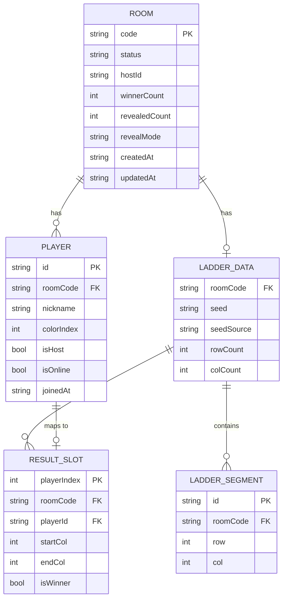

# SCHEMA.md — Ladder Room Online Redis Schema Design

> Redis is the sole persistence layer. There is no SQL database. All state lives in Redis key-value structures with explicit TTLs.

---

## 1. 資料儲存概覽

### 持久層選擇

Ladder Room Online 使用 **Redis 作為唯一的持久層**。選擇 Redis 的原因：

- 房間生命週期短（數分鐘到數小時），天然適合 TTL 驅動的資料管理
- WebSocket 廣播需要低延遲讀寫，Redis 的亞毫秒響應完全符合
- 原子操作（INCR、SETNX、MULTI/EXEC、WATCH）消除競態條件，無需分散式鎖服務
- 記憶體用量可預測（每房間 ~88 KB，100 房間僅 ~8.8 MB）

### 儲存的資料類型

| 類別 | 儲存內容 |
|------|---------|
| 房間狀態 | status、hostId、winnerCount、revealMode、createdAt、updatedAt |
| 玩家狀態 | players 陣列（nickname、colorIndex、isHost、isOnline） |
| 梯子資料 | seed、rowCount、colCount、segments 陣列 |
| 揭示計數 | revealedCount 原子計數器 |
| 踢除名單 | kickedPlayerIds Set |
| Session 對應 | playerId → sessionId Hash |

### TTL 策略

| 房間狀態 | TTL | 觸發條件 |
|---------|-----|---------|
| `waiting` / `running` / `revealing` | 24h | 建立或任何狀態變更時重設 |
| `finished` | 1h | 轉換至 finished 狀態時設定 |
| 所有玩家離線 | 5min (300s) | 最後一個 WS 連線關閉時 EXPIRE |
| Pod 重啟 | 維持現有 TTL | 無連線的房間不重設，自然過期 |

所有 `room:{code}:*` 子鍵與主鍵使用相同的 TTL，並在主鍵更新時一起重設。

### 序列化策略

- **複雜物件**（Room、LadderData）序列化為 JSON 字串，儲存在 Redis String 鍵
- **revealedCount** 使用 Redis 原生計數器（INCR），值為整數字串如 `"3"`
- **kickedPlayerIds** 使用 Redis Set，成員為 playerId 字串
- **sessions** 使用 Redis Hash，field 為 playerId，value 為 sessionId

---

## 2. Redis Key Schema

### 完整鍵清單

| Key 模式 | Type | Value | TTL | 用途 |
|---------|------|-------|-----|------|
| `room:{code}` | String (JSON) | 序列化的 Room 物件（含 players 陣列） | 24h（每次狀態變更重設） | 房間主狀態 |
| `room:{code}:ladder` | String (JSON) | LadderData JSON（seed、segments、results） | 與主鍵同步 | 梯子結構與結果 |
| `room:{code}:revealedCount` | String (counter) | 整數字串，如 `"0"` 到 `"N"` | 與主鍵同步 | 揭示進度原子計數器 |
| `room:{code}:kicked` | Set | `{ playerId1, playerId2, ... }` | 與主鍵同步 | 踢除玩家 ID 集合，用於重連檢查 |
| `room:{code}:sessions` | Hash | `{ playerId: sessionId }` | 與主鍵同步 | 追蹤活躍 WebSocket Session |

### 鍵格式說明

- `{code}` 為 6 位大寫英數字房間代碼，例如 `ALPHA1`
- 所有子鍵（`:ladder`、`:revealedCount`、`:kicked`、`:sessions`）的 TTL 與主鍵 `room:{code}` 一致
- 主鍵更新時，使用 `MULTI/EXEC` 批次重設所有子鍵的 EXPIRE

### 範例鍵

```
room:ALPHA1
room:ALPHA1:ladder
room:ALPHA1:revealedCount
room:ALPHA1:kicked
room:ALPHA1:sessions
```

---

## 3. Room 物件 JSON 結構

### Stage 1: waiting（剛建立，等待玩家加入）

```json
{
  "code": "ALPHA1",
  "status": "waiting",
  "hostId": "player-uuid-001",
  "winnerCount": 3,
  "revealMode": "sequential",
  "createdAt": "2026-04-19T08:00:00.000Z",
  "updatedAt": "2026-04-19T08:00:00.000Z",
  "players": [
    {
      "id": "player-uuid-001",
      "nickname": "Alice",
      "colorIndex": 0,
      "isHost": true,
      "isOnline": true,
      "joinedAt": "2026-04-19T08:00:00.000Z"
    }
  ]
}
```

`room:ALPHA1:ladder` → `""`（空字串或鍵不存在）
`room:ALPHA1:revealedCount` → `"0"`
`room:ALPHA1:kicked` → 空 Set
`room:ALPHA1:sessions` → `{ "player-uuid-001": "sess-abc123" }`

---

### Stage 2: running（主持人開始遊戲，梯子已生成）

```json
{
  "code": "ALPHA1",
  "status": "running",
  "hostId": "player-uuid-001",
  "winnerCount": 3,
  "revealMode": "sequential",
  "createdAt": "2026-04-19T08:00:00.000Z",
  "updatedAt": "2026-04-19T08:05:30.000Z",
  "players": [
    {
      "id": "player-uuid-001",
      "nickname": "Alice",
      "colorIndex": 0,
      "isHost": true,
      "isOnline": true,
      "joinedAt": "2026-04-19T08:00:00.000Z"
    },
    {
      "id": "player-uuid-002",
      "nickname": "Bob",
      "colorIndex": 1,
      "isHost": false,
      "isOnline": true,
      "joinedAt": "2026-04-19T08:01:15.000Z"
    },
    {
      "id": "player-uuid-003",
      "nickname": "Carol",
      "colorIndex": 2,
      "isHost": false,
      "isOnline": false,
      "joinedAt": "2026-04-19T08:02:00.000Z"
    }
  ]
}
```

`room:ALPHA1:ladder` → 見下方 LadderData 結構
`room:ALPHA1:revealedCount` → `"0"`
`room:ALPHA1:kicked` → `{ "player-uuid-004" }` （被踢玩家）
`room:ALPHA1:sessions` → `{ "player-uuid-001": "sess-abc123", "player-uuid-002": "sess-def456" }`

---

### Stage 3: revealing（揭示進行中）

房間主鍵 JSON 同 Stage 2，但 `status` 更新：

```json
{
  "code": "ALPHA1",
  "status": "revealing",
  "updatedAt": "2026-04-19T08:10:00.000Z",
  "...": "其餘欄位同 Stage 2"
}
```

`room:ALPHA1:revealedCount` → `"2"` （已揭示 2 位玩家）

`room:ALPHA1:ladder` 中的 `results` 陣列此時已填入（見下方 LadderData）

---

### Stage 4: finished（全部揭示完畢）

```json
{
  "code": "ALPHA1",
  "status": "finished",
  "hostId": "player-uuid-001",
  "winnerCount": 3,
  "revealMode": "sequential",
  "createdAt": "2026-04-19T08:00:00.000Z",
  "updatedAt": "2026-04-19T08:15:42.000Z",
  "players": [
    {
      "id": "player-uuid-001",
      "nickname": "Alice",
      "colorIndex": 0,
      "isHost": true,
      "isOnline": true,
      "joinedAt": "2026-04-19T08:00:00.000Z"
    },
    {
      "id": "player-uuid-002",
      "nickname": "Bob",
      "colorIndex": 1,
      "isHost": false,
      "isOnline": true,
      "joinedAt": "2026-04-19T08:01:15.000Z"
    },
    {
      "id": "player-uuid-003",
      "nickname": "Carol",
      "colorIndex": 2,
      "isHost": false,
      "isOnline": false,
      "joinedAt": "2026-04-19T08:02:00.000Z"
    }
  ]
}
```

此時 TTL 降為 1h，`room:ALPHA1:revealedCount` → `"3"`（等於 players.length）

---

### LadderData JSON（`room:ALPHA1:ladder`）

```json
{
  "seed": "a3f8c2e1d9b7",
  "seedSource": "host-submitted",
  "rowCount": 10,
  "colCount": 3,
  "segments": [
    { "row": 0, "col": 0 },
    { "row": 1, "col": 1 },
    { "row": 2, "col": 0 },
    { "row": 3, "col": 1 },
    { "row": 4, "col": 0 },
    { "row": 5, "col": 0 },
    { "row": 6, "col": 1 },
    { "row": 7, "col": 0 },
    { "row": 8, "col": 1 },
    { "row": 9, "col": 0 }
  ],
  "results": [
    {
      "playerIndex": 0,
      "playerId": "player-uuid-001",
      "startCol": 0,
      "endCol": 1,
      "isWinner": true,
      "path": [0, 1, 0, 1, 0, 0, 1, 0, 1, 1]
    },
    {
      "playerIndex": 1,
      "playerId": "player-uuid-002",
      "startCol": 1,
      "endCol": 2,
      "isWinner": true,
      "path": [1, 0, 1, 0, 1, 1, 0, 1, 0, 2]
    },
    {
      "playerIndex": 2,
      "playerId": "player-uuid-003",
      "startCol": 2,
      "endCol": 0,
      "isWinner": false,
      "path": [2, 2, 2, 2, 2, 2, 2, 2, 2, 0]
    }
  ]
}
```

---

## 4. 資料模型（TypeScript → Redis 對應）

### TypeScript 介面

```typescript
interface Room {
  code: string;
  status: 'waiting' | 'running' | 'revealing' | 'finished';
  hostId: string;
  winnerCount: number;
  revealMode: 'sequential' | 'simultaneous';
  createdAt: string;       // ISO 8601
  updatedAt: string;       // ISO 8601
  players: Player[];
}

interface Player {
  id: string;
  nickname: string;
  colorIndex: number;
  isHost: boolean;
  isOnline: boolean;
  joinedAt: string;        // ISO 8601
}

interface LadderData {
  seed: string;
  seedSource: 'host-submitted' | 'server-random';
  rowCount: number;
  colCount: number;
  segments: LadderSegment[];
  results: ResultSlot[];
}

interface LadderSegment {
  row: number;
  col: number;             // 橫槓左端的欄位索引
}

interface ResultSlot {
  playerIndex: number;
  playerId: string;
  startCol: number;
  endCol: number;
  isWinner: boolean;
  path: number[];          // 每一 row 所在欄位，長度 = rowCount
}
```

### TypeScript 欄位 → Redis 鍵對應表

| TypeScript 欄位 | Redis 鍵 | 儲存位置 |
|----------------|---------|---------|
| `Room.code` | `room:{code}` | JSON 頂層 `code` 欄位 |
| `Room.status` | `room:{code}` | JSON 頂層 `status` 欄位 |
| `Room.hostId` | `room:{code}` | JSON 頂層 `hostId` 欄位 |
| `Room.winnerCount` | `room:{code}` | JSON 頂層 `winnerCount` 欄位 |
| `Room.revealMode` | `room:{code}` | JSON 頂層 `revealMode` 欄位 |
| `Room.createdAt` | `room:{code}` | JSON 頂層 `createdAt` 欄位 |
| `Room.updatedAt` | `room:{code}` | JSON 頂層 `updatedAt` 欄位 |
| `Room.players[]` | `room:{code}` | JSON 頂層 `players` 陣列 |
| `Player.id` | `room:{code}` | `players[n].id` |
| `Player.nickname` | `room:{code}` | `players[n].nickname` |
| `Player.colorIndex` | `room:{code}` | `players[n].colorIndex` |
| `Player.isHost` | `room:{code}` | `players[n].isHost` |
| `Player.isOnline` | `room:{code}` | `players[n].isOnline` |
| `Player.joinedAt` | `room:{code}` | `players[n].joinedAt` |
| `LadderData.seed` | `room:{code}:ladder` | JSON 頂層 `seed` 欄位 |
| `LadderData.seedSource` | `room:{code}:ladder` | JSON 頂層 `seedSource` 欄位 |
| `LadderData.rowCount` | `room:{code}:ladder` | JSON 頂層 `rowCount` 欄位 |
| `LadderData.colCount` | `room:{code}:ladder` | JSON 頂層 `colCount` 欄位 |
| `LadderData.segments[]` | `room:{code}:ladder` | JSON 頂層 `segments` 陣列 |
| `LadderData.results[]` | `room:{code}:ladder` | JSON 頂層 `results` 陣列 |
| `ResultSlot.playerIndex` | `room:{code}:ladder` | `results[n].playerIndex` |
| `ResultSlot.playerId` | `room:{code}:ladder` | `results[n].playerId` |
| `ResultSlot.startCol` | `room:{code}:ladder` | `results[n].startCol` |
| `ResultSlot.endCol` | `room:{code}:ladder` | `results[n].endCol` |
| `ResultSlot.isWinner` | `room:{code}:ladder` | `results[n].isWinner` |
| `ResultSlot.path[]` | `room:{code}:ladder` | `results[n].path` |
| revealedCount（隱含） | `room:{code}:revealedCount` | Redis String 計數器 |
| kickedPlayerIds（隱含） | `room:{code}:kicked` | Redis Set 成員 |
| sessionId 對應 | `room:{code}:sessions` | Redis Hash field/value |

---

## 5. 原子操作設計

### 5.1 建立房間（`POST /rooms`）

**需要原子性的原因**：並發請求可能生成相同的 6 位房間代碼，必須確保唯一性。

```redis
# SETNX 確保只有一個請求成功建立房間
SETNX room:ALPHA1 "{...roomJson...}"

# 若回傳 0（已存在），重新生成代碼並重試，最多重試 10 次
# 若回傳 1（成功），設定所有子鍵與 TTL
SET room:ALPHA1:revealedCount "0"
SADD room:ALPHA1:kicked ""       # 初始化空 Set（可跳過，SISMEMBER 不存在鍵返回 0）
EXPIRE room:ALPHA1 86400
EXPIRE room:ALPHA1:revealedCount 86400
EXPIRE room:ALPHA1:kicked 86400
EXPIRE room:ALPHA1:sessions 86400
```

**衝突處理**：最多重試 10 次。若 10 次均衝突（機率極低），回傳 503。

---

### 5.2 開始遊戲（`START_GAME`）

**需要原子性的原因**：必須同時寫入 room status、LadderData、results，防止部分更新導致狀態不一致。

```redis
WATCH room:ALPHA1

# 讀取當前狀態並驗證（status 必須為 waiting，請求者必須是 host）
GET room:ALPHA1

# 開始 transaction
MULTI
  SET room:ALPHA1 "{...updatedRoomJson with status:running...}"
  SET room:ALPHA1:ladder "{...ladderDataJson...}"
  SET room:ALPHA1:revealedCount "0"
  EXPIRE room:ALPHA1 86400
  EXPIRE room:ALPHA1:ladder 86400
  EXPIRE room:ALPHA1:revealedCount 86400
  EXPIRE room:ALPHA1:kicked 86400
  EXPIRE room:ALPHA1:sessions 86400
EXEC
# 若 EXEC 返回 nil（WATCH 觸發），表示有並發修改，重試整個流程
```

---

### 5.3 揭示計數（`REVEAL_NEXT`）

**需要原子性的原因**：多個玩家可能同時觸發揭示，必須保證揭示順序唯一且遞增。

```redis
# 原子遞增，返回新值（即本次揭示的索引 1-based）
INCR room:ALPHA1:revealedCount
# 返回值如 "3" 表示第 3 位玩家揭示完成

# 同時更新房間狀態（若這是最後一位）
# 檢查 revealedCount 是否等於 players.length
# 若是，WATCH + MULTI/EXEC 更新 status 為 finished，並設定 TTL 為 3600
```

---

### 5.4 踢除玩家（`KICK_PLAYER`）

**需要原子性的原因**：必須同時更新 players 陣列（移除玩家）和 kicked Set（加入 playerId），避免資料不一致。

```redis
WATCH room:ALPHA1

# 讀取當前 room，驗證請求者是 host 且目標玩家存在
GET room:ALPHA1

MULTI
  SET room:ALPHA1 "{...roomJson with player removed from players array...}"
  SADD room:ALPHA1:kicked "player-uuid-003"
  EXPIRE room:ALPHA1 86400
  EXPIRE room:ALPHA1:kicked 86400
EXEC
# EXEC 返回 nil 時重試
```

---

### 5.5 再玩一局（`RESET_ROOM`）

**需要原子性的原因**：必須原子地清除梯子資料、結果、計數器、踢除名單，並重設 players 狀態，避免重置中途有玩家讀取到半清空的狀態。

```redis
WATCH room:ALPHA1

# 讀取當前 room，過濾掉離線玩家（prune offline players）
GET room:ALPHA1

MULTI
  SET room:ALPHA1 "{...roomJson with status:waiting, only online players, no results...}"
  SET room:ALPHA1:ladder ""         # 清空梯子資料
  SET room:ALPHA1:revealedCount "0" # 重設計數器
  DEL room:ALPHA1:kicked            # 清空踢除名單
  EXPIRE room:ALPHA1 86400
  EXPIRE room:ALPHA1:ladder 86400
  EXPIRE room:ALPHA1:revealedCount 86400
  EXPIRE room:ALPHA1:sessions 86400
EXEC
```

---

## 6. 記憶體估算

估算基準：50 名玩家、梯子 10 列 × 50 欄（約 600 個橫槓 segments）、每位玩家 path 長度 10（rowCount）。

| 物件 | 大小估算 | 說明 |
|------|---------|------|
| Room JSON（50 players） | ~10 KB | 每位玩家約 200 bytes，加上頂層欄位 |
| LadderData segments（~600 segments） | ~5 KB | 每個 segment `{row, col}` 約 20 bytes |
| ResultSlot[]（50 players × path[10]） | ~72 KB | 每個 ResultSlot 含 path 陣列約 1.5 KB |
| kickedPlayerIds Set | < 1 KB | UUID 字串 × 最多數十個被踢玩家 |
| revealedCount counter | 8 bytes | Redis String 計數器 |
| sessions Hash | ~3 KB | 50 個 playerId:sessionId 對 |
| Redis 鍵名 overhead | ~0.5 KB | 5 個鍵名字串 |
| **單房間合計** | **~90 KB** | 含所有子鍵 |
| 100 房間（MVP 目標） | **~9 MB** | 遠低於標準 Redis 實例記憶體限制 |

> 注意：ResultSlot 的 `path` 陣列是最大的記憶體消耗項目。若 rowCount 增加至 120（樓梯遊戲典型高度），ResultSlot[] 估算將增加至 ~72 KB（50 × 120 步 × 12 bytes/步），單房間合計約 88 KB。

---

## 7. ER 圖（Mermaid erDiagram）

> 以下為邏輯 ER 圖，反映 Redis 中各資料集合之間的關係。雖然 Redis 無外鍵約束，但應用層在寫入時強制維護這些關係。



---

## 8. 查詢模式與使用案例（Redis 命令序列）

### 8.1 加入房間流程

```redis
# Step 1: 讀取房間狀態
GET room:ALPHA1
# 若 nil → 房間不存在，回傳 404

# Step 2: 檢查玩家是否被踢除
SISMEMBER room:ALPHA1:kicked "player-uuid-003"
# 若返回 1 → 玩家已被踢，回傳 403

# Step 3: 讀取當前 room JSON，反序列化後加入新玩家
# Step 4: 原子寫入更新後的 room

WATCH room:ALPHA1
MULTI
  SET room:ALPHA1 "{...roomJson with new player appended...}"
  HSET room:ALPHA1:sessions "player-uuid-005" "sess-new-xyz"
  EXPIRE room:ALPHA1 86400
  EXPIRE room:ALPHA1:sessions 86400
EXEC
```

---

### 8.2 開始遊戲流程

```redis
# Step 1: 讀取並驗證
WATCH room:ALPHA1
GET room:ALPHA1
# 驗證 status == 'waiting' 且 hostId == 請求者

# Step 2: 在應用層生成 LadderData

# Step 3: 原子寫入
MULTI
  SET room:ALPHA1 "{...status:running, updatedAt:now...}"
  SET room:ALPHA1:ladder "{...ladderDataJson...}"
  SET room:ALPHA1:revealedCount "0"
  EXPIRE room:ALPHA1 86400
  EXPIRE room:ALPHA1:ladder 86400
  EXPIRE room:ALPHA1:revealedCount 86400
  EXPIRE room:ALPHA1:kicked 86400
  EXPIRE room:ALPHA1:sessions 86400
EXEC
# nil → 並發衝突，重試
```

---

### 8.3 揭示下一位

```redis
# Step 1: 原子遞增揭示計數
INCR room:ALPHA1:revealedCount
# 返回新的計數值，例如 3

# Step 2: 讀取 ladder results[2]（index = 返回值 - 1）
GET room:ALPHA1:ladder
# 解析 results[2] 並透過 WebSocket 廣播 REVEAL_INDEX 事件

# Step 3: 若計數 == players.length，更新 status 為 finished，TTL 改為 1h
WATCH room:ALPHA1
GET room:ALPHA1
MULTI
  SET room:ALPHA1 "{...status:finished, updatedAt:now...}"
  EXPIRE room:ALPHA1 3600
  EXPIRE room:ALPHA1:ladder 3600
  EXPIRE room:ALPHA1:revealedCount 3600
  EXPIRE room:ALPHA1:kicked 3600
  EXPIRE room:ALPHA1:sessions 3600
EXEC
```

---

### 8.4 重連查詢

```redis
# 玩家重連時，一次取得所有需要的狀態

# Step 1: 確認玩家未被踢除
SISMEMBER room:ALPHA1:kicked "player-uuid-002"
# 返回 1 → 拒絕重連（403）

# Step 2: 取得房間主狀態
GET room:ALPHA1

# Step 3: 取得梯子資料（若 status 為 running/revealing/finished）
GET room:ALPHA1:ladder

# Step 4: 取得揭示計數
GET room:ALPHA1:revealedCount

# Step 5: 更新 session 對應
HSET room:ALPHA1:sessions "player-uuid-002" "sess-new-reconnect"
EXPIRE room:ALPHA1:sessions 86400

# Step 6: 更新 player.isOnline = true，廣播 PLAYER_RECONNECTED 事件
WATCH room:ALPHA1
GET room:ALPHA1
MULTI
  SET room:ALPHA1 "{...roomJson with player.isOnline=true...}"
  EXPIRE room:ALPHA1 86400
EXEC
```

---

### 8.5 房間清理（TTL 過期）

Redis TTL 過期時自動刪除鍵，無需主動清理。但若需要提前清理（例如主持人主動解散房間），執行：

```redis
# 刪除所有相關鍵
DEL room:ALPHA1
DEL room:ALPHA1:ladder
DEL room:ALPHA1:revealedCount
DEL room:ALPHA1:kicked
DEL room:ALPHA1:sessions

# 或使用 UNLINK（非同步刪除，避免阻塞）
UNLINK room:ALPHA1 room:ALPHA1:ladder room:ALPHA1:revealedCount room:ALPHA1:kicked room:ALPHA1:sessions
```

**最後玩家離線時（所有連線關閉）**：

```redis
# WS 連線關閉 handler
HDEL room:ALPHA1:sessions "player-uuid-001"

# 檢查 sessions Hash 是否為空
HLEN room:ALPHA1:sessions
# 若返回 0 → 設定 5 分鐘短 TTL
EXPIRE room:ALPHA1 300
EXPIRE room:ALPHA1:ladder 300
EXPIRE room:ALPHA1:revealedCount 300
EXPIRE room:ALPHA1:kicked 300
EXPIRE room:ALPHA1:sessions 300
```

---

## 9. TTL 管理策略

### TTL 規則總覽

| 情境 | TTL | 設定時機 | 套用對象 |
|------|-----|---------|---------|
| 房間建立 | 86400s（24h） | `POST /rooms` 成功後 | 所有 `room:{code}:*` 鍵 |
| 狀態變更（任何） | 86400s（24h） | 每次 MULTI/EXEC 成功後 | 所有 `room:{code}:*` 鍵 |
| 轉換至 finished | 3600s（1h） | `status` → `finished` 的 EXEC 後 | 所有 `room:{code}:*` 鍵 |
| 所有玩家離線 | 300s（5min） | 最後一個 WS `close` 事件後 | 所有 `room:{code}:*` 鍵 |
| Pod 重啟後重連 | 不重設 | 有玩家重連時才重設為 24h | 所有 `room:{code}:*` 鍵 |

### TTL 管理原則

1. **子鍵 TTL 與主鍵同步**：每次寫入操作在 MULTI/EXEC 中一次重設所有相關鍵的 EXPIRE，確保不出現部分過期的情況。

2. **finished 狀態降低 TTL**：遊戲結束後資料僅供短時間查閱，1h 後自動清理，釋放記憶體。

3. **空房縮短 TTL**：所有玩家離線 5 分鐘後自動清理，防止殭屍房間積累記憶體。

4. **Pod 重啟不影響現有 TTL**：Redis 鍵的 TTL 在 Pod 重啟後仍然有效（Redis 持久化），無需在啟動時掃描並重設 TTL。只有當玩家實際重連時，才在 MULTI/EXEC 中將 TTL 重設為 24h。

5. **TTL 重設在 MULTI/EXEC 內完成**：所有 EXPIRE 命令與狀態更新放在同一個 transaction 中，確保原子性。若 transaction 失敗（WATCH 觸發），TTL 不會被單獨更新。

### TTL 狀態機

```
建立（24h）
    ↓ 玩家加入/離開（重設 24h）
    ↓ 開始遊戲（重設 24h）
    ↓ 揭示進行（重設 24h）
    ↓ 全部揭示完成
finished（降至 1h）
    ↓ 再玩一局（重設 24h）
    ↓ 所有玩家離線（降至 5min）
（過期自動刪除）
```
