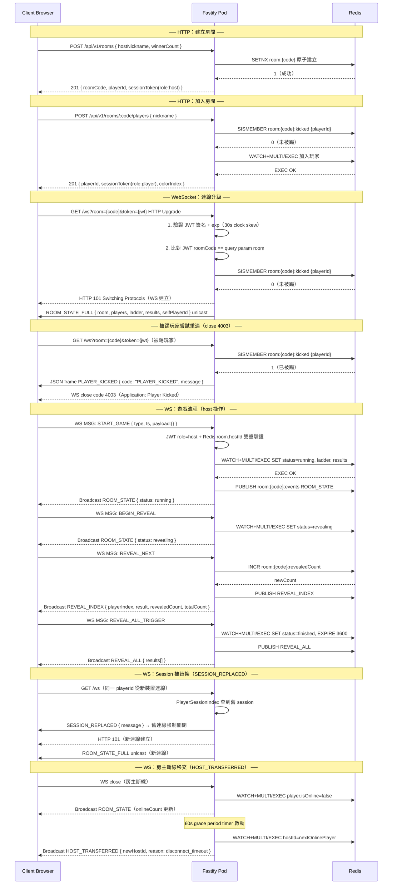

# API 流程圖（HTTP + WebSocket 生命週期）

> 自動生成自 API.md § 3

```mermaid
sequenceDiagram
    participant C as Client Browser
    participant F as Fastify Pod
    participant R as Redis

    Note over C,R: ── HTTP：建立房間 ──

    C->>F: POST /api/v1/rooms { hostNickname, winnerCount }
    F->>R: SETNX room:{code} 原子建立
    R-->>F: 1（成功）
    F-->>C: 201 { roomCode, playerId, sessionToken(role:host) }

    Note over C,R: ── HTTP：加入房間 ──

    C->>F: POST /api/v1/rooms/:code/players { nickname }
    F->>R: SISMEMBER room:{code}:kicked {playerId}
    R-->>F: 0（未被踢）
    F->>R: WATCH+MULTI/EXEC 加入玩家
    R-->>F: EXEC OK
    F-->>C: 201 { playerId, sessionToken(role:player), colorIndex }

    Note over C,R: ── WebSocket：連線升級 ──

    C->>F: GET /ws?room={code}&token={jwt} HTTP Upgrade
    F->>F: 1. 驗證 JWT 簽名 + exp（30s clock skew）
    F->>F: 2. 比對 JWT roomCode == query param room
    F->>R: SISMEMBER room:{code}:kicked {playerId}
    R-->>F: 0（未被踢）
    F-->>C: HTTP 101 Switching Protocols（WS 建立）
    F->>C: ROOM_STATE_FULL { room, players, ladder, results, selfPlayerId } unicast

    Note over C,R: ── 被踢玩家嘗試重連（close 4003） ──

    C->>F: GET /ws?room={code}&token={jwt}（被踢玩家）
    F->>R: SISMEMBER room:{code}:kicked {playerId}
    R-->>F: 1（已被踢）
    F->>C: JSON frame PLAYER_KICKED { code: "PLAYER_KICKED", message }
    F-->>C: WS close code 4003（Application: Player Kicked）

    Note over C,R: ── WS：遊戲流程（host 操作） ──

    C->>F: WS MSG: START_GAME { type, ts, payload:{} }
    F->>F: JWT role=host + Redis room.hostId 雙重驗證
    F->>R: WATCH+MULTI/EXEC SET status=running, ladder, results
    R-->>F: EXEC OK
    F->>R: PUBLISH room:{code}:events ROOM_STATE
    F-->>C: Broadcast ROOM_STATE { status: running }

    C->>F: WS MSG: BEGIN_REVEAL
    F->>R: WATCH+MULTI/EXEC SET status=revealing
    F-->>C: Broadcast ROOM_STATE { status: revealing }

    C->>F: WS MSG: REVEAL_NEXT
    F->>R: INCR room:{code}:revealedCount
    R-->>F: newCount
    F->>R: PUBLISH REVEAL_INDEX
    F-->>C: Broadcast REVEAL_INDEX { playerIndex, result, revealedCount, totalCount }

    C->>F: WS MSG: REVEAL_ALL_TRIGGER
    F->>R: WATCH+MULTI/EXEC SET status=finished, EXPIRE 3600
    F->>R: PUBLISH REVEAL_ALL
    F-->>C: Broadcast REVEAL_ALL { results[] }

    Note over C,R: ── WS：Session 被替換（SESSION_REPLACED） ──

    C->>F: GET /ws（同一 playerId 從新裝置連線）
    F->>F: PlayerSessionIndex 查到舊 session
    F->>C: SESSION_REPLACED { message } → 舊連線強制關閉
    F-->>C: HTTP 101（新連線建立）
    F->>C: ROOM_STATE_FULL unicast（新連線）

    Note over C,R: ── WS：房主斷線移交（HOST_TRANSFERRED） ──

    C->>F: WS close（房主斷線）
    F->>R: WATCH+MULTI/EXEC player.isOnline=false
    F-->>C: Broadcast ROOM_STATE（onlineCount 更新）
    Note over F: 60s grace period timer 啟動
    F->>R: WATCH+MULTI/EXEC hostId=nextOnlinePlayer
    F-->>C: Broadcast HOST_TRANSFERRED { newHostId, reason: disconnect_timeout }
```
