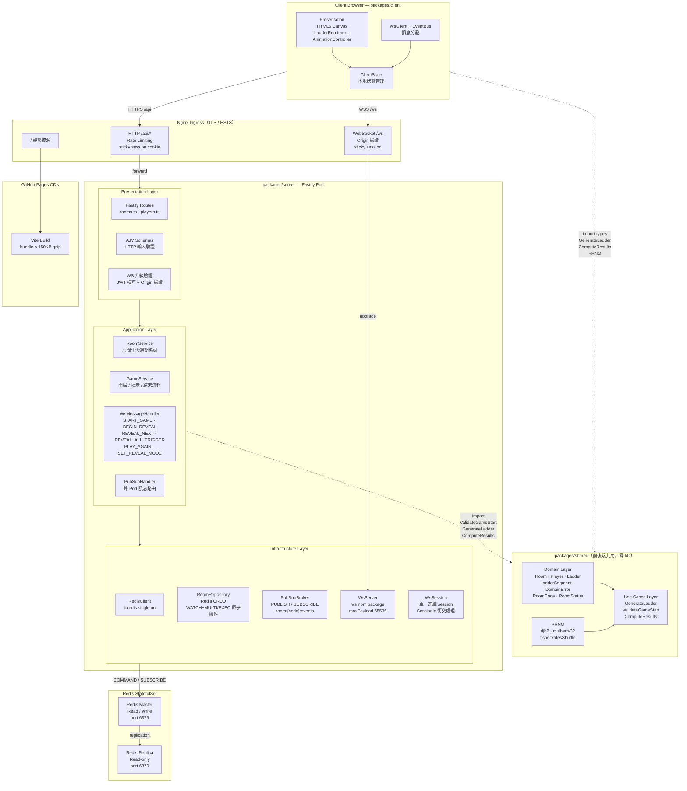

# 系統架構圖（Clean Architecture 分層）

> 依 Presentation / Application / Infrastructure 三層結構呈現，
> 並包含 packages/shared（Domain + Use Cases）與前端客戶端

## 分層職責摘要

| 層級 | 所在位置 | 核心職責 | 外部依賴 |
|------|----------|----------|----------|
| Domain | packages/shared | Entity、Value Object、純業務規則 | 無 |
| Use Cases | packages/shared | 協調 Domain 完成業務流程，回傳純資料 | 僅 Domain |
| Application | packages/server/application | 呼叫 Use Cases、協調 Repository、發布 WS 事件 | Use Cases + 抽象 Interface |
| Infrastructure | packages/server/infrastructure | Redis 實作、WS 封裝 | ioredis、ws、jose |
| Presentation | packages/server/presentation | HTTP Route、AJV 驗證、WS 訊息分派 | Application Service |
