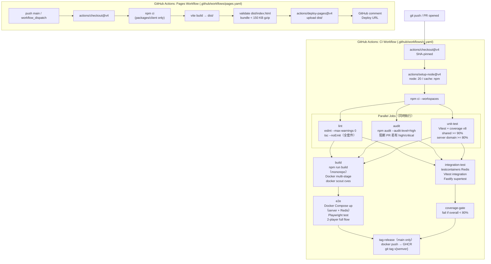

# CI/CD Pipeline 圖

> 自動生成自 EDD.md § 11

```mermaid
graph TD
    Push["git push / PR opened"]

    subgraph CI["GitHub Actions: CI Workflow (.github/workflows/ci.yaml)"]
        Checkout["actions/checkout@v4\nSHA-pinned"]
        Setup["actions/setup-node@v4\nnode: 20 / cache: npm"]
        Install["npm ci --workspaces"]

        subgraph Parallel["Parallel Jobs（同時執行）"]
            Lint["lint\neslint --max-warnings 0\ntsc --noEmit（全套件）"]
            Audit["audit\nnpm audit --audit-level=high\n阻斷 PR 若有 high/critical"]
            Unit["unit-test\nVitest + coverage v8\nshared >= 90%\nserver domain >= 80%"]
        end

        Integ["integration-test\ntestcontainers Redis\nVitest integration\nFastify supertest"]
        Build["build\nnpm run build（monorepo）\nDocker multi-stage\ndocker scout cves"]
        E2E["e2e\nDocker Compose up（server + Redis）\nPlaywright test\n2-player full flow"]
        Gate["coverage-gate\nfail if overall < 80%"]
        Release["tag-release（main only）\ndocker push → GHCR\ngit tag v{semver}"]
    end

    Push --> Checkout --> Setup --> Install
    Install --> Lint
    Install --> Audit
    Install --> Unit
    Lint --> Integ
    Audit --> Integ
    Unit --> Integ
    Lint --> Build
    Audit --> Build
    Unit --> Build
    Integ --> Gate
    Build --> E2E
    E2E --> Release
    Gate --> Release

    subgraph Pages["GitHub Actions: Pages Workflow (.github/workflows/pages.yaml)"]
        PTrigger["push main / workflow_dispatch"]
        PCheckout["actions/checkout@v4"]
        PInstall["npm ci\n(packages/client only)"]
        PBuild["vite build → dist/"]
        PCheck["validate dist/index.html\nbundle < 150 KB gzip"]
        PDeploy["actions/deploy-pages@v4\nupload dist/"]
        PNotify["GitHub comment\nDeploy URL"]
    end

    PTrigger --> PCheckout --> PInstall --> PBuild --> PCheck --> PDeploy --> PNotify
```
