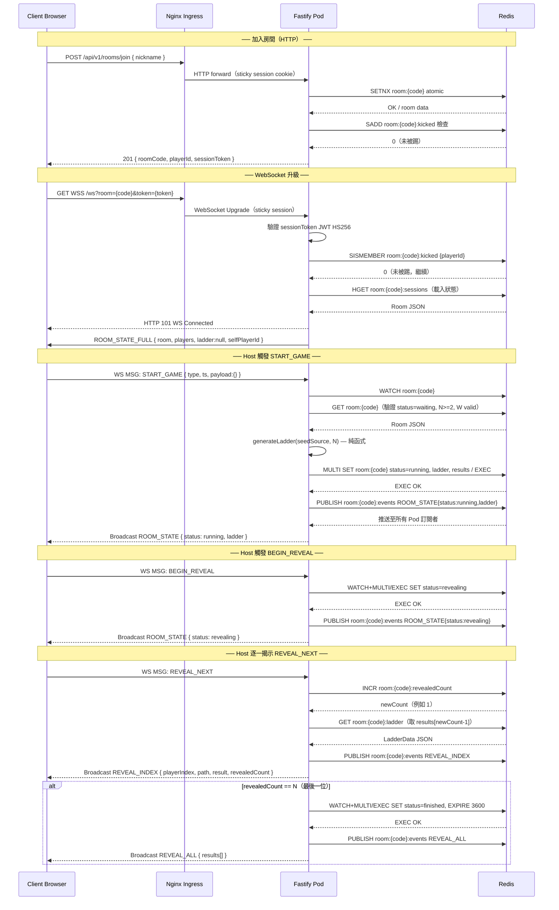

# 資料流圖（加入房間 → 開始遊戲 → 揭示）

> 自動生成自 EDD.md § 2.3

```mermaid
sequenceDiagram
    participant C as Client Browser
    participant N as Nginx Ingress
    participant F as Fastify Pod
    participant R as Redis

    Note over C,R: ── 加入房間（HTTP） ──

    C->>N: POST /api/v1/rooms/join { nickname }
    N->>F: HTTP forward（sticky session cookie）
    F->>R: SETNX room:{code} atomic
    R-->>F: OK / room data
    F->>R: SADD room:{code}:kicked 檢查
    R-->>F: 0（未被踢）
    F-->>C: 201 { roomCode, playerId, sessionToken }

    Note over C,R: ── WebSocket 升級 ──

    C->>N: GET WSS /ws?room={code}&token={token}
    N->>F: WebSocket Upgrade（sticky session）
    F->>F: 驗證 sessionToken JWT HS256
    F->>R: SISMEMBER room:{code}:kicked {playerId}
    R-->>F: 0（未被踢，繼續）
    F->>R: HGET room:{code}:sessions（載入狀態）
    R-->>F: Room JSON
    F-->>C: HTTP 101 WS Connected
    F->>C: ROOM_STATE_FULL { room, players, ladder:null, selfPlayerId }

    Note over C,R: ── Host 觸發 START_GAME ──

    C->>F: WS MSG: START_GAME { type, ts, payload:{} }
    F->>R: WATCH room:{code}
    F->>R: GET room:{code}（驗證 status=waiting, N>=2, W valid）
    R-->>F: Room JSON
    F->>F: generateLadder(seedSource, N) — 純函式
    F->>R: MULTI SET room:{code} status=running, ladder, results / EXEC
    R-->>F: EXEC OK
    F->>R: PUBLISH room:{code}:events ROOM_STATE{status:running,ladder}
    R-->>F: 推送至所有 Pod 訂閱者
    F-->>C: Broadcast ROOM_STATE { status: running, ladder }

    Note over C,R: ── Host 觸發 BEGIN_REVEAL ──

    C->>F: WS MSG: BEGIN_REVEAL
    F->>R: WATCH+MULTI/EXEC SET status=revealing
    R-->>F: EXEC OK
    F->>R: PUBLISH room:{code}:events ROOM_STATE{status:revealing}
    F-->>C: Broadcast ROOM_STATE { status: revealing }

    Note over C,R: ── Host 逐一揭示 REVEAL_NEXT ──

    C->>F: WS MSG: REVEAL_NEXT
    F->>R: INCR room:{code}:revealedCount
    R-->>F: newCount（例如 1）
    F->>R: GET room:{code}:ladder（取 results[newCount-1]）
    R-->>F: LadderData JSON
    F->>R: PUBLISH room:{code}:events REVEAL_INDEX
    F-->>C: Broadcast REVEAL_INDEX { playerIndex, path, result, revealedCount }

    alt revealedCount == N（最後一位）
        F->>R: WATCH+MULTI/EXEC SET status=finished, EXPIRE 3600
        R-->>F: EXEC OK
        F->>R: PUBLISH room:{code}:events REVEAL_ALL
        F-->>C: Broadcast REVEAL_ALL { results[] }
    end
```
