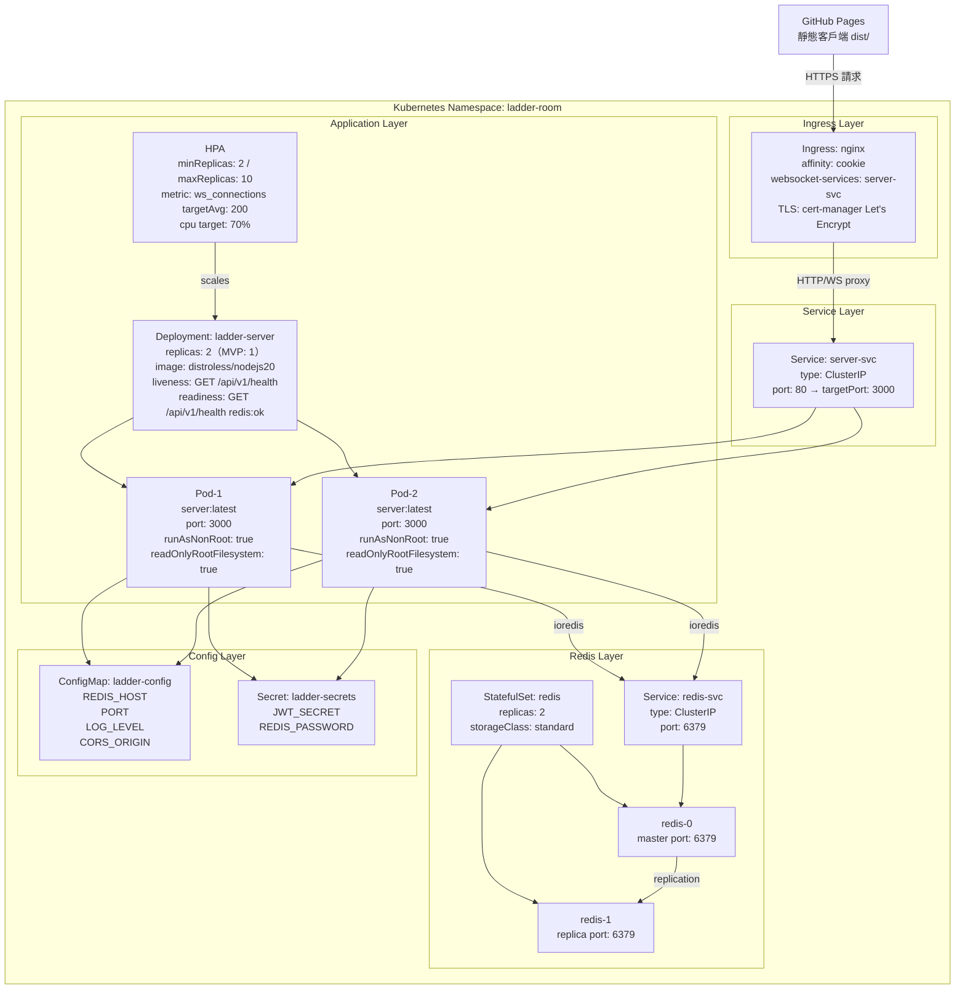

# 部署架構圖

> 自動生成自 EDD.md § 2.4

```mermaid
graph TD
    GHP["GitHub Pages\n靜態客戶端 dist/"]

    subgraph NS["Kubernetes Namespace: ladder-room"]

        subgraph IngressLayer["Ingress Layer"]
            ING["Ingress: nginx\naffinity: cookie\nwebsocket-services: server-svc\nTLS: cert-manager Let's Encrypt"]
        end

        subgraph AppLayer["Application Layer"]
            HPA["HPA\nminReplicas: 2 / maxReplicas: 10\nmetric: ws_connections targetAvg: 200\ncpu target: 70%"]
            DEP["Deployment: ladder-server\nreplicas: 2（MVP: 1）\nimage: distroless/nodejs20\nliveness: GET /api/v1/health\nreadiness: GET /api/v1/health redis:ok"]
            POD1["Pod-1\nserver:latest\nport: 3000\nrunAsNonRoot: true\nreadOnlyRootFilesystem: true"]
            POD2["Pod-2\nserver:latest\nport: 3000\nrunAsNonRoot: true\nreadOnlyRootFilesystem: true"]
            HPA -->|"scales"| DEP
            DEP --> POD1
            DEP --> POD2
        end

        subgraph ServiceLayer["Service Layer"]
            SVC["Service: server-svc\ntype: ClusterIP\nport: 80 → targetPort: 3000"]
        end

        subgraph StatefulLayer["Redis Layer"]
            RSTS["StatefulSet: redis\nreplicas: 2\nstorageClass: standard"]
            RPOD0["redis-0\nmaster port: 6379"]
            RPOD1["redis-1\nreplica port: 6379"]
            RSVC["Service: redis-svc\ntype: ClusterIP\nport: 6379"]
            RSTS --> RPOD0
            RSTS --> RPOD1
            RPOD0 -->|"replication"| RPOD1
        end

        subgraph ConfigLayer["Config Layer"]
            CM["ConfigMap: ladder-config\nREDIS_HOST\nPORT\nLOG_LEVEL\nCORS_ORIGIN"]
            SEC["Secret: ladder-secrets\nJWT_SECRET\nREDIS_PASSWORD"]
        end

        ING -->|"HTTP/WS proxy"| SVC
        SVC --> POD1
        SVC --> POD2
        POD1 -->|"ioredis"| RSVC
        POD2 -->|"ioredis"| RSVC
        RSVC --> RPOD0
        POD1 --> CM
        POD1 --> SEC
        POD2 --> CM
        POD2 --> SEC
    end

    GHP -->|"HTTPS 請求"| ING
```
