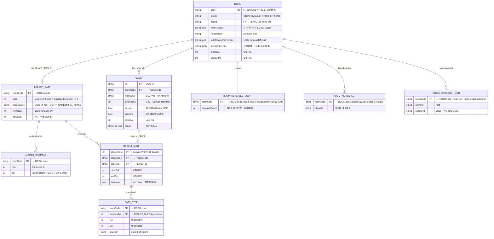

# 實體關係圖（邏輯 ER）

> 自動生成自 SCHEMA.md § 7

```mermaid
erDiagram
    ROOM {
        string code PK "6-char [A-HJ-NP-Z2-9] 房間代碼"
        string status "waiting | running | revealing | finished"
        string hostId "FK → PLAYER.id（可移交）"
        int_or_null winnerCount "1 <= W <= N-1；null 未設定"
        string revealMode "manual | auto"
        int_or_null autoRevealIntervalSec "1-30s；manual 時 null"
        string_array kickedPlayerIds "冗余鏡像，Redis Set 為準"
        int createdAt "Unix ms"
        int updatedAt "Unix ms"
    }

    PLAYER {
        string id PK "UUID v4"
        string roomCode FK "→ ROOM.code"
        string nickname "1-20 字元，禁控制字元"
        int colorIndex "0-49，Canvas 顏色索引"
        bool isHost "由 ROOM.hostId 決定"
        bool isOnline "WS 連線存活狀態"
        int joinedAt "Unix ms"
        string_or_null result "揭示後填入"
    }

    LADDER_DATA {
        string roomCode FK "→ ROOM.code"
        int seed "Mulberry32 seed = djb2(seedSource) >>> 0"
        string seedSource "UUID v4 hex，START_GAME 時生成，供稽核"
        int rowCount "clamp(N*3, 20, 60)"
        int colCount "= N（含離線玩家）"
    }

    LADDER_SEGMENT {
        string roomCode FK "→ ROOM.code"
        int row "0-indexed 列"
        int col "橫槓左端欄位（col <-> col+1 之間）"
    }

    RESULT_SLOT {
        int playerIndex PK "Canvas 列索引（0-based）"
        string roomCode FK "→ ROOM.code"
        string playerId FK "→ PLAYER.id"
        int startCol "起始欄位"
        int endCol "落點欄位"
        bool isWinner "win / lose（無命名獎項）"
    }

    PATH_STEP {
        string roomCode FK "→ ROOM.code"
        int playerIndex FK "→ RESULT_SLOT.playerIndex"
        int row "步驟所在列"
        int col "步驟所在欄"
        string direction "down | left | right"
    }

    ROOM_REVEALED_COUNT {
        string roomCode FK "→ ROOM.code (Redis key: room:{code}:revealedCount)"
        int revealedCount "INCR 原子計數，真相來源"
    }

    ROOM_KICKED_SET {
        string roomCode FK "→ ROOM.code (Redis key: room:{code}:kicked)"
        string playerId "UUID v4（成員）"
    }

    ROOM_SESSIONS_HASH {
        string roomCode FK "→ ROOM.code (Redis key: room:{code}:sessions)"
        string playerId "field"
        string sessionId "value（WS 連線 UUID）"
    }

    ROOM ||--o{ PLAYER : "has（max 50）"
    ROOM ||--o| LADDER_DATA : "has（START_GAME 後）"
    ROOM ||--|| ROOM_REVEALED_COUNT : "counter"
    ROOM ||--o{ ROOM_KICKED_SET : "kicked players"
    ROOM ||--o{ ROOM_SESSIONS_HASH : "active sessions"
    LADDER_DATA ||--o{ LADDER_SEGMENT : "contains rungs"
    LADDER_DATA ||--o{ RESULT_SLOT : "produces"
    RESULT_SLOT ||--o{ PATH_STEP : "traced path"
    PLAYER ||--o| RESULT_SLOT : "maps to（揭示後）"
```
