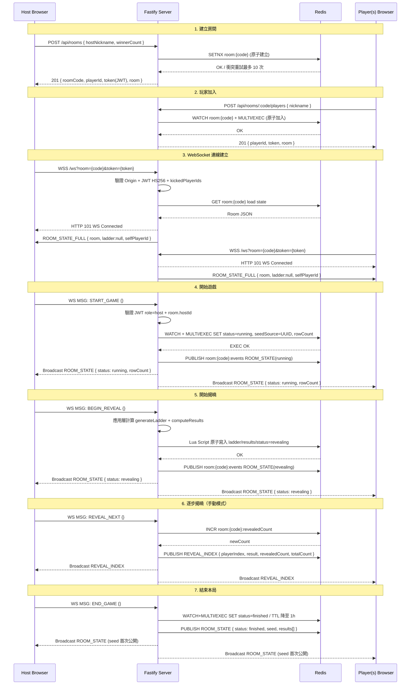

# Game Flow

> 生成自 devsop-autodev STEP 13

```mermaid
sequenceDiagram
    participant Host as Host Browser
    participant Server as Fastify Server
    participant Redis as Redis
    participant Players as Player(s) Browser

    Note over Host,Players: 1. 建立房間
    Host->>Server: POST /api/rooms { hostNickname, winnerCount }
    Server->>Redis: SETNX room:{code} (原子建立)
    Redis-->>Server: OK / 衝突重試最多 10 次
    Server-->>Host: 201 { roomCode, playerId, token(JWT), room }

    Note over Host,Players: 2. 玩家加入
    Players->>Server: POST /api/rooms/:code/players { nickname }
    Server->>Redis: WATCH room:{code} + MULTI/EXEC (原子加入)
    Redis-->>Server: OK
    Server-->>Players: 201 { playerId, token, room }

    Note over Host,Players: 3. WebSocket 連線建立
    Host->>Server: WSS /ws?room={code}&token={token}
    Server->>Server: 驗證 Origin + JWT HS256 + kickedPlayerIds
    Server->>Redis: GET room:{code} load state
    Redis-->>Server: Room JSON
    Server-->>Host: HTTP 101 WS Connected
    Server->>Host: ROOM_STATE_FULL { room, ladder:null, selfPlayerId }

    Players->>Server: WSS /ws?room={code}&token={token}
    Server-->>Players: HTTP 101 WS Connected
    Server->>Players: ROOM_STATE_FULL { room, ladder:null, selfPlayerId }

    Note over Host,Players: 4. 開始遊戲
    Host->>Server: WS MSG: START_GAME {}
    Server->>Server: 驗證 JWT role=host + room.hostId
    Server->>Redis: WATCH + MULTI/EXEC SET status=running, seedSource=UUID, rowCount
    Redis-->>Server: EXEC OK
    Server->>Redis: PUBLISH room:{code}:events ROOM_STATE(running)
    Server-->>Host: Broadcast ROOM_STATE { status: running, rowCount }
    Server-->>Players: Broadcast ROOM_STATE { status: running, rowCount }

    Note over Host,Players: 5. 開始揭曉
    Host->>Server: WS MSG: BEGIN_REVEAL {}
    Server->>Server: 應用層計算 generateLadder + computeResults
    Server->>Redis: Lua Script 原子寫入 ladder/results/status=revealing
    Redis-->>Server: OK
    Server->>Redis: PUBLISH room:{code}:events ROOM_STATE(revealing)
    Server-->>Host: Broadcast ROOM_STATE { status: revealing }
    Server-->>Players: Broadcast ROOM_STATE { status: revealing }

    Note over Host,Players: 6. 逐步揭曉（手動模式）
    Host->>Server: WS MSG: REVEAL_NEXT {}
    Server->>Redis: INCR room:{code}:revealedCount
    Redis-->>Server: newCount
    Server->>Redis: PUBLISH REVEAL_INDEX { playerIndex, result, revealedCount, totalCount }
    Server-->>Host: Broadcast REVEAL_INDEX
    Server-->>Players: Broadcast REVEAL_INDEX

    Note over Host,Players: 7. 結束本局
    Host->>Server: WS MSG: END_GAME {}
    Server->>Redis: WATCH+MULTI/EXEC SET status=finished / TTL 降至 1h
    Server->>Redis: PUBLISH ROOM_STATE { status: finished, seed, results[] }
    Server-->>Host: Broadcast ROOM_STATE (seed 首次公開)
    Server-->>Players: Broadcast ROOM_STATE (seed 首次公開)
```

## 說明

完整遊戲流程涵蓋七個階段：建立房間、玩家加入、WebSocket 連線建立、開始遊戲（生成 seedSource）、開始揭曉（原子生成梯子結構）、逐步揭曉路徑、結束本局（seed 首次公開供驗算）。所有狀態變更透過 Redis Pub/Sub 廣播至房間內所有連線。
