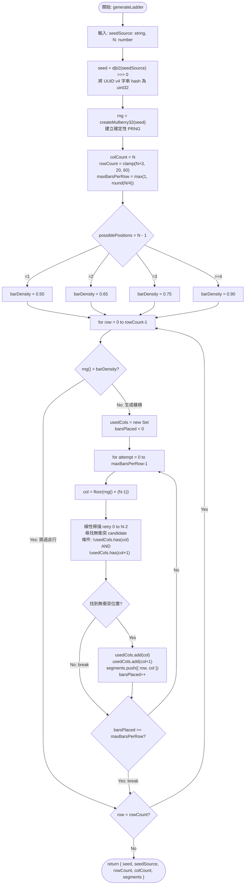

# Ladder Generation Algorithm

> 生成自 devsop-autodev STEP 13

## 說明

梯子生成算法基於確定性 PRNG（djb2 + Mulberry32），確保相同 seedSource 與玩家數 N 必然產生完全一致的梯子結構。barDensity 依照可用位置數（N-1）動態調整（N=2 時僅 50% 密度，避免所有行皆相同），usedCols 碰撞檢測確保同一行內橫槓不重疊，最多重試 N-1 次以尋找有效位置。
