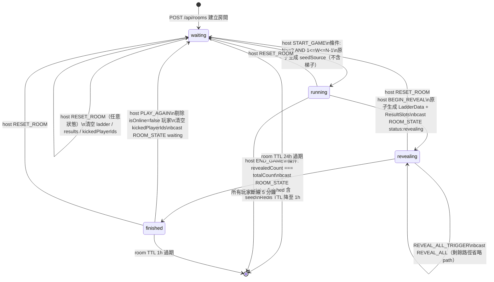

# Room Lifecycle

> 生成自 devsop-autodev STEP 13

## 說明

房間生命週期包含四個核心狀態：waiting（等待玩家加入）、running（遊戲已開始，等待揭曉）、revealing（逐步揭曉路徑中）、finished（本局結束，seed 首次公開）。RESET_ROOM 可在任意狀態觸發回到 waiting，PLAY_AGAIN 則僅限 finished 狀態且自動剔除離線玩家。
