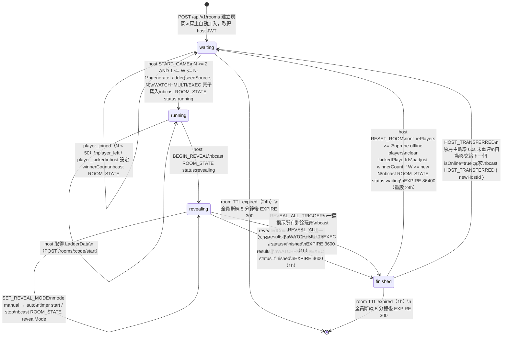

# 房間狀態機圖

> 自動生成自 EDD.md § 2.5

```mermaid
stateDiagram-v2
    [*] --> waiting : POST /api/v1/rooms 建立房間\n房主自動加入，取得 host JWT

    waiting --> waiting : player_joined（N < 50）\nplayer_left / player_kicked\nhost 設定 winnerCount\nbcast ROOM_STATE

    waiting --> running : host START_GAME\nN >= 2 AND 1 <= W <= N-1\ngenerateLadder(seedSource, N)\nWATCH+MULTI/EXEC 原子寫入\nbcast ROOM_STATE status:running

    running --> running : host 取得 LadderData\n（POST /rooms/:code/start）

    running --> revealing : host BEGIN_REVEAL\nbcast ROOM_STATE status:revealing

    revealing --> revealing : REVEAL_NEXT（manual mode）\nINCR revealedCount\nbcast REVEAL_INDEX path+result\nrevealedCount < N

    revealing --> revealing : auto-timer fires（auto mode）\nINCR revealedCount\nbcast REVEAL_INDEX\nrevealedCount < N

    revealing --> revealing : SET_REVEAL_MODE\nmode manual ↔ auto\ntimer start / stop\nbcast ROOM_STATE revealMode

    revealing --> finished : revealedCount == N\n（最後一次 REVEAL_NEXT / auto-timer）\nbcast REVEAL_ALL results[]\nWATCH+MULTI/EXEC status=finished\nEXPIRE 3600（1h）

    revealing --> finished : REVEAL_ALL_TRIGGER\n一鍵揭示所有剩餘玩家\nbcast REVEAL_ALL results[]\nWATCH+MULTI/EXEC status=finished\nEXPIRE 3600（1h）

    finished --> waiting : host RESET_ROOM\nonlinePlayers >= 2\nprune offline players\nclear kickedPlayerIds\nadjust winnerCount if W >= new N\nbcast ROOM_STATE status:waiting\nEXPIRE 86400（重設 24h）

    finished --> waiting : HOST_TRANSFERRED\n原房主斷線 60s 未重連\n自動移交給下一個 isOnline=true 玩家\nbcast HOST_TRANSFERRED { newHostId }

    waiting --> [*] : room TTL expired（24h）\n全員斷線 5 分鐘後 EXPIRE 300

    finished --> [*] : room TTL expired（1h）\n全員斷線 5 分鐘後 EXPIRE 300
```
