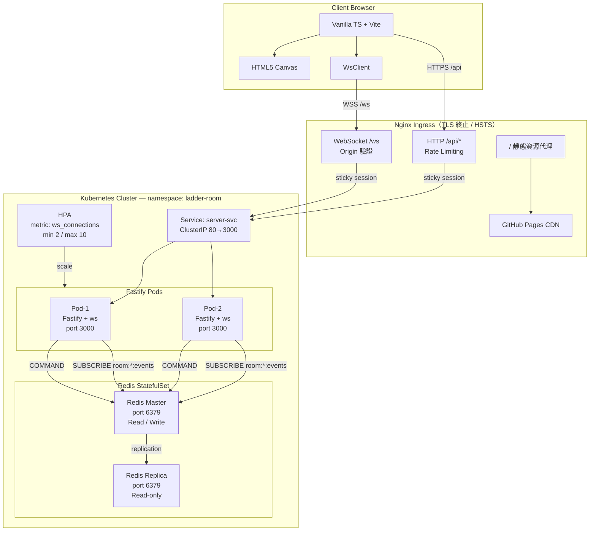

# 系統架構圖

> 自動生成自 EDD.md § 2.2

```mermaid
graph TD
    subgraph ClientBrowser["Client Browser"]
        TS["Vanilla TS + Vite"]
        Canvas["HTML5 Canvas"]
        WSClient["WsClient"]
        TS --> Canvas
        TS --> WSClient
    end

    subgraph IngressLayer["Nginx Ingress（TLS 終止 / HSTS）"]
        NginxHTTP["HTTP /api/*\nRate Limiting"]
        NginxWS["WebSocket /ws\nOrigin 驗證"]
        NginxStatic["/ 靜態資源代理"]
        NginxStatic --> Pages["GitHub Pages CDN"]
    end

    subgraph K8sCluster["Kubernetes Cluster — namespace: ladder-room"]
        HPA["HPA\nmetric: ws_connections\nmin 2 / max 10"]
        SVC["Service: server-svc\nClusterIP 80→3000"]

        subgraph Pods["Fastify Pods"]
            Pod1["Pod-1\nFastify + ws\nport 3000"]
            Pod2["Pod-2\nFastify + ws\nport 3000"]
        end

        HPA -->|"scale"| Pods
        SVC --> Pod1
        SVC --> Pod2

        subgraph RedisSet["Redis StatefulSet"]
            RedisMaster["Redis Master\nport 6379\nRead / Write"]
            RedisReplica["Redis Replica\nport 6379\nRead-only"]
            RedisMaster -->|"replication"| RedisReplica
        end

        Pod1 -->|"COMMAND"| RedisMaster
        Pod2 -->|"COMMAND"| RedisMaster
        Pod1 -->|"SUBSCRIBE room:*:events"| RedisMaster
        Pod2 -->|"SUBSCRIBE room:*:events"| RedisMaster
    end

    WSClient -->|"WSS /ws"| NginxWS
    TS -->|"HTTPS /api"| NginxHTTP
    NginxHTTP -->|"sticky session"| SVC
    NginxWS -->|"sticky session"| SVC
```
