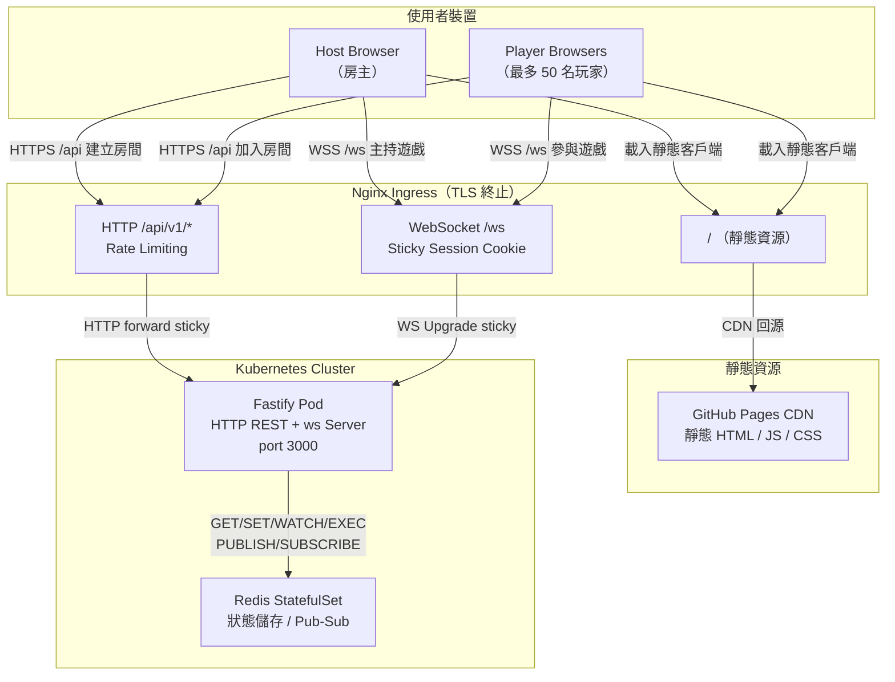

# 系統情境圖

> 自動生成自 EDD.md § 2.2

```mermaid
graph TD
    subgraph Browsers["使用者裝置"]
        Host["Host Browser\n（房主）"]
        Player["Player Browsers\n（最多 50 名玩家）"]
    end

    subgraph CDN["靜態資源"]
        GHP["GitHub Pages CDN\n靜態 HTML / JS / CSS"]
    end

    subgraph Ingress["Nginx Ingress（TLS 終止）"]
        NginxHTTP["HTTP /api/v1/*\nRate Limiting"]
        NginxWS["WebSocket /ws\nSticky Session Cookie"]
        NginxStatic["/ （靜態資源）"]
    end

    subgraph K8s["Kubernetes Cluster"]
        FastifyPod["Fastify Pod\nHTTP REST + ws Server\nport 3000"]
        Redis["Redis StatefulSet\n狀態儲存 / Pub-Sub"]
    end

    Host -->|"HTTPS /api 建立房間"| NginxHTTP
    Host -->|"WSS /ws 主持遊戲"| NginxWS
    Player -->|"HTTPS /api 加入房間"| NginxHTTP
    Player -->|"WSS /ws 參與遊戲"| NginxWS
    Host -->|"載入靜態客戶端"| NginxStatic
    Player -->|"載入靜態客戶端"| NginxStatic
    NginxStatic -->|"CDN 回源"| GHP
    NginxHTTP -->|"HTTP forward sticky"| FastifyPod
    NginxWS -->|"WS Upgrade sticky"| FastifyPod
    FastifyPod -->|"GET/SET/WATCH/EXEC\nPUBLISH/SUBSCRIBE"| Redis
```
