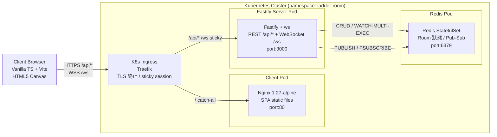

# System Overview

> 生成自 devsop-autodev STEP 13

## 說明

系統採用四層架構：Client Browser 透過 Traefik Ingress 路由至兩個獨立 K8s Pod。靜態資源由 Nginx Client Pod 提供，REST API 與 WebSocket 即時事件則由 Fastify Server Pod 處理，房間狀態與跨 Pod 廣播使用 Redis StatefulSet 持久化。
