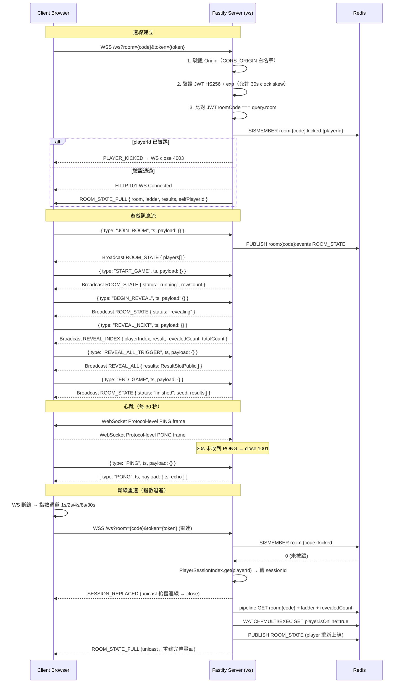

# WebSocket Protocol

> 生成自 devsop-autodev STEP 13

## 說明

WebSocket 協定涵蓋三個主要階段：連線建立時進行 Origin 驗證、JWT 驗證與踢除攔截；遊戲進行中透過訊息 Envelope（type/ts/payload）驅動狀態流轉；斷線時採指數退避重連（1/2/4/8/30s），重連後發送 SESSION_REPLACED 至舊連線並以 ROOM_STATE_FULL 恢復完整畫面。速率限制為 60 msg/min/連線，超限以 close 4029 關閉。
