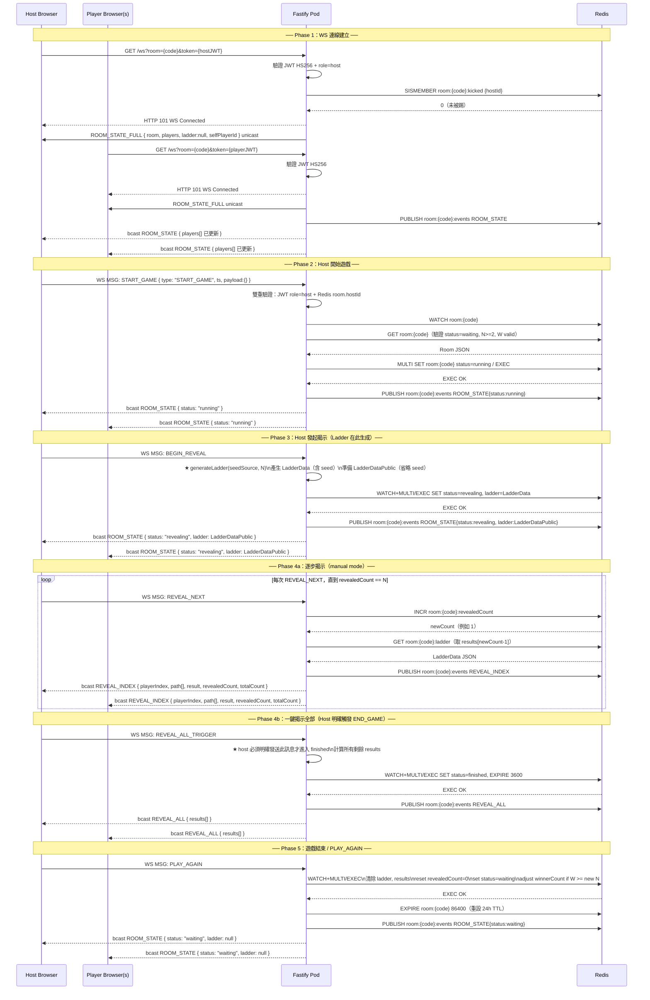

# WebSocket 關鍵訊息序列圖

> 主軸：主持人開始遊戲 → 揭曉完整流程
> 反映設計決策：
> - Ladder 在 BEGIN_REVEAL 時生成（非 START_GAME）
> - LadderDataPublic（省略 seed）用於 WS 廣播
> - END_GAME 需 Host 明確觸發

```mermaid
sequenceDiagram
    participant H as Host Browser
    participant P as Player Browser(s)
    participant F as Fastify Pod
    participant R as Redis

    Note over H,R: ── Phase 1：WS 連線建立 ──

    H->>F: GET /ws?room={code}&token={hostJWT}
    F->>F: 驗證 JWT HS256 + role=host
    F->>R: SISMEMBER room:{code}:kicked {hostId}
    R-->>F: 0（未被踢）
    F-->>H: HTTP 101 WS Connected
    F->>H: ROOM_STATE_FULL { room, players, ladder:null, selfPlayerId } unicast

    P->>F: GET /ws?room={code}&token={playerJWT}
    F->>F: 驗證 JWT HS256
    F-->>P: HTTP 101 WS Connected
    F->>P: ROOM_STATE_FULL unicast
    F->>R: PUBLISH room:{code}:events ROOM_STATE
    F-->>H: bcast ROOM_STATE { players[] 已更新 }
    F-->>P: bcast ROOM_STATE { players[] 已更新 }

    Note over H,R: ── Phase 2：Host 開始遊戲 ──

    H->>F: WS MSG: START_GAME { type: "START_GAME", ts, payload:{} }
    F->>F: 雙重驗證：JWT role=host + Redis room.hostId
    F->>R: WATCH room:{code}
    F->>R: GET room:{code}（驗證 status=waiting, N>=2, W valid）
    R-->>F: Room JSON
    F->>R: MULTI SET room:{code} status=running / EXEC
    R-->>F: EXEC OK
    F->>R: PUBLISH room:{code}:events ROOM_STATE{status:running}
    F-->>H: bcast ROOM_STATE { status: "running" }
    F-->>P: bcast ROOM_STATE { status: "running" }

    Note over H,R: ── Phase 3：Host 發起揭示（Ladder 在此生成）──

    H->>F: WS MSG: BEGIN_REVEAL
    F->>F: ★ generateLadder(seedSource, N)\n產生 LadderData（含 seed）\n準備 LadderDataPublic（省略 seed）
    F->>R: WATCH+MULTI/EXEC SET status=revealing, ladder=LadderData
    R-->>F: EXEC OK
    F->>R: PUBLISH room:{code}:events ROOM_STATE{status:revealing, ladder:LadderDataPublic}
    F-->>H: bcast ROOM_STATE { status: "revealing", ladder: LadderDataPublic }
    F-->>P: bcast ROOM_STATE { status: "revealing", ladder: LadderDataPublic }

    Note over H,R: ── Phase 4a：逐步揭示（manual mode）──

    loop 每次 REVEAL_NEXT，直到 revealedCount == N
        H->>F: WS MSG: REVEAL_NEXT
        F->>R: INCR room:{code}:revealedCount
        R-->>F: newCount（例如 1）
        F->>R: GET room:{code}:ladder（取 results[newCount-1]）
        R-->>F: LadderData JSON
        F->>R: PUBLISH room:{code}:events REVEAL_INDEX
        F-->>H: bcast REVEAL_INDEX { playerIndex, path[], result, revealedCount, totalCount }
        F-->>P: bcast REVEAL_INDEX { playerIndex, path[], result, revealedCount, totalCount }
    end

    Note over H,R: ── Phase 4b：一鍵揭示全部（Host 明確觸發 END_GAME）──

    H->>F: WS MSG: REVEAL_ALL_TRIGGER
    F->>F: ★ host 必須明確發送此訊息才進入 finished\n計算所有剩餘 results
    F->>R: WATCH+MULTI/EXEC SET status=finished, EXPIRE 3600
    R-->>F: EXEC OK
    F->>R: PUBLISH room:{code}:events REVEAL_ALL
    F-->>H: bcast REVEAL_ALL { results[] }
    F-->>P: bcast REVEAL_ALL { results[] }

    Note over H,R: ── Phase 5：遊戲結束 / PLAY_AGAIN ──

    H->>F: WS MSG: PLAY_AGAIN
    F->>R: WATCH+MULTI/EXEC\n清除 ladder, results\nreset revealedCount=0\nset status=waiting\nadjust winnerCount if W >= new N
    R-->>F: EXEC OK
    F->>R: EXPIRE room:{code} 86400（重設 24h TTL）
    F->>R: PUBLISH room:{code}:events ROOM_STATE{status:waiting}
    F-->>H: bcast ROOM_STATE { status: "waiting", ladder: null }
    F-->>P: bcast ROOM_STATE { status: "waiting", ladder: null }
```
